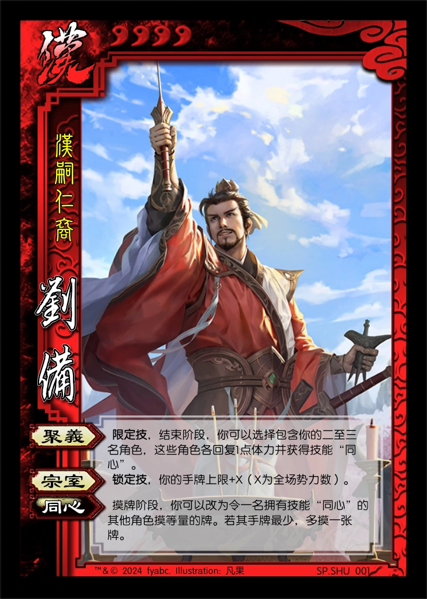

# 三国杀重置计划 扩展包1：黄巾之乱 (184 - 185)

## 说明

1. 该扩展包与重置计划的标准版配合使用。
2. SP武将  
   SP武将是标准包或扩展包的已有武将的复刻。  
   原则上只包含相应扩展包中的SP武将（例如当使用标准包和扩展1进行游戏时，只包含扩展1中的SP武将，不能包含扩展2中的SP武将）  
   可选的几种处理方法：

      - 在进行游戏时，可以在多个相同武将中只选择一个加入武将牌堆。
      - 在选将完毕，亮出所选武将后，可以使用一个未加入游戏的同名武将替换你所选的武将。
      - 将同名的武将完全视为不同的武将，没有只选择一个加入和同名替换之类的措施。
3. 官方“江山如故”系列中的“议事”机制，并加以细化。
   1. 参与议事的角色同时展示一张手牌，此牌（称为“议事牌”）的某种属性（称为“议事属性”，默认为颜色）对应其“意见”；若议事属性为某一值的数量为唯一最多，则此次议事的结果为该值，持有该意见的角色议事赢，其余参与角色议事没赢。若不存在唯一最多的议事属性，则此次议事无结果，所有参与角色均没赢。

## 游戏牌

### 全牌表

| 花色\点数 |   A    |   2    |    3     |    4     |   5   |    6     |   7   |   8   |   9   |    10    |   J   |    Q     |    K     |
| :-------: | :----: | :----: | :------: | :------: | :---: | :------: | :---: | :---: | :---: | :------: | :---: | :------: | :------: |
|     ♠     | *太平* | *黄巾* | **雷符** | **雷符** | *黄巾* | **盗贼** | 雷杀  | 雷杀  |  酒   |    杀    |  杀   |  *飞石*  | **无懈** |
|     ♥     |**桃园**|   杀   |    桃    |    桃    |  桃   |    桃    | 火杀  |  闪   |  闪   | **雷符** |  闪   | **闪电** | **无懈** |
|     ♣     |**民不**| *黄巾* |   雷杀   |   雷杀   | *-1*  | **盗贼** |  杀   |  杀   |  杀   |    杀    |  杀   | **铁索** | **铁索** |
|     ♦     |**大赦**| *法剑* |    桃    |   火杀   |  闪   |    闪    |  闪   |  闪   |  杀   |    闪    |  闪   |    杀    | **无懈** |

统计： 总 164，标+EX 112，扩展1 52  
注：括号内为扩展1牌数量

1. 基本牌 84 (31) 51.220%
   1. 杀 44 (16) 26.829%
      1. 黑色 29 (11) 17.683%
      2. 红色 15 (5) 9.146%
      3. 普通杀 30 (10) 18.293%
      4. 属性杀 14 (6) 8.537%
         1. 雷杀 9 (4) 5.488%
         2. 火杀 5 (2) 3.049%
   2. 闪 23 (9) 14.024%
      1. ♥ 7 (3) 4.268%
      2. ♦ 16 (6) 9.756%
   3. 桃 13 (5) 7.927%
      1. ♥ 10 (4) 6.098%
      2. ♦ 3 (1) 1.829%
   4. 酒 4 (1) 2.439%
2. **锦囊牌** 51 (14) 31.098%
   1. 普通 41 (9) 25.000%
      - 决斗 2 顺 4 拆 5
      - 借刀 2 无中 4 无懈 6 (3)
      - 南蛮 3 万箭 1 桃园 2 (1)
      - 五谷 2 火攻 2 铁索 5 (2)
      - 大赦 1 (1) 盗贼 2 (2)
   2. 延时 10 (5) 6.098%
      - 闪电 2 (1) 乐 2 兵 2
      - 民不 1 (1) 雷符 3 (3)
3. *装备牌* 29 (7) 17.683%
   1. 武器 13 (2) 7.927%
   2. 防具 7 (3) 4.268%
   3. 坐骑 7 (1) 4.268%
      1. +1马 3 1.829%
      2. -1马 4 (1) 2.439%
   4. 宝物 2 (1) 1.220%

> 说明：  
> 1.该扩展包的特征与军争篇比较类似，攻击性较强，节奏较快。  
> 2.加入该扩展后，164张牌中各类牌的占比与官方的标准版+军争篇也基本一致，可以认为产生的环境与官方军争场接近。  
> 3.该扩展中会导致判定的锦囊较多（5张，其中两张还会在场上持续产生效果），因此与判定相关的武将会得到加强。  
> 4.该扩展中雷电属性伤害牌较多。  

### 游戏牌说明

1.  【大赦天下】：锦囊，普通  
    出牌阶段，对所有角色使用。每名目标角色复原其武将牌，然后每名以此法翻面的角色弃置两张手牌。

    > “复原武将牌”包括重置和翻至正面朝上。只有原来武将牌是背面朝上的角色在复原之后需要弃置两张手牌。  
    > 该牌用来平衡大量属性伤害的效果，类似【白银狮子】在军争篇中的地位。  
2.  【盗贼蜂起】：锦囊，普通  
   出牌阶段，对所有其他角色使用。每名目标角色弃置与其距离最小（你除外）的另一名角色的一张牌。

    > 若除你以外只有一名其他角色，使用【盗贼蜂起】没有任何效果。  
3.  【民不聊生】：锦囊，延时  
    出牌阶段，对一名角色使用。将【民不聊生】置于其判定区，若判定结果不为♦，则该角色摸牌阶段少摸一张牌，并将之置入其下家的判定区。

    > 若判定结果为♦，则移去该【民不聊生】。  
4.  【黄巾雷符】：锦囊，延时  
    出牌阶段，对距离为1的一名其他角色使用。将【黄巾雷符】放置于该角色的判定区，若判定结果不为♦，则该角色受到1点雷电伤害。

    > 为避免跨回合记忆，【黄巾雷符】造成的伤害没有来源。
5.  【黄天法剑】：装备，武器 攻击范围：2  
   结束阶段，若你未于本回合中使用过【杀】，你可以横置或重置一名角色。
6.  【飞石】：装备，武器 攻击范围：2  
   **锁定技**，当你使用【杀】指定一名角色为目标后，若你不在该角色的攻击范围内，此【杀】不可被【闪】响应。

   > 说明：该武器是许褚用来对付盗贼的，和许褚的相性也算不错。  
7.  【黄头巾】：装备，防具  
   当你受到伤害后，你可以判定，若点数不大于3X（X为场上装备着【黄头巾】的角色数），你对伤害来源造成1点雷电伤害。

   > 装备【黄头巾】的角色越多越有用，契合黄巾起义一呼百应的特点。  
8.  【玉追】：装备，-1马  
9.  【太平要术】：装备，宝物  
   出牌阶段结束时，你可以将任意张手牌置于该牌上，称为“符”（“符”的数量至多为4）。  
   当一名角色的判定牌生效前，你可以打出一张“符”代替之。  
   你可以将两张“符”当一张【闪】使用或打出。

### SP卡牌

1.  【黄钺】：装备，武器 攻击范围：4  
   你的回合限一次，一张拼点牌亮出后/一张判定牌生效前，你可以令其点数-4或+4。

   > 点数为♠Q，使用时替换♠Q【飞石】。  
   > 增减后的点数最小为A，最大为K。  
   > 与皇甫嵩【奋钺】和刘协【密诏】契合，并且+4/-4暗示魏蜀吴群四大势力，体现天子之器。（设计思路：from @百花缭乱）  

## 场景牌

## 武将

1.  QUN011 张宝 男 群-黄 3体力 称号：地公将军
   1. 【咒缚】：出牌阶段限一次，你可以将一张手牌置于一名没有“咒”的其他角色武将牌旁，称为“咒”，然后横置该角色。当有“咒”的角色判定时，将“咒”作为判定牌；其回合结束时，你获得其武将牌旁的“咒”，然后获得其一张牌。
   2. 【影兵】：当一张“咒”成为判定牌后，你可以摸两张牌。

2.  QUN012 张梁 男 群-黄 4体力 称号：人公将军
   1. 【方统】：一名角色的判定牌生效前，你可以打出一张手牌代替之，然后若这两张牌：颜色相同，其回复1点体力；颜色不同，其失去1点体力；点数乘积为36，你摸两张牌。

   > TODO：需要实际测试得到此技能在一轮内的平均发动次数，以此评估强度。
3.  QUN013 张燕 男 群-黄 4体力 称号：黑山的飞燕
   1. 【捷速】：准备阶段/结束阶段，若你的手牌数小于手牌上限，你可以进行判定，若结果为黑色，你视为对一名其他角色使用一张无距离限制的雷【杀】。

   > 【捷速】出处：“燕剽捍捷速过人，故军中号曰飞燕。 ——《三国志·魏志·二公孙陶四张传》”
4.  QUN014 黄巾雷使 女 群-黄 3体力 称号：雷祭之姝
   1. 【黄巾】：**锁定技**，若你的装备区里没有防具牌，你视为装备着【黄头巾】。
   2. 【符篆】：出牌阶段限一次，你可以将一张黑色普通锦囊牌当【黄巾雷符】使用。
   3. 【助祭】：当一名角色造成雷电伤害时，你可以令其进行判定，若结果为：黑色，该角色获得此牌；红色，你获得此牌。
5.  HAN003 刘宏 男 汉 5体力 称号：汉灵帝
   1. 【鬻爵】：其他角色的出牌阶段限一次，该角色可以展示并交给你一张牌。若此牌为：黑色，其弃置场上的一张牌；红色，其摸一张牌。
   2. 【党锢】：**锁定技**，摸牌阶段，你少摸一张牌，然后令所有手牌数大于你的其他角色依次选择一项：交给你一张牌，或本回合所有非锁定技失效。
   3. 【天威】：**主公技**，准备阶段，你可以弃置一张牌，移去一名角色判定区内的一张牌。

   > 目标是设计为高体力带有负面技能的武将，符合三国杀对昏君/暴君的设计惯例（董卓、孙晧）

6.  HAN004 张让 男 汉-宦 3体力 称号：窃幸绝禋
   1. 【潜听】：一名其他角色的摸牌阶段开始时，你可以观看牌堆顶的两张牌。若如此做，本回合内，该角色与你的距离视为1。
   2. 【滔乱】：出牌阶段限两次，你可以声明一种花色，然后令一名其他角色选择是否交给你一张该花色的基本牌或普通锦囊牌。若其选择是，你视为使用此牌，且不计入使用次数。

   > 【潜听】出处：“又张让等使人潜听，具闻其语。 ——《后汉书·窦何列传第五十九》”。  
   > 【滔乱】视为使用的牌仍然存在（可以再使用一次）。  
   > 【滔乱】设计思路与官方类似，表现宦官凭借皇权作威作福的特点。  
   > TODO：需要实际测试强度（初版强度过弱，增强为现版）。
7.  HAN005 皇甫嵩 男 汉 4体力 称号：志定雪霜
   1. 【奋钺】：出牌阶段限一次，你可以与一名角色拼点，若你赢，根据你拼点的牌的点数依次执行以下效果：小于等于5：获得其一张牌；小于等于9：摸一张牌；小于等于K：视为对其使用一张【杀】。若你没赢，你摸一张牌并结束出牌阶段。
   2. 【舍身】：**限定技**，当一名其他角色处于濒死状态时，你可以令该角色将体力回复至X点（X为你的体力值），获得你的所有牌，然后你死亡。

   > 根据官方设计略微修改。  
   > 根据 @百花缭乱 的建议，增加拼点失败效果。  
8.  HAN006 卢植 男 汉 3体力 称号：国之桢干
   1. 【明任】：每轮限一次，当一名角色回复体力或造成伤害后，你可以获得与该角色距离为1的另一名角色的一张牌，然后交给一名角色。
   2. 【儒宗】：当你使用♠牌指定目标后，你可以弃置一张牌，令此牌不可被响应；当你成为♠牌的目标时，你可以弃置一张牌，令此牌对你无效。

   > 【明任】与刘备和公孙瓒契合。

----

1.  SP.SHU001 SP刘备 男 汉 4体力 称号：汉嗣仁裔
   1. 【聚义】：**限定技**，结束阶段，你可以选择包含你的二至三名角色，这些角色各回复1点体力并获得技能“同心”。
   2. 【宗室】：**锁定技**，你的手牌上限+X（X为全场势力数）。

   > 【同心】：摸牌阶段，你可以改为令一名拥有技能“同心”的其他角色摸等量的牌。若其手牌最少，多摸一张牌。

----

1.  LE001 张角 男 神 4体力 称号：时代的先驱
   1. 【天兵】：**限定技**，结束阶段，你可以减1点体力上限，在你和你的下家之间召唤一个“天兵”。
   2. 【问道】：准备阶段，你可以将一名其他角色装备区或判定区中的【太平要术】移动到你的装备区。
   3. 【驱雷】：**锁定技**，防止你和“天兵”受到的所有雷属性伤害。

   > “天兵”由神张角玩家操控，体力上限为2，无特殊技能。  
   > 当召唤“天兵”时，其摸四张起始手牌。  
   > “天兵”无身份，杀死“天兵”无奖惩。  
   > 当神张角死亡后，若游戏未结束，其玩家仍然可以操控“天兵”进行游戏。
