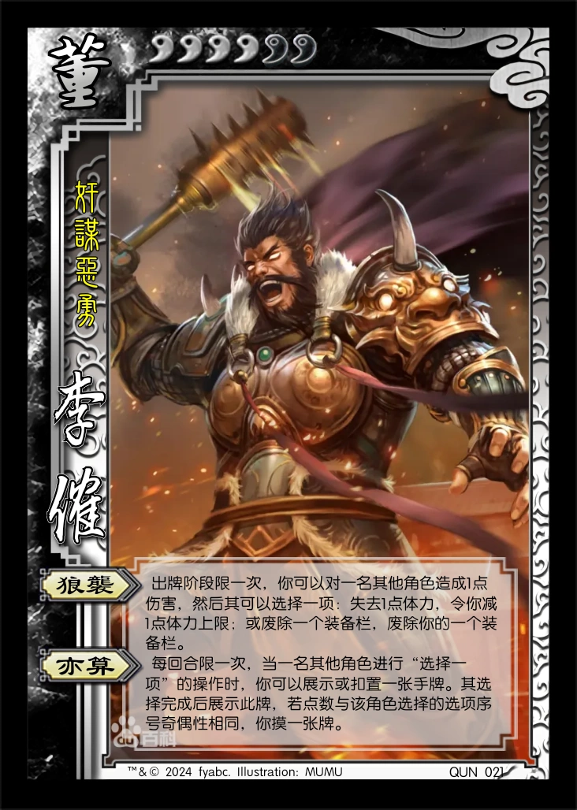
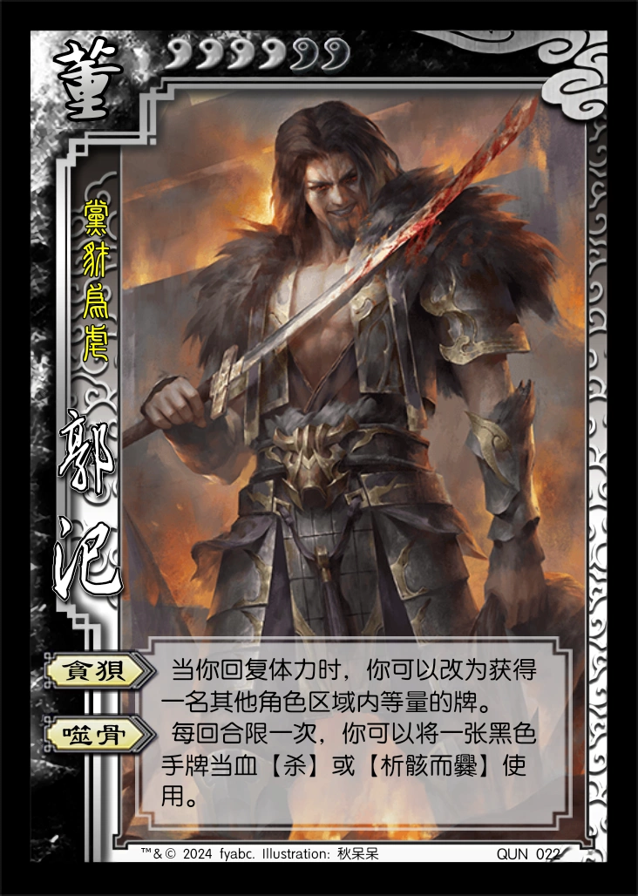

# 三国杀重置计划 扩展包4：文和乱武 (192 - 195)

## 新概念

1. 带触发效果的基本牌/普通锦囊牌：类似于官方国战【敕令】的效果。若一张带触发效果的牌未因使用而进入弃牌堆，则于此回合结束时视为**当前回合角色**使用了此牌，*且此牌不可被抵消*（若此牌需指定目标，则由**当前回合角色**指定（合法的）目标；若此牌无合法目标，则取消此牌），此结算称为此牌被**触发**。

   > 带触发效果的牌的右上角有⚠️形状的触发标记。  
   > 注：带触发效果的牌可通过打出或在弃牌阶段弃置的方式，利用其不可被抵消的特点，作为主动输出手段（对于【杀】，还能实现双刀）。  
   > 注：注意区分“响应”和“抵消”，“抵消”仅包含使用【闪】抵消【杀】，和使用【无懈可击】抵消锦囊牌。

## 特殊玩法说明

## 游戏牌

### 全牌表

“T”表示带触发效果的锦囊牌

| 花色\点数 |    A    |    2    |   3   |   4    |   5    |   6    |   7   |   8    |   9    |   10    |   J   |   Q    |   K    |
| :-------: | :-----: | :----: | :---: | :----: | :----: | :----: | :---: | :----: | :----: | :-----: | :---: | :----: | :----: |
|     ♠     |**乱武T**| *鱼鳞* |   酒   |**析骸**| *大驾* |   杀   |**绝处**|  血杀T |  血杀  |**盗贼** |  雷杀T |  雷杀  | *狼牙* |
|     ♥     |**绝处** |   桃   |   桃   |**析骸**| **顺T**| *巨锤* |   闪   |   闪   |   闪   |**盗贼T**|  血杀T |**无懈**|   桃   |
|     ♣     |**无懈** | *鱼鳞* | **拆T**| **兵** |  血杀T |   杀T  |   杀T  |   杀   |   酒   |  血杀   |  血杀  |**绝处**| *弯刀* |
|     ♦     | *拂尘*  |   闪   |   闪   |   闪   |   桃   |  火杀T |  血杀  |  血杀  |   闪   |    闪   |   闪   | *长枪* |**乱武T**|

统计： 总 164，标+EX 112，扩展4 52  
注：括号内为扩展4牌数量

1. 基本牌 83 (30) 50.610%
   1. 杀 43 (15) 26.220%
      1. 黑色 29 (11) 17.683%
      2. 红色 14 (4) 8.537%
      3. 普通杀 32 (12) 19.512%
         1. 血杀 8 (8) 4.878%
      4. 属性杀 11 (3) 6.707%
         1. 雷杀 7 (2) 4.268%
         2. 火杀 4 (1) 2.439%
   2. 闪 23 (9) 14.024%
      1. ♥ 7 (3) 4.268%
      2. ♦ 16 (6) 9.756%
   3. 桃 12 (4) 7.317%
      1. ♥ 9 (3) 5.488%
      2. ♦ 3 (1) 1.829%
   4. 酒 5 (2) 3.049%
2. **锦囊牌** 51 (14) 31.098%
   1. 普通 45 (13) 27.439%
      - 决斗 2 顺 5 (1) 拆 6 (1)
      - 借刀 2 无中 4 无懈 5 (2)
      - 南蛮 3 万箭 1 桃园 1
      - 五谷 2 火攻 2 铁索 3
      - 盗贼 2 (2) 乱武 2 (2) 析骸 2 (2) 绝处 3 (3)
   2. 延时 6 (1) 3.659%
      - 闪电 1 乐 2 兵 3 (1)
3. *装备牌* 30 (8) 18.293%
   1. 武器 15 (4) 9.146%
   2. 防具 6 (2) 3.659%
   3. 坐骑 7 (1) 4.268%
      1. +1马 3 1.829%
      2. -1马 4 (1) 2.439%
   4. 宝物 2 (1) 1.220%

- 说明：  
   1. 该扩展伤害类AOE和弃牌效果较多，可能类似于官方“文和乱武”模式的环境。  
   2. 该扩展引入血【杀】和【绝处逢生】对大量伤害进行一定的平衡。 
   3. 董卓四将的四把武器分别分布于四种花色，且和各自拥有者配合较好。  
   4. 本扩展包含与不可再生资源（限定技、废除/恢复装备栏、体力上限）相关的卡牌和技能。
   5. 本扩展包含与判定相关的卡牌和技能。
   6. **备注**：在废除装备栏时，进攻坐骑栏和防御坐骑栏视为两个装备栏。

### 游戏牌说明

1.  血【杀】：基本  
   属于【杀】的一种。当你使用血【杀】造成伤害时，你可以进行判定，若结果不小于4X（X为你的体力值），你回复1点体力。

   > 血【杀】造成的伤害为普通伤害。  
   > 考虑到该扩展的大量AOE，增加血【杀】，为低血量角色提供一个额外的回复机会。  
   > 血【杀】可增加判定的次数，而因判定而进入弃牌堆的带触发效果的牌会被触发，客观上增加了触发效果的出现频率。  
2.  【文和乱武】：锦囊，普通  
   出牌阶段，对所有其他角色使用。目标角色依次选择一项：1.对其最近的另一名角色使用一张【杀】；2.失去1点体力。

   > 引文：“我自冷眼看世界，不闻天下是与非。”  
   > ♠A和♦K，一头一尾各一张【文和乱武】，显示扩展主题。  
3.  【析骸而爨】：锦囊，普通  
   当一名角色脱离濒死状态后，对你或该角色使用。目标角色摸三张牌，然后交给脱离濒死状态的角色一张手牌。  
   当一名角色死亡后，对至多两名角色使用。目标角色选择一项：回复1点体力，或恢复一个装备栏。  

   > 引文：“华元曰：‘敝邑易子而食，析骸以爨。’” ——《左传·宣公十五年》  
   > 以“分食尸体”的效果契合锦囊的名称。  
   > 为提高该锦囊的使用频率，设定了两个使用时机。  
   > 提供恢复装备栏的能力。  
4.  【绝处逢生】：锦囊，普通  
   当你受到伤害时，对你使用。防止此伤害，然后若你的手牌数和体力值均为最少，你摸一张牌。

   > 参考了官方的【金蝉脱壳】和【草船借箭】的设计，增加额外的回复功能，作为【无懈可击】的替代品。   
5.  【飞熊狼牙棒】：装备，武器 攻击范围：3  
    每回合限一次，当你造成伤害时，若此伤害的来源不是【杀】或【决斗】，你可以摸一张牌。

    > 生造的李傕/飞熊军的武器，飞熊军来源于官方“诸侯伐董”模式。  
6.  【狂豺弯刀】：装备，武器 攻击范围：2  
   **锁定技**，你使用血【杀】无距离限制；你使用血【杀】造成伤害判定时，判定牌点数+2。

   > 生造的郭汜/狂豺军的武器，狂豺军来源于官方“诸侯伐董”模式。  
7.  【虎贲巨锤】：装备，武器 攻击范围：3  

   > 生造的樊稠/虎贲军的武器，虎贲军来源于官方“诸侯伐董”模式。  
8.  【龙骧长枪】：装备，武器 攻击范围：4  

   > 生造的张济/龙骧军的武器，龙骧军来源于官方“诸侯伐董”模式。  
9.  【鱼鳞甲】：装备，防具  
    **锁定技**，本回合回复过体力的其他角色不能对你使用牌；本回合对你使用过牌的其他角色不能回复体力。

    > 引文：“幡旗如鸟翼，甲胄似鱼鳞。” ——杨炯
10.  【乘舆大驾】：装备，-1马  
    结束阶段，你可以进行判定，若结果为装备牌，则你可以恢复一个装备栏，然后你可以将判定牌置于你的装备区（不能替换原装备）。

    > 引文：“乘舆大驾，公卿奉引，太仆卿，大将军参乘。属车八十一乘，备千乘万骑。西都行祠天郊，甘泉备之。” ——《后汉书.舆服志》  
    > 天子座驾，提供恢复装备栏的能力。  
11.  【拂尘】：装备，宝物  
    当你受到伤害时，若此时处于一张牌的触发结算中，或本回合有限定技发动过，你可以防止此伤害。

    > 贾诩的宝物，具有在【文和乱武】等混乱的触发牌和限定技中保全自身的能力。  
    > 若此时处于本回合发动的首个限定技的结算中，也视为本回合已有限定技发动过。  

----

来自其他扩展的游戏牌：

1. 

## 武将

1.  QUN021 李傕 男 群-董 4体力/6上限 称号：奸谋恶勇
    1. 【狼袭】：出牌阶段限一次，你可以对一名其他角色造成1点伤害，然后其可以选择一项：失去1点体力，令你减1点体力上限；或废除一个装备栏，废除你的一个装备栏。
    2. 【亦算】：每回合限一次，当一名其他角色进行“选择一项”的操作时，你可以展示或扣置一张手牌。其选择完成后展示此牌，若点数与该角色选择的选项序号奇偶性相同，你摸一张牌。

    > 【亦算】探索新机制：将“选择一项”抽象为可响应事件（包括卡牌、装备技能和武将技能产生的选择事件）。  
    > 【亦算】具有一定的博弈性，同时能和【狼袭】、【乱武】和【文和乱武】等卡牌/技能联动。  
    > 【亦算】允许正面朝上展示手牌，方便和队友配合。  
2.  QUN022 郭汜 男 群-董 4体力/6上限 称号：党豺为虐
    1. 【贪狈】：当你回复体力时，你可以改为获得一名其他角色区域内等量的牌。
    2. 【噬骨】：每回合限一次，你可以将一张黑色手牌当血【杀】或【析骸而爨】使用。
3.  QUN023 樊稠 男 群-董 4体力/6上限 称号：庸生变难
    1. 【兴乱】：（TODO：继续调整）其他角色于其出牌阶段外对你使用的牌结算后，你可获得此牌。
    2. 【危言】：TODO
   
    > 【兴乱】可以获得其他角色结束阶段使用的触发式AOE（如【文和乱武】等），使这些牌额外触发一次，体现“兴乱”的效果。  
    > TODO：参考DIY <https://zhuanlan.zhihu.com/p/377417674>，增加“背水：减体力上限或废除装备栏或失去技能”，契合事迹。
4.  QUN024 张济 男 群-董 4体力/6上限 称号：武威雄豪
    1. 【凶掠】：结束阶段，你可以减至多2点体力上限并选择一个区域，获得所有该区域内牌数不大于X的其他角色此区域内的所有牌（X为你以此法减少的体力上限值）。
    2. 【屯军】：**限定技**，出牌阶段，你可以将至多两张装备牌依次置于任意名角色的装备区（若对应装备栏已废除，则先恢复之），然后增加等量的体力上限。

    > 【屯军】不可替换原装备。  
    > 【屯军】每一次指定的角色互相独立，可以相同也可以不同。  

5.  HAN017 杨奉 男 汉 4体力 称号：忠勇半途
    1. 【血途】：TODO：参考官方设计。
6.  HAN018 杨彪 男 汉 3体力 称号：德彰海内
7.  HAN019 段煨 男 汉 4体力 称号：凉国之英
8.  HAN020 马腾 男 汉 4体力 称号：驰骋西陲

----

1.  SP.HAN001 SP刘协 男 汉 3体力 称号：危机四伏
    1. 【危境】：你可以将所有手牌交给一名其他角色，视为使用了一张【绝处逢生】。若此时是一名角色的出牌阶段内，此技能本回合失效。
    2. 【止戈】：TODO：与一技能联动，将【杀】或普通锦囊牌引向自己，有几率失败？
    3. 【济民】：**主公技**，当一张带触发效果的牌指定目标后，你可令一名其他汉势力角色回复1点体力。

    > 【危境】和其他版本刘协风格保持一致（给牌+防御），在出牌阶段外可反复使用（给牌后【绝处逢生】大概率能摸一张牌继续发动），对结束阶段结算的触发牌有较强的防御力。  
    > 【济民】取献帝在关中饥荒期间赈济灾民的典故。TODO：改成和其他技能有联动。  
    > TODO：【济民】：**主公技**，出牌阶段限一次，你可以减1点体力上限，令任意名汉势力角色各回复1点体力或摸两张牌。（然后【劝和】与体力上限有关？）  
    > TODO：《后汉书 董卓列传第六十二》献帝亲自检查粮食典故，也可用于技能（或者整合到【济民】中去）。  
2.  SP.WEI-TODO SP徐晃 男 汉 4体力 称号：沉详性严
    1. 【治严】：

----

1.  LE004 贾诩 男 神 3体力 称号：倒悬云衢
    1. 【兆乱】：结束阶段或你死亡时，你可令所有其他角色获得“相啖”。
    2. 【毒策】：游戏开始时，你随机抽取等同于角色数量的“策”。一名角色的出牌阶段限一次，其可付出相应的代价换取一个“策”并执行其效果。回合开始时，你重置所有“策”。

    > 【相啖】：**锁定技**，你的【桃】只能当血【杀】或【闪】使用或打出；当你换取“策”后，你失去此技能。  

    - 所有“策”列表（游戏开始时洗混并随机抽取）：
        - (1个) 代价：无。效果：本回合不能使用【杀】。
        - (3个) 代价：弃置一张牌或令神贾诩摸一张牌。效果：本回合手牌上限+1。
        - (2个) 代价：交给神贾诩一张非基本牌。效果：恢复一个装备栏。
        - (2个) 代价：交给神贾诩一张【杀】。效果：视为对一名除神贾诩外的其他角色使用一张【决斗】。
        - (1个) 代价：交给神贾诩两张红色手牌。效果：增加1点体力上限（不能超过游戏开始时的值）或回复1点体力。
        - (1个) 代价：本回合结束时，失去你选择的技能。效果：令你武将牌上的一个技能视为未发动过。
        - (1个) 代价：减1点体力上限，然后失去1点体力。效果：视为使用一张【盗贼蜂起】或【文和乱武】。

    > 被换取的“策”在被重置之前不能再被其他角色换取；神贾诩自身换取“策”执行其效果也要付出代价。  
    > 备注：第一个“策”的影响很小，主要目的是给敌方角色一个可用的选择，避免游戏体验过差。  
    > 【相啖】继承标贾诩的封桃效果；若神贾诩死亡时发动【兆乱】，由于无法换取“策”，因此【相啖】会永久保留（类似于进入鏖战模式）。  
