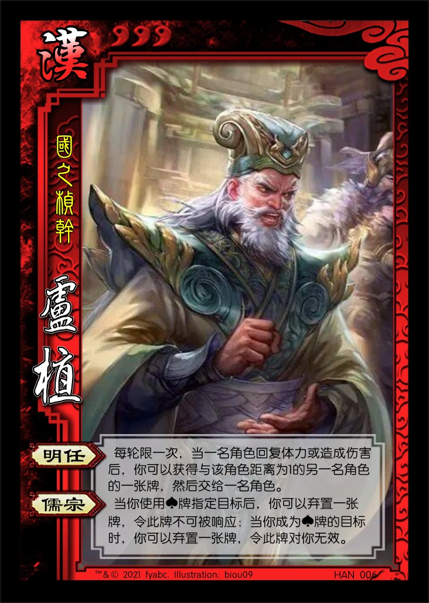
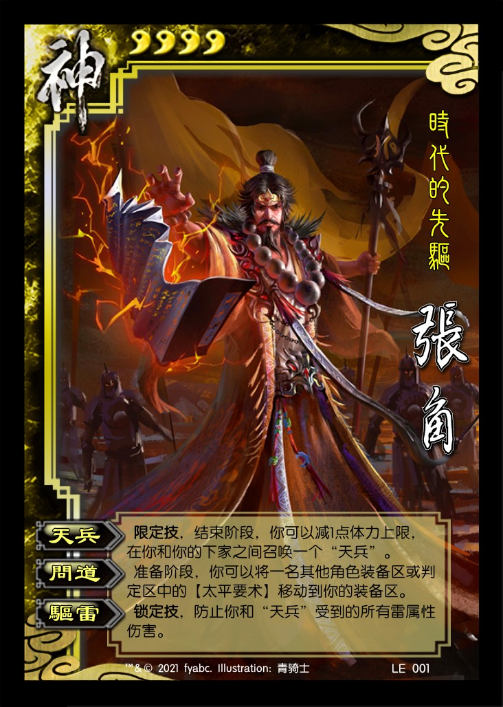

# 三国杀重置计划 扩展包1：黄巾之乱 (184 - 185)

## 说明

1. 该扩展包与重置计划的标准版配合使用。
2. SP武将  
   SP武将是标准包或扩展包的已有武将的复刻。  
   原则上只包含相应扩展包中的SP武将（例如当使用标准包和扩展1进行游戏时，只包含扩展1中的SP武将，不能包含扩展2中的SP武将）  
   可选的几种处理方法：

      - 在进行游戏时，可以在多个相同武将中只选择一个加入武将牌堆。
      - 在选将完毕，亮出所选武将后，可以使用一个未加入游戏的同名武将替换你所选的武将。
      - 将同名的武将完全视为不同的武将，没有只选择一个加入和同名替换之类的措施。

3. **忠臣技**，**反贼技**，**内奸技**：三种特定的技能类型关键词。准备阶段，你可以明置你的身份牌，若为相应的身份，则该技能从此时刻开始生效。当你未明置身份牌时，该技能无效。

## 游戏牌

### 全牌表

| 花色\点数 |    A     |   2    |    3     |    4     |   5   |    6     |   7   |   8   |   9   |    10    |   J   |    Q     |    K     |
| :-------: | :------: | :----: | :------: | :------: | :---: | :------: | :---: | :---: | :---: | :------: | :---: | :------: | :------: |
|     ♠     |  *太平*  |  *帽*  | **雷符** | **雷符** | *帽*  | **盗贼** | 雷杀  | 雷杀  |  酒   |    杀    |  杀   |  *飞石*  | **无懈** |
|     ♥     | **桃园** |   杀   |    桃    |    桃    |  桃   |    桃    | 火杀  |  闪   |  闪   | **雷符** |  闪   | **闪电** | **无懈** |
|     ♣     | **民不** |  *帽*  |   雷杀   |   雷杀   | *-1*  | **盗贼** |  杀   |  杀   |  杀   |    杀    |  杀   | **铁索** | **铁索** |
|     ♦     | **大赦** | *法剑* |    桃    |   火杀   |  闪   |    闪    |  闪   |  闪   |  杀   |    闪    |  闪   |    杀    | **无懈** |

统计： 总 164，标+EX 112，扩展1 52
注：括号内为扩展1牌数量

1. 基本牌 84 (31) 51.220%
   1. 杀 44 (16) 26.829%
      1. 黑色 29 (11) 17.683%
      2. 红色 15 (5) 9.146%
      3. 普通杀 30 (10) 18.293%
      4. 属性杀 14 (6) 8.537%
         1. 雷杀 9 (4) 5.488%
         2. 火杀 5 (2) 3.049%
   2. 闪 23 (9) 14.024%
      1. ♥ 7 (3) 4.268%
      2. ♦ 16 (6) 9.756%
   3. 桃 13 (5) 7.927%
      1. ♥ 10 (4) 6.098%
      2. ♦ 3 (1) 1.829%
   4. 酒 4 (1) 2.439%
2. **锦囊牌** 51 (14) 31.098%
   1. 普通 41 (9) 25.000%
      - 决斗 2 顺 4 拆 5
      - 借刀 2 无中 4 无懈 6 (3)
      - 南蛮 3 万箭 1 桃园 2 (1)
      - 五谷 2 火攻 2 铁索 5 (2)
      - 大赦 1 (1) 盗贼 2 (2)
   2. 延时 10 (5) 6.098%
      - 闪电 2 (1) 乐 2 兵 2
      - 民不 1 (1) 雷符 3 (3)
3. *装备牌* 29 (7) 17.683%
   1. 武器 13 (2) 7.927%
   2. 防具 7 (3) 4.268%
   3. 坐骑 7 (1) 4.268%
      1. +1马 3 1.829%
      2. -1马 4 (1) 2.439%
   4. 宝物 2 (1) 1.220%

### 游戏牌说明

1. 【大赦天下】：锦囊，普通  
    出牌阶段，对所有角色使用。每名目标角色复原其武将牌，然后每名以此法翻面的角色弃置两张手牌。

    > “复原武将牌”包括重置和翻至正面朝上。只有原来武将牌是背面朝上的角色在复原之后需要弃置两张手牌。  
    > 该牌用来平衡大量属性伤害的效果，类似【白银狮子】在军争篇中的地位。  
    > 引文：“夏四月甲戌朔，日有食之。辛巳，中常侍王甫及太尉段颎并下狱死。丁酉，大赦天下，诸党人禁锢小功以下皆除之。 ——《后汉书·孝灵纪》”
2. 【盗贼蜂起】：锦囊，普通  
   出牌阶段，对所有其他角色使用。每名目标角色弃置与其距离最小（你除外）的另一名角色的一张牌。

    > 若除你以外只有一名其他角色，使用【盗贼蜂起】没有任何效果。  
    > 引文：“朝政日非，以致天下人心思乱，盗贼蜂起。  ——《三国演义》第一回”
3. 【民不聊生】：锦囊，延时  
    出牌阶段，对一名角色使用。将【民不聊生】置于其判定区，若判定结果不为♦，则目标角色摸牌阶段少摸一张牌，并将之置入其下家的判定区。

    > 若判定结果为♦，则移去该【民不聊生】。  
    > 引文：“百姓罢敝，头会箕敛，以供军费，财匮力尽，民不聊生。  ——《史记·张耳陈余列传》”
4. 【黄巾雷符】：锦囊，延时  
    出牌阶段，对距离为1的一名其他角色使用。将【黄巾雷符】置入该角色的判定区，若判定结果不为♦，则该角色受到1点雷电伤害。

    > 为避免跨回合记忆，【黄巾雷符】造成的伤害没有来源。
5. 【黄天法剑】：装备，武器 攻击范围：2  
   结束阶段，若你未于本回合中使用过【杀】，你可以横置或重置一名角色。
6. 【飞石】：装备，武器 攻击范围：2  
   **锁定技**，当你使用【杀】指定一名角色为目标后，若你不在该角色的攻击范围内，此【杀】不可被【闪】响应。

   > 引文：“兵矢尽，乃令壁中男女，聚治石如杅斗者置四隅。褚飞石掷之，所值皆摧碎。 ——《三国志·魏志·许褚传》”
7. 【黄巾帽】：装备，防具  
   你的回合外，当你需要使用或打出一张基本牌时，你可以令一名其他角色选择是否弃置一张同名的牌。若其选择是，则视为你使用或打出了该牌；然后若该角色装备着【黄巾帽】，其摸一张牌。

   > 每次需要使用或打出一张基本牌的时机限一次，你只能对一名其他角色发动【黄巾帽】的特效。
8. 【玉追】：装备，-1马

   > 引文：“人中有张飞，马中有玉追。 ——《太平寰宇记》”
9. 【太平要术】：装备，宝物  
   出牌阶段结束时，你可以将任意张手牌置于该牌上，称为“符”（“符”的数量至多为4）。  
   当一名角色的判定牌生效前，你可以打出一张“符”代替之。  
   你可以将两张“符”当一张【闪】使用或打出。

## 场景牌

## 新游戏模式

1. 黄天当立模式
   1. TODO（汉阵营、群阵营，双方主帅分别为刘宏和张角）

## 武将

1.  张宝 男 群 3体力 称号：地公将军
   1. 【咒缚】：出牌阶段限一次，你可以将一张手牌置于一名没有“咒”的其他角色武将牌旁，称为“咒”，然后横置该角色。当有“咒”的角色判定时，将“咒”作为判定牌；其回合结束时，你获得其武将牌旁的“咒”。
   2. 【影兵】：当一张“咒”成为判定牌后，你可以摸两张牌。

2.  张梁 男 群 4体力 称号：人公将军
   1. 【方统】：一名角色的判定牌生效后，你可以弃置一张手牌，然后根据此牌的颜色执行如下效果：黑色，该角色失去1点体力；红色，该角色回复1点体力。

   > TODO：需要实际测试得到此技能在一轮内的平均发动次数，以此评估强度。
3.  张燕 男 群 4体力 称号：黑山的飞燕
   1. 【捷速】：TODO

   > 【捷速】出处：“燕剽捍捷速过人，故军中号曰飞燕。 ——《三国志·魏志·二公孙陶四张传》”
4.  黄巾雷使 女 群 3体力 称号：雷祭之姝
5.  刘宏 男 汉 5体力 称号：汉灵帝
   1. 【鬻爵】：TODO
   2. 【党锢】：TODO
   3. 【天威】：**主公技**，准备阶段，你可以弃置一张牌，移去一名角色判定区内的一张牌。

   > TODO：【党锢】设计为一个负面技能。  
   > 目标是设计为高体力带有负面技能的武将，符合三国杀对昏君/暴君的设计惯例（董卓、孙晧）

6.  张让 男 汉 3体力 称号：窃幸绝禋
   1. 【潜听】：一名其他角色的摸牌阶段开始时，你可以观看牌堆顶的两张牌。若如此做，本回合内，该角色与你的距离视为1。
   2. 【滔乱】：出牌阶段限两次，你可以声明一种花色，然后令一名其他角色选择是否交给你一张该花色的手牌。若其选择是，你视为使用此牌，且不受次数限制。

   > 【潜听】出处：“又张让等使人潜听，具闻其语。 ——《后汉书·窦何列传第五十九》”。  
   > 【滔乱】视为使用的牌仍然存在（可以再使用一次）。  
   > 【滔乱】设计思路与官方类似，表现宦官凭借皇权作威作福的特点。  
   > TODO：需要实际测试强度（初版强度过弱，增强为现版）。
7.  皇甫嵩 男 汉 4体力 称号：志定雪霜
   1. 【奋钺】：TODO
   2. 【舍身】：**忠臣技**，当一名其他角色处于濒死状态时，你可以令该角色将体力回复至X点（X为你的体力值），获得你的所有牌，然后你死亡。
8.  卢植 男 汉 3体力 称号：国之桢干
   1. 【明任】：TODO
   2. 【儒宗】：当你使用♠牌指定目标后，你可以弃置一张牌，令此牌不可被响应；当你成为♠牌的目标时，你可以弃置一张牌，令此牌对你无效。

----

1.  SP刘宏 男 汉 5体力 称号：委体宦孽
   1. 【佞信】：出牌阶段开始时，你可以令一名其他角色交给你任意数量的牌。若如此做，本回合内，由该角色的操控者操控你的角色。
   2. 【天威】：**主公技**，准备阶段，你可以弃置一张牌，移去一名角色判定区内的一张牌。

   > 称号出处：“灵帝负乘，委体宦孽。征亡备兆，《小雅》尽缺。麋鹿霜露，遂栖宫卫。 ——《后汉书·孝灵帝纪》”  
   > 当有新手玩家的时候，可以直接选择这个武将，方便老玩家演示游戏的基本概念。

----

1.  张角 男 神 4体力 称号：时代的先驱
   1. 【天兵】：**限定技**，结束阶段，你可以减1点体力上限，在你和你的下家之间召唤一个“天兵”。
   2. 【问道】：准备阶段，你可以将一名其他角色装备区或判定区中的【太平要术】移动到你的装备区。
   3. 【驱雷】：**锁定技**，防止你和“天兵”受到的所有雷属性伤害。

   > “天兵”由神张角玩家操控，体力上限为2，无特殊技能。  
   > 当召唤“天兵”时，其摸四张起始手牌。  
   > “天兵”无身份，杀死“天兵”无奖惩。  
   > 当神张角死亡后，若游戏未结束，其玩家仍然可以操控“天兵”进行游戏。
