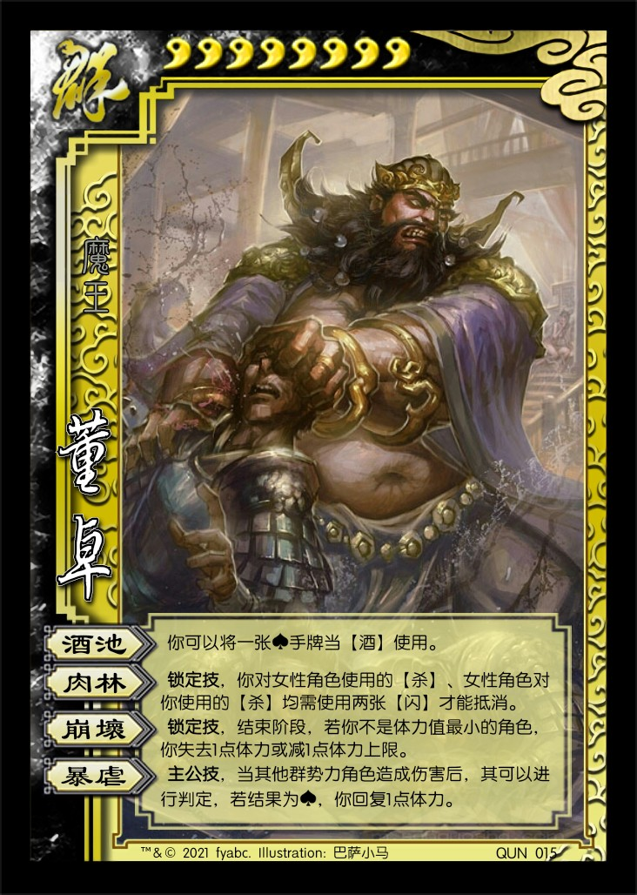
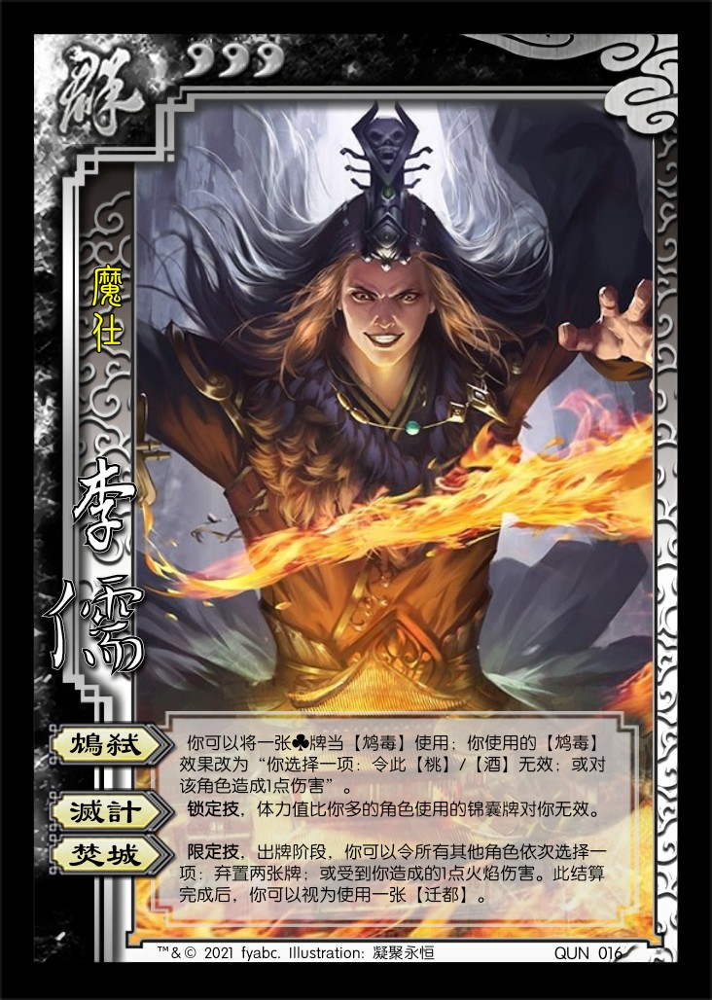
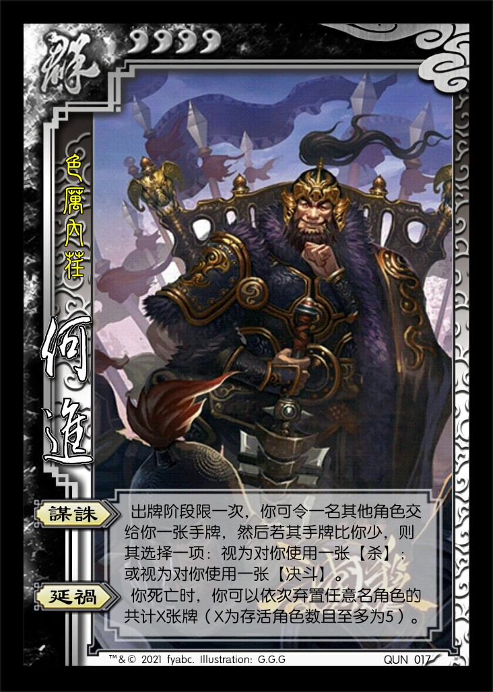
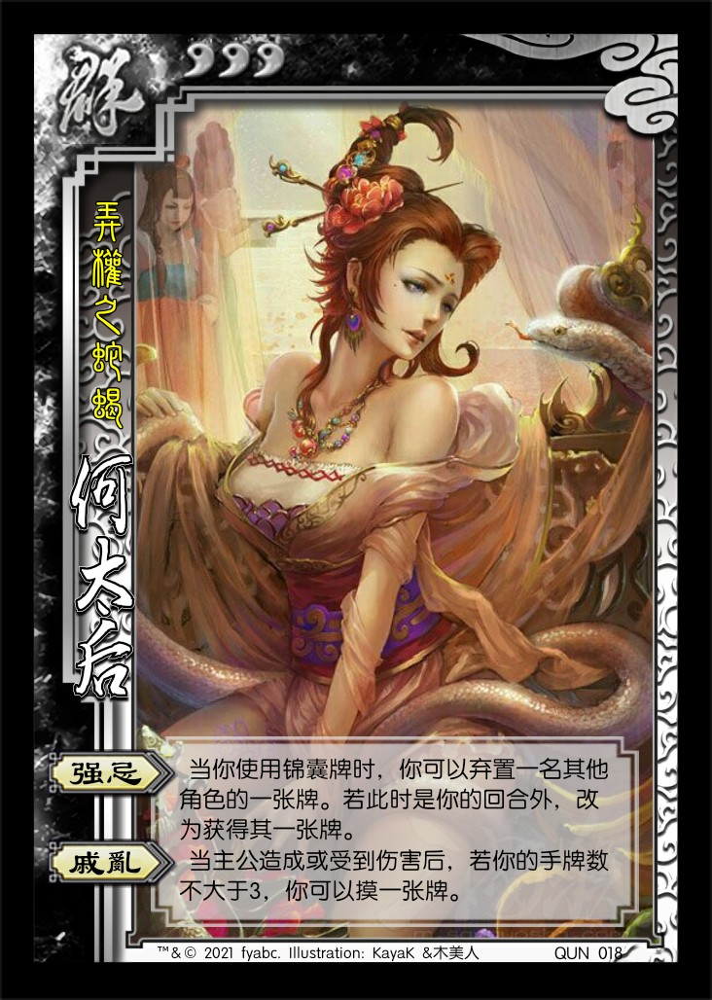
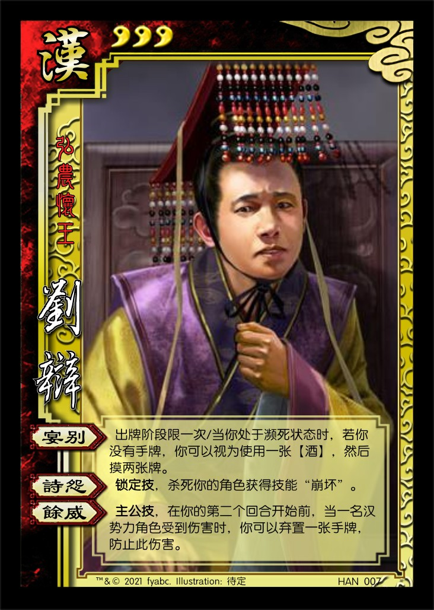
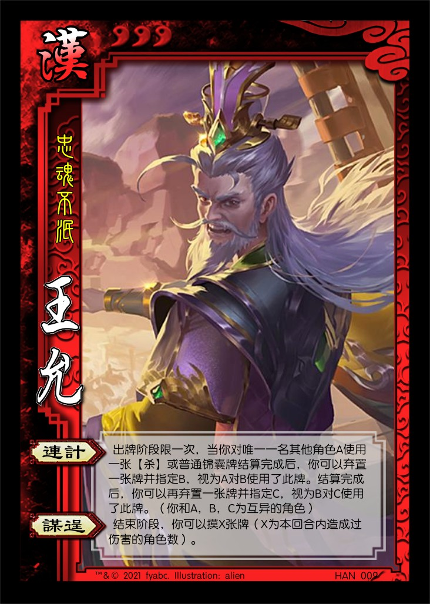
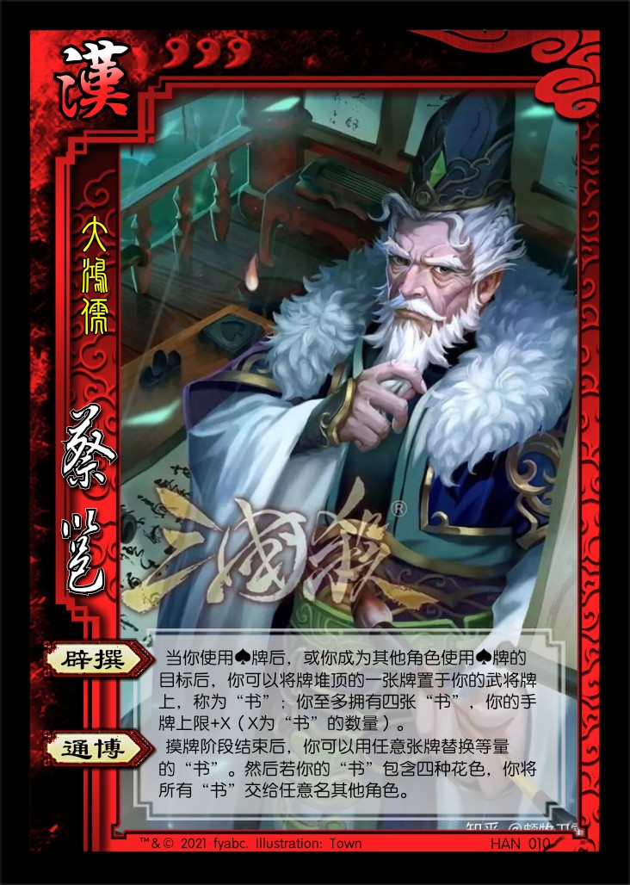
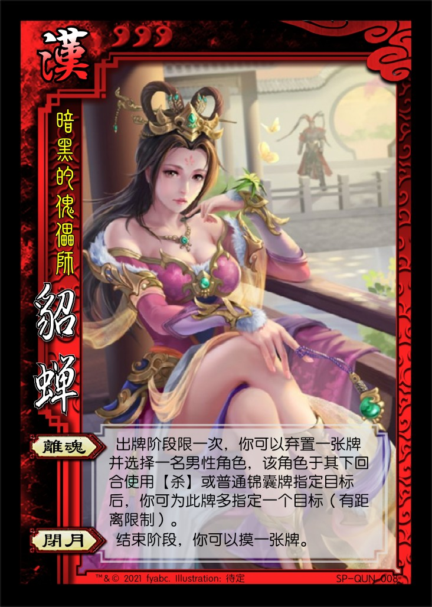
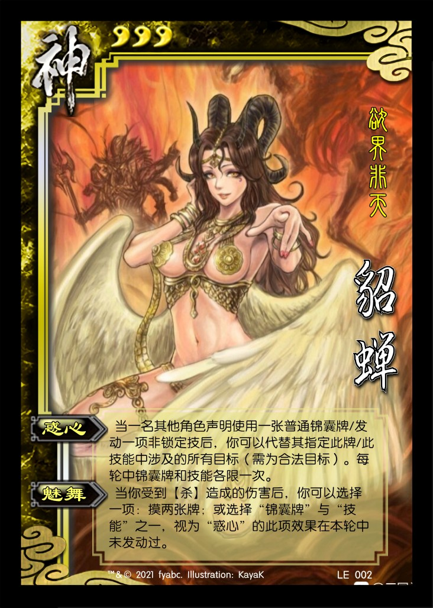

# 三国杀重置计划 扩展包2：董卓入京 (189 - 192)

## 新概念

1. 角色变量：A, B, C...

## 特殊玩法说明

## 游戏牌

### 全牌表

| 花色\点数 |    A     |   2   |   3   |   4   |   5   |   6   |   7   |   8   |   9   |  10   |   J   |    Q     |   K   |
| :-------: | :------: | :---: | :---: | :---: | :---: | :---: | :---: | :---: | :---: | :---: | :---: | :------: | :---: |
|     ♠     |  *古锭*  |       |       |       |       |       |       |       |       |       |       |          |       |
|     ♥     |         |       |       |       |       | *七宝* |       |       |       |       |       |          |       |
|     ♣     | **迁都** |       |       |       |       |       |       |       |       |       |       | **铁索** |       |
|     ♦     |  *手戟*  |       |       |       |       |       |       |       |       |       |       |          |  *+2* |

### 游戏牌说明

1. 【迁都】：锦囊，普通  
   每局游戏限一次，出牌阶段，对一名角色使用。你将该角色的座位移动到另一个由你指定的位置，然后你摸一张牌。  
   重铸：出牌阶段，你可以移去此牌，然后摸一张牌。

   > 每局游戏中【迁都】至多被使用一次（包括所有转化和非转化的），需要一个标记来记录【迁都】是否被使用过。
2. 【手戟】：装备，武器 攻击范围：1  
   结束阶段，你可以弃置装备区中的【手戟】，视为对一名其他角色使用一张无距离限制的【杀】。
3. 【七宝刀】：装备，武器 攻击范围：2  
   出牌阶段，你可以将此牌交给一名其他角色，然后该角色可以立即使用此牌。
4. 【骅骝】：装备，+2马  
   **锁定技**，准备阶段，若你装备着【骅骝】，将其弃置，然后摸一张牌。

## 场景牌

## 武将

1.  董卓 男 群 8体力 称号：魔王
   1. 【酒池】：你可以将一张♠手牌当【酒】使用。
   2. 【肉林】：**锁定技**，你对女性角色使用的【杀】、女性角色对你使用的【杀】均需使用两张【闪】才能抵消。
   3. 【崩坏】：**锁定技**，结束阶段，若你不是体力值最小的角色，你失去1点体力或减1点体力上限。
   4. 【暴虐】：**主公技**，当其他群势力角色造成伤害后，其可以进行判定，若结果为♠，你回复1点体力。
2.  李儒 男 群 3体力 称号：魔仕
   1. 【绝策】：
   2. 【灭计】：
   3. 【焚城】：
3.  何进 男 群 4体力
   1. 【谋诛】：TODO
   2. 【延祸】：你死亡时，你可以依次弃置任意名角色的共计至多X张牌（X为存活角色数且至多为5）。
4.  何太后 女 群 3体力
   1. 【鸩毒】：其他角色的出牌阶段开始时，你可以弃置一张手牌，令其视为使用一张【酒】，然后你对其造成1点伤害。
   2. 【戚乱】：一名角色的回合结束时，若你于此回合内杀死过角色，你可以摸三张牌。
5.  刘辩 男 汉 3体力
   1. 【某某】：TODO
   2. 【某某】：TODO
   3. 【某某】：**主公技**，TODO
6.  王允 男 汉 3体力
   1. 【连计】：出牌阶段限一次，当你对唯一一名其他角色A使用一张【杀】或普通锦囊牌结算完成后，你可以弃置一张牌并指定B，视为A对B使用了此牌。结算完成后，你可以再弃置一张牌并指定C，视为B对C使用了此牌。（你和A, B, C为互异的角色）
   2. 【谋逞】：结束阶段，你可以摸X张牌（X为本回合内造成过伤害的角色数）。
7.  蔡邕 男 汉 3体力
   1. 【辟撰】：当你使用♠牌后，或你成为其他角色使用♠牌的目标后，你可以将牌堆顶的一张牌置于武将牌上，称为“书”；你至多拥有四张“书”，你的手牌上限+X（X为“书”的数量）。
   2. 【通博】：摸牌阶段结束后，你可以用任意张牌替换等量的“书”，然后若你的“书”包含四种花色，你将所有“书”交给任意名其他角色。

----

1.  SP貂蝉 女 汉 3体力
   1. 【离魂】：出牌阶段限一次，你可以弃置一张牌并选择一名男性角色，该角色于其下回合使用【杀】或普通锦囊牌指定目标后，你可为此牌多指定一个目标（有距离限制）。
   2. 【闭月】：结束阶段，你可以摸一张牌。

   > 当没有曹植等武将干扰时，可将发动“离魂”弃置的牌置于目标角色的武将牌旁，作为标记使用。  
   > 体验过差？

----

1.  貂蝉 女 神 3体力
   1. 【某某】：TODO
