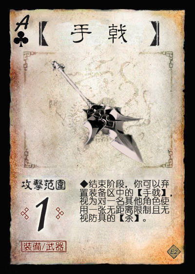
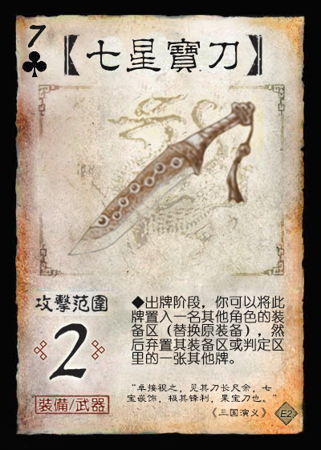
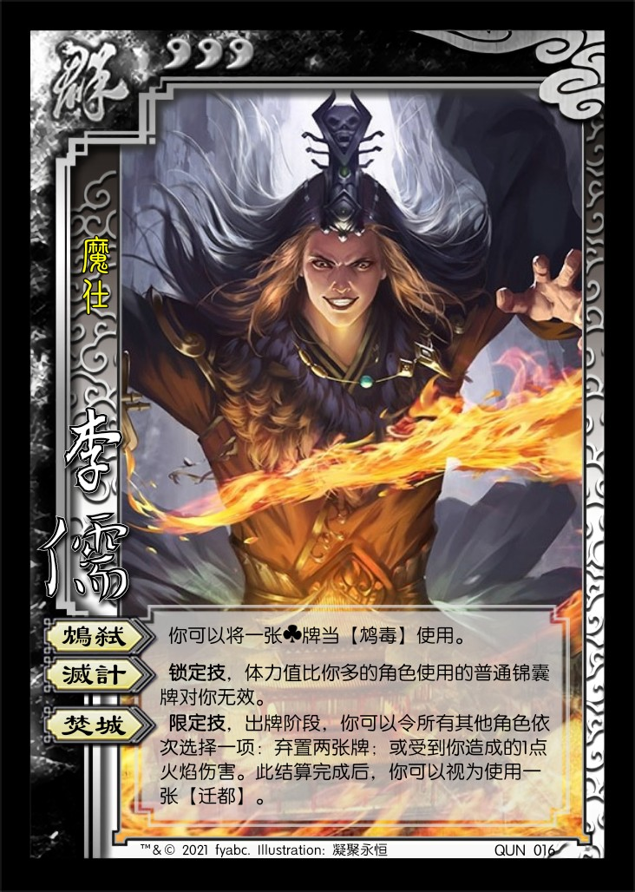
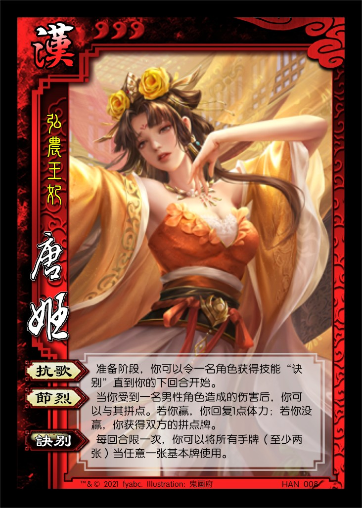

# 三国杀重置计划 扩展包2：董卓入京 (189 - 192)

## 新概念

1. 角色变量：A, B, C...：与普通变量X, Y, Z类似，但通常指代不同的角色，以简化描述。

## 特殊玩法说明

## 游戏牌

### 全牌表

| 花色\点数 |    A     |   2    |   3   |    4    |   5   |    6    |   7   |    8     |   9   |   10   |   J   |    Q     |    K    |
| :-------: | :------: | :----: | :---: | :-----: | :---: | :----: | :----: | :------: | :---: | :---: | :----: | :------: | :-----: |
|     ♠     | **迁都** | *百花* |  酒   |    杀    |  杀   |   杀   | **鸩** |  **鸩**  |  酒   |  雷杀  |  雷杀  | **无懈** | **铁索** |
|     ♥     |  *百花*  |   闪   |  闪   |    闪    |  闪   |   杀   |  火杀  | **笑里** |  酒   |   桃   |   桃   |    桃    |   桃    |
|     ♣     |  *手戟*  |  *坞*  |  酒   |    杀    |  杀   |   杀   | *七星* |   雷杀   |  酒   | **鸩** | **鸩** |    杀    |   *+2*  |
|     ♦     | **无懈** |   闪   |  闪   | **笑里** |  桃   |   闪   |   闪   |    闪    |  火杀 |   杀   |   闪   |    闪    |   闪    |

统计： 总 164，标+EX 112，扩展2 52  
注：括号内为扩展2牌数量

1. 基本牌 89 (36) 54.268%
   1. 杀 42 (14) 25.610%
      1. 黑色 28 (10) 17.073%
      2. 红色 14 (4) 8.537%
      3. 普通杀 29 (9) 17.683%
      4. 属性杀 13 (5) 7.927%
         1. 雷杀 8 (3) 4.878%
         2. 火杀 5 (2) 3.049%
   2. 闪 26 (12) 15.854%
      1. ♥ 8 (4) 4.878%
      2. ♦ 18 (8) 10.976%
   3. 桃 13 (5) 7.927%
      1. ♥ 10 (4) 6.098%
      2. ♦ 3 (1) 1.829%
   4. 酒 8 (5) 4.878%
2. **锦囊牌** 47 (10) 28.659%
   1. 普通 42 (10) 25.610%
      - 决斗 2 顺 4 拆 5
      - 借刀 2 无中 4 无懈 5 (2)
      - 南蛮 3 万箭 1 桃园 1
      - 五谷 2 火攻 2 铁索 4 (1)
      - 迁都 1 (1) 鸩毒 4 (4) 笑里 2 (2)
   2. 延时 5 3.049%
      - 闪电 1 乐 2 兵 2
3. *装备牌* 28 (6) 17.073%
   1. 武器 13 (2) 7.927%
   2. 防具 7 (3) 4.268%
   3. 坐骑 7 (1) 4.268%
      1. +1马 4 (1) 2.439%
      2. -1马 3 1.829%
   4. 宝物 1 0.610%

> 说明：  
> 1.与官方标准版+军争篇相比，该扩展包有更多的【酒】（3+5=8张）和【桃】（8+5=13张），使用【鸩毒】来进行平衡。  
> 2.与官方标准版+军争篇相比，该扩展包杀闪比更低（标准44/24=1.833，该扩展42/26=1.615），同样降低了【酒】增加伤害的几率，平衡【酒】过多带来的影响；同时，强命系武将的价值有所提高。  
> 3.与官方标准版+军争篇相比，该扩展锦囊比例偏低（标准31.06%，该扩展28.66%），且包含【鸩毒】等无法直接使用的锦囊。依赖锦囊的武将价值有所降低。

### 游戏牌说明

1.  【迁都】：锦囊，普通  
   每局游戏限一次，出牌阶段，对一名角色使用。你将该角色的座位移动到另一个由你指定的位置，然后你摸一张牌。  
   重铸：出牌阶段，你可以移去此牌，然后摸一张牌。

   > 引文：“于是尽徙洛阳人数百万口于长安，步骑驱蹙，更相蹈藉，饥饿寇掠，积尸盈路。” ——《后汉书·董卓传》  
   > 每局游戏中【迁都】至多被使用一次（包括所有转化和非转化的），可能需要一个标记来记录【迁都】是否被使用过。
2.  【鸩毒】：锦囊，普通  
   当一名角色使用【桃】/【酒】时，对其使用。取消此【桃】/【酒】的效果；若没有角色处于濒死状态，该角色可改为失去1点体力。
3.  【笑里藏刀】：锦囊，普通  
   你或目标角色的出牌阶段开始时，对一名距离为1的其他角色使用。该角色摸一张牌，然后你对其造成1点伤害。

   > 引文：“信而安之，阴而图之；备而后动，勿使有变。刚中柔外也。” ——《三十六计》
4.  【手戟】：装备，武器 攻击范围：1  
   结束阶段，你可以弃置装备区中的【手戟】，视为对一名其他角色使用一张无距离限制且无视防具的【杀】。

   > 模拟掷出手戟伤人的效果。  
5.  【七星宝刀】：装备，武器 攻击范围：2  
   出牌阶段，你可以将此牌置入一名其他角色的装备区（替换原装备），然后弃置其装备区或判定区里的一张其他牌。

   > 引文：“卓接视之，见其刀长尺余，七宝嵌饰，极其锋利，果宝刀也。” ——《三国演义》  
   > 若其装备区和判定区中没有其他牌，则无事发生。  
6.  【百花裙】：装备，防具  
   当你成为一张同性其他角色使用的♣牌或异性角色使用的黑色牌的目标时，你可以摸一张牌。
7.  【万岁坞】：装备，防具  
   **锁定技**，你的手牌上限+2；当你即将因为被其他角色获得或弃置而失去牌时，你可以改为自己选择失去的牌；当你失去装备区里的【万岁坞】时，你摸两张牌。  

   > 引文：“东汉初平三年， 董卓筑坞于郿 ，高厚七丈，与长安城相埒，号曰“万岁坞”，世称“郿坞”。坞中广聚珍宝，积谷为三十年储。  ——《后汉书·董卓传》”  
   > 照搬国战卞夫人的技能。由于【万岁坞】本身占用了防具的位置，不会因为防具拆不掉造成较严重的游戏体验问题。
8.  【骅骝】：装备，+2马  
   **锁定技**，准备阶段，若你装备着【骅骝】，将其弃置，然后摸一张牌。

   > 引文：“枥下骅骝思鼓角，门前老将识风云。” ——《上将行》  
   > 一个持续一回合的加强版+1马。

### SP卡牌

暂无

## 武将

1.  QUN015 董卓 男 群 8体力 称号：魔王
   1. 【酒池】：你可以将一张♠手牌当【酒】使用。
   2. 【肉林】：**锁定技**，你对女性角色使用的【杀】、女性角色对你使用的【杀】均需使用两张【闪】才能抵消。
   3. 【崩坏】：**锁定技**，结束阶段，若你不是体力值最小的角色，你失去1点体力或减1点体力上限。
   4. 【暴虐】：**主公技**，当其他群势力角色造成伤害后，其可以进行判定，若结果为♠，你回复1点体力。

   > 未作改动。
2.  QUN016 李儒 男 群 3体力 称号：魔仕  
   1. 【鸩弑】：你可以将一张♣牌当【鸩毒】使用。
   2. 【灭计】：**锁定技**，体力值比你多的角色使用的普通锦囊牌对你无效。
   3. 【焚城】：**限定技**，出牌阶段，你可以令所有其他角色依次选择一项：弃置两张牌；或受到你造成的1点火焰伤害。此结算完成后，你可视为使用一张【迁都】。

   > 若本局游戏中已使用过【迁都】，则李儒不能视为使用【迁都】。  
3.  QUN017 何进 男 群 4体力 称号：色厉内荏  
   1. 【谋诛】：出牌阶段限一次，你可令一名其他角色交给你一张手牌，然后若其手牌比你少，则其选择一项：视为对你使用一张【杀】；或视为对你使用一张【决斗】。
   2. 【延祸】：你死亡时，你可以依次弃置任意名角色的共计至多X张牌（X为存活角色数且至多为5）。

   > 基本沿用原版技能。
4.  QUN018 何太后 女 群 3体力 称号：弄权之蛇蝎
   1. 【强忌】：当你使用锦囊牌时，你可以弃置一名其他角色的一张牌。若此时是你的回合外，改为获得其一张牌。
   2. 【戚乱】：当主公造成或受到伤害后，若你的手牌数不大于3，你可以摸一张牌。

   > 【强忌】出处：“性强忌，后宫莫不震慑。 ——《后汉书·皇后纪》”  
   > 【强忌】与【鸩毒】和【笑里藏刀】的配合较好，契合人物事迹。
5.  HAN007 刘辩 男 汉 3体力 称号：弘农怀王  
   1. 【宴别】：出牌阶段限一次/当你处于濒死状态时，若你没有手牌，你可以视为使用一张【酒】，然后摸两张牌。
   2. 【诗怨】：**锁定技**，杀死你的角色获得技能“崩坏”。
   3. 【余威】：**主公技**，在你的第二个回合开始前，当一名汉势力角色受到伤害时，你可以弃置一张手牌，防止此伤害。

   > 【宴别】出处：刘辩死前与妻唐姬及宫人饮宴而别。  
   > 【宴别】被【鸩毒】和李儒克制。  
   > TODO：测试【宴别】强度。
6.  HAN008 唐姬 女 汉 3体力 称号：弘农王妃  
   1. 【抗歌】：准备阶段，你可以令一名角色获得技能“诀别”直到你的下回合开始。
   2. 【节烈】：当你受到一名男性角色造成的伤害后，你可以与其拼点。若你赢，你回复1点体力；若你没赢，你获得双方的拼点牌。

   > 【诀别】：每回合限一次，你可以将所有手牌（至少两张）当任意一张基本牌使用。  
   > 【抗歌】可以配合刘辩：用掉多余手牌，或者在【宴别】摸牌后将所有手牌当【杀】使用，或者于回合外防御。
7.  HAN009 王允 男 汉 3体力 称号：忠魂不泯  
   1. 【连计】：出牌阶段限一次，当你对唯一一名其他角色A使用一张【杀】或普通锦囊牌结算完成后，你可以弃置一张牌并指定B，视为A对B使用了此牌。结算完成后，你可以再弃置一张牌并指定C，视为B对C使用了此牌。（你和A, B, C为互异的角色）
   2. 【谋逞】：结束阶段，你可以摸X张牌（X为本回合内造成过伤害的角色数）。
8.  HAN010 蔡邕 男 汉 3体力 称号：大鸿儒  
   1. 【辟撰】：当你使用♠牌后，或你成为其他角色使用♠牌的目标后，你可以将牌堆顶的一张牌置于武将牌上，称为“书”；你至多拥有四张“书”，你的手牌上限+X（X为“书”的数量）。
   2. 【通博】：摸牌阶段结束后，你可以用任意张牌替换等量的“书”，然后若你的“书”包含四种花色，你将所有“书”交给任意名其他角色。

   > 未作改动。

----

1.  SP-QUN008 SP貂蝉 女 汉 3体力 称号：暗黑的傀儡师  
   1. 【离魂】：出牌阶段限一次，你可以弃置一张牌并选择一名男性角色，该角色于其下回合使用【杀】或普通锦囊牌指定目标后，你可为此牌多指定一个目标（有距离限制）。
   2. 【闭月】：结束阶段，你可以摸一张牌。

   > 当没有曹植等武将干扰时，可将发动“离魂”弃置的牌置于目标角色的武将牌旁，作为标记使用。  
   > TODO：【离魂】目标角色的体验是否过差？

----

1.  LE002 貂蝉 女 神 3体力 称号：欲界非天  
   1. 【惑心】：当一名其他角色声明使用一张普通锦囊牌/发动一项非锁定技后，你可以代替其指定此牌/此技能中涉及的所有目标（需为合法目标）。每轮中锦囊牌和技能各限一次。
   2. 【魅舞】：当你受到【杀】造成的伤害后，你可以选择一项：摸两张牌；或选择“锦囊牌”与“技能”之一，视为“惑心”的此项效果在本轮中未发动过。

   > 1. 神貂蝉附带两个标记，标示【惑心】两部分的发动情况。  
   > 2. 神貂蝉可以指定的目标必须是锦囊牌或技能的描述文本中明确包含的目标，衍生的目标不算在内。  
   > 3. TODO：需要完善FAQ，并且以严格的规则集语言表述技能。  
   > 4. FAQ：  
   > Q1：神貂蝉【惑心】指定【无中生有】，如何结算？  
   > A1：没有实际效果（【无中生有】的合法目标只有使用者，神貂蝉无法修改）。  
   > Q2：神貂蝉【惑心】指定【顺手牵羊】，如何结算？  
   > A2：神貂蝉选择另一名与使用者距离为1的角色及其区域内的一张牌，锦囊使用者获得此牌。  
   > Q3：神貂蝉【惑心】指定【火攻】（重置版本），如何结算？  
   > A3：神貂蝉选择一名角色为目标，若其有手牌，展示手牌后，由锦囊使用者选择是否弃置一张相同花色的手牌造成伤害。  
   > Q4：神貂蝉【惑心】指定刘焉【立牧】，如何结算？  
   > A4：刘焉【立牧】只能指定自己为【乐不思蜀】的目标，神貂蝉仍然要遵守该限制，因此【惑心】没有实际效果。  
   > Q5：神貂蝉【惑心】指定甘宁【奇袭】，如何结算？  
   > A5：若神貂蝉使用的是【惑心】的技能部分，则没有实际效果；若神貂蝉使用的是【惑心】的锦囊牌部分，则该转化的【过河拆桥】的目标角色和目标卡牌均由神貂蝉指定。  
   > Q6：神貂蝉【惑心】指定荀彧【驱虎】，如何结算？  
   > A6：该【驱虎】的拼点目标和拼点赢后造成伤害的目标均由神貂蝉指定，但合法性检测不变（拼点目标体力值需比荀彧多，伤害目标不能是拼点目标）。  
   > Q7：神貂蝉【惑心】指定孙乾【说盟】，如何结算？  
   > A7：神貂蝉指定【说盟】拼点的目标，若拼点没赢，视为使用的【过河拆桥】由使用者指定目标（此时神貂蝉可以发动另一次【惑心】，指定该【过河拆桥】为目标）。若此时孙乾发动【谦雅】，神貂蝉不能指定【谦雅】的给牌目标。  
