# 三国杀重生计划 扩展包3：诸侯讨董（190 - 191）

## 新概念

1. 援军牌：类似国战势备篇连横牌，可以在自己的回合将此牌（正面朝上）交给一名其他角色（此动作本身称为支援）若援军牌为装备牌，则可以改为直接置入目标角色的装备区。

   > 与官方扩展中的“赠予”机制几乎相同，唯一的区别是支援装备时多了一个置入手牌的选项。

## 特殊玩法说明

## 杂注

1. 董卓军的势力特色：高体力上限（不一定高体力值），可能有负面效果

## 资料

1. 十八路诸侯（演义）
   1. 标准版已出现：曹操、袁术、公孙瓒、孙坚、袁绍
   2. 标准版未出现：韩馥、孔伷、刘岱、王匡、张邈、桥瑁、袁遗、鲍信、孔融、张超、陶谦、马腾、张杨
2. 虎牢关之战，装备信息：
   1. 第五回：“见吕布出阵：头戴三叉束发紫金冠，体挂西川红锦百花袍，身披兽面吞头连环铠，腰系勒甲玲珑狮蛮带”
   2. 第五回：“北海太守孔融部将武安国，使铁锤飞马而出”
   3. 第五回：“刘玄德掣双股剑，骤黄鬃马，刺斜里也来助战”
   4. 第五回：“次日筑台三层，遍列五方旗帜，上建白旄黄钺，兵符将印，请绍登坛。”
   5. 第五回：“第一个，右北平土垠人，姓程，名普，字德谋，使一条铁脊蛇矛；第二个，姓黄，名盖，字公覆，零陵人也，使铁鞭；第三个，姓韩，名当，字义公，辽西令支人也，使一口大刀；第四个，姓祖，名茂，字大荣，吴郡富春人也，使双刀。”
   6. 第五回：“孙坚披烂银铠，裹赤帻，横古锭刀，骑花鬃马”

## 游戏牌

### 全牌表

“'”表示援军牌

| 花色\点数  |    A     |   2    |    3    |    4    |    5    |   6   |    7    |     8     |   9   |  10   |    J    |    Q     |    K     |
| :-------: | :------: | :----: | :-----: | :-----: | :-----: | :---: | :------: | :-------: | :---: | :---: | :-----: | :------: | :------: |
|     ♠     |  *古锭'*  |   杀   | **偷梁** | **偷梁**|  雷杀  | 雷杀'  | **摧锋** | **冲阵'** |  酒' | **兵** |   杀    | **无懈** | **勠力** |
|     ♥     | **联军** | *赤帻'* |   酒'   |   桃    |   桃    |  桃   |    桃    | **冲阵'** |  闪  |   闪   |    杀    |   火杀   |  火杀'   |
|     ♣     |  *烂银*  |   杀   | **联军** | **兵**  | *鹊画'* |  杀   | **摧锋'** | **冲阵'** | 雷杀 | 雷杀'  | **无懈** | **勠力** | **勠力** |
|     ♦     | **决斗** |   桃'   | **联军** |  闪     |  *+1'*  |  闪   |    闪    |    闪     |  闪  |  闪'   |   闪'   |  *铁脊*  | **摧锋** |

统计： 总 164，标+EX 112，扩展3 52  
注：括号内为扩展3牌数量

1. 基本牌 80 (27) 48.780%
   1. 杀 39 (11) 23.780%
      1. 黑色 26 (8) 15.854%
      2. 红色 13 (3) 7.927%
      3. 普通杀 25 (5) 15.244%
      4. 属性杀 14 (6) 8.537%
         1. 雷杀 9 (4) 5.488%
         2. 火杀 5 (2) 3.049%
   2. 闪 23 (9) 14.024%
      1. ♥ 6 (2) 3.659%
      2. ♦ 17 (7) 10.366%
   3. 桃 13 (5) 7.927%
      1. ♥ 10 (4) 6.098%
      2. ♦ 3 (1) 1.829%
   4. 酒 5 (2) 3.049%
2. **锦囊牌** 56 (19) 34.146%
   1. 普通 49 (17) 29.878%
      - 决斗 3 (1) 顺 4 拆 5
      - 借刀 2 无中 4 无懈 5 (2)
      - 南蛮 3 万箭 1 桃园 1
      - 五谷 2 火攻 2 铁索 3
      - 偷梁 2 (2) 摧锋 3 (3) 冲阵 3 (3) 勠力 3 (3) 联军 3 (3)
   2. 延时 7 (2) 4.2688%
      - 闪电 1 乐 2 兵 4 (2)
3. *装备牌* 28 (6) 17.073%
   1. 武器 14 (3) 8.537%
   2. 防具 6 (2) 3.659%
   3. 坐骑 7 (1) 4.268%
      1. +1马 4 (1) 2.439%
      2. -1马 3 1.829%
   4. 宝物 1 0.610%

> 说明：  
> 1.增加了锦囊牌比例  
> 2.增加了两张【兵粮寸断】，反映袁术给孙坚断粮的典故。  
> 3.总计16张援军牌，每个花色4张。  

### 游戏牌说明

1. 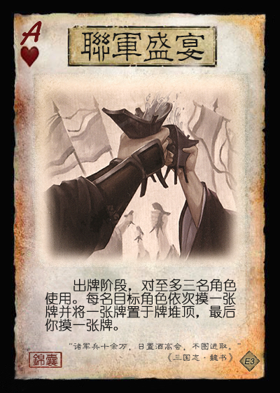 【联军盛宴】：锦囊，普通  
   出牌阶段，对至多三名角色使用。每名目标角色依次摸一张牌并将一张牌置于牌堆顶，最后你摸一张牌。
2. 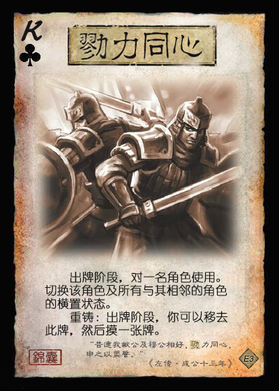 【勠力同心】：锦囊，普通  
   出牌阶段，对一名角色使用。切换该角色及所有与其相邻的角色的横置状态。  
   重铸：出牌阶段，你可以移去此牌，然后摸一张牌。

   > “切换横置状态”指将武将牌从横置（连环状态）变为竖置（非连环状态），竖置变为横置。
   > 当总角色数不大于3时，相当于切换所有角色的横置状态。  
   > 作为【铁索连环】的替代品。  
3. 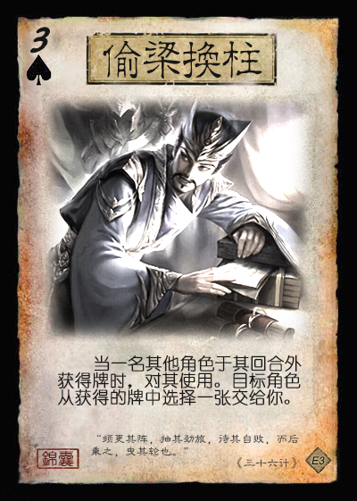 【偷梁换柱】：锦囊，普通  
   当一名其他角色于其回合外获得牌时，对其使用。目标角色从获得的牌中选择一张交给你。
4. 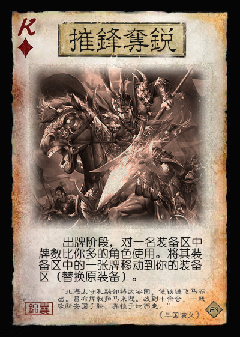 【摧锋夺锐】：锦囊，普通  
   出牌阶段，对一名装备区中牌数比你多的角色使用。将其装备区中的一张牌移动到你的装备区（替换原装备）。

   > 补充标准包中减少的拆装备手段。
5. 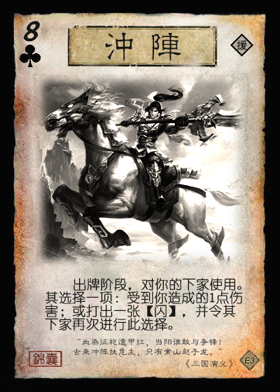 【冲阵】：锦囊，普通  
   出牌阶段，对你的下家使用。其选择一项：受到你造成的1点伤害；或打出一张【闪】，并令其下家再次进行此选择。

   > 说明：当有角色选择受到伤害后，此结算终止，否则按照座位顺序不断向下传递。  
   > 【冲阵】的结算可能影响多名角色，但目标角色只有下家一人。  
   > 【冲阵】的结算可能转回自己。特殊情况：单挑情况下，【冲阵】类似于双方打出【闪】版本的【决斗】。  
   > 所有【冲阵】均为援军牌，与位置相关的效果相配合，类似官方国战中的【火烧连营】。  
6. 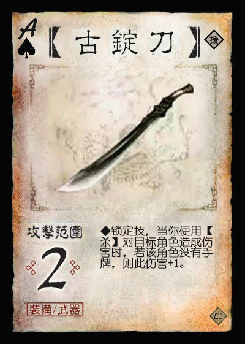 【古锭刀】：装备，武器 攻击范围：2  
   **锁定技**，当你使用【杀】对目标角色造成伤害时，若该角色没有手牌，则此伤害+1。

   > 此【古锭刀】为援军牌。
7. 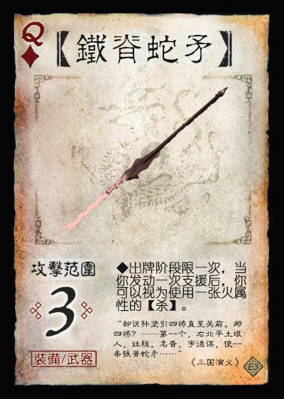 【铁脊蛇矛】：装备，武器 攻击范围：3  
   出牌阶段限一次，当你发动一次支援后，你可以视为使用一张火属性的【杀】。

   > 此法使用的火【杀】的使用时机不是出牌阶段内的空闲时间点，因此不计入使用次数限制。
8. 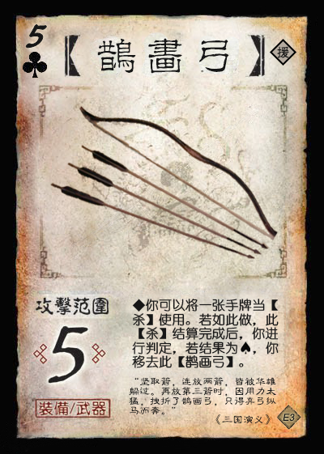 【鹊画弓】：装备，武器 攻击范围：5  
   你可以将一张手牌当【杀】使用。若如此做，此【杀】结算完成后，你进行判定，若结果为♠，你移去此【鹊画弓】。

   > 引文：“坚取箭，连放两箭，皆被华雄躲过。再放第三箭时，因用力太猛，拽折了鹊画弓，只得弃弓纵马而奔。”  ——《三国演义》
9. 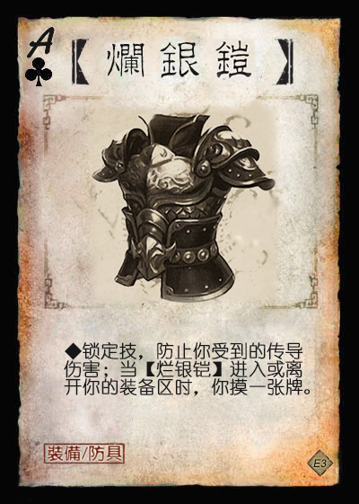 【烂银铠】：装备，防具  
   **锁定技**，防止你受到的传导伤害；当【烂银铠】进入或离开你的装备区时，你摸一张牌。

   > 是否会导致刷牌？  
   > 修改效果，以与支援机制配合？
10. 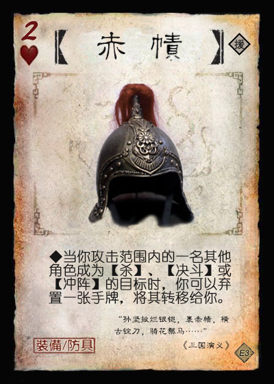 【赤帻】：装备，防具  
   当你攻击范围内的一名其他角色成为【杀】、【决斗】或【冲阵】的目标时，你可以弃置一张手牌，将其转移给你。

   > 是否会导致刷牌？  
   > 修改效果，以与支援机制配合？
11. 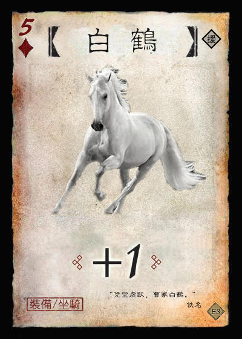 【白鹤】：装备，+1马

   > 引文：“凭空虚跃，曹家白鹤。” ——佚名  
   > 传说中曹洪的坐骑。为援军牌，符合“曹洪赠马”的典故。

## 场景牌

## 武将

1. 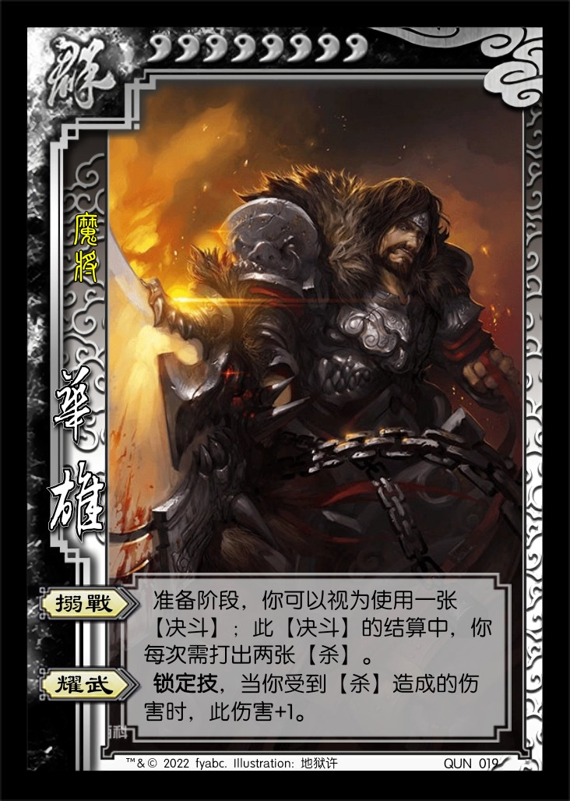 QUN019 华雄 男 群 8体力/8上限 称号：魔将
   1. 【搦战】：准备阶段，你可以视为使用一张【决斗】；此【决斗】的结算中，你可以减1点体力上限，视为打出一张【杀】。
   2. 【耀武】：锁定技，当你受到伤害时，此伤害+1。
2. 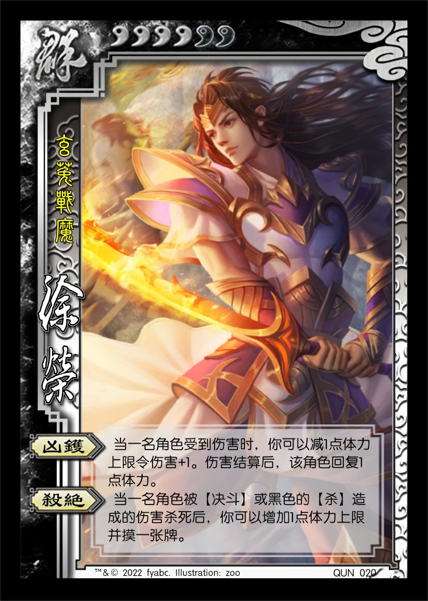 QUN020 徐荣 男 群 4体力/6上限 称号：玄菟战魔
   1. 【凶镬】：当一名角色受到伤害时，你可以减1点体力上限令此伤害+1。伤害结算完成后，该角色回复1点体力。
   2. 【杀绝】：当一名角色被【决斗】或黑色的【杀】造成的伤害杀死后，你可以增加1点体力上限并摸一张牌。
3.  QUN021 李肃 男 群 3体力/5上限 称号：魔使
4. 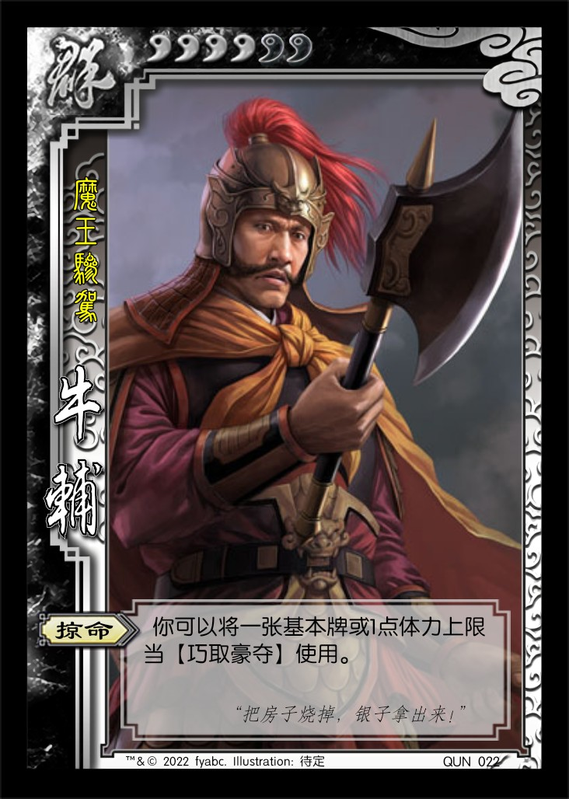 QUN022 牛辅 男 群 4体力
5. 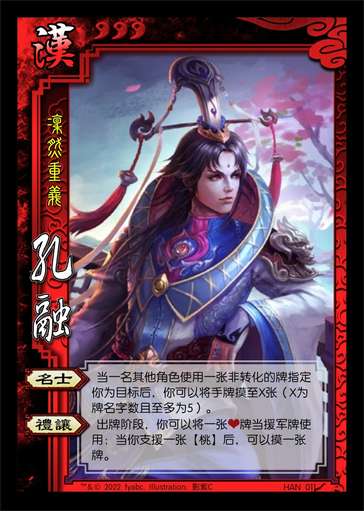 HAN011 孔融 男 汉 3体力
   1. 【名士】：**锁定技**，当你受到非转化牌造成的伤害时，若此牌的牌名字数大于你的体力值，此伤害-1。
   2. 【礼让】：出牌阶段，你可以将一张♥牌当援军牌使用；当你支援一张【桃】后，可以摸一张牌。
6. 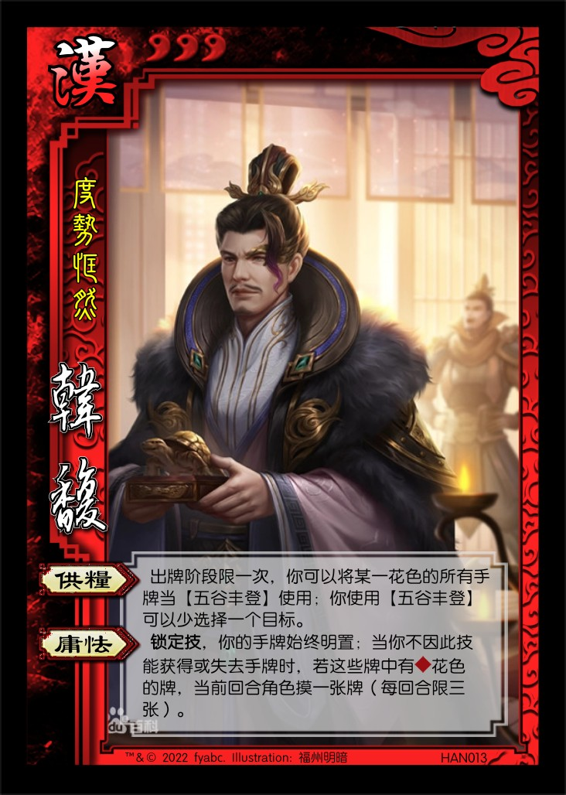 HAN012 韩馥 男 汉 3体力
7.  HAN013 鲍信 男 汉 3体力
8.  HAN014 刘虞 男 汉 3体力
   1. 【止戈】：TODO
   2. 【宗室】：**锁定技**，你的手牌上限+X（X为全场势力数）。

----

1. 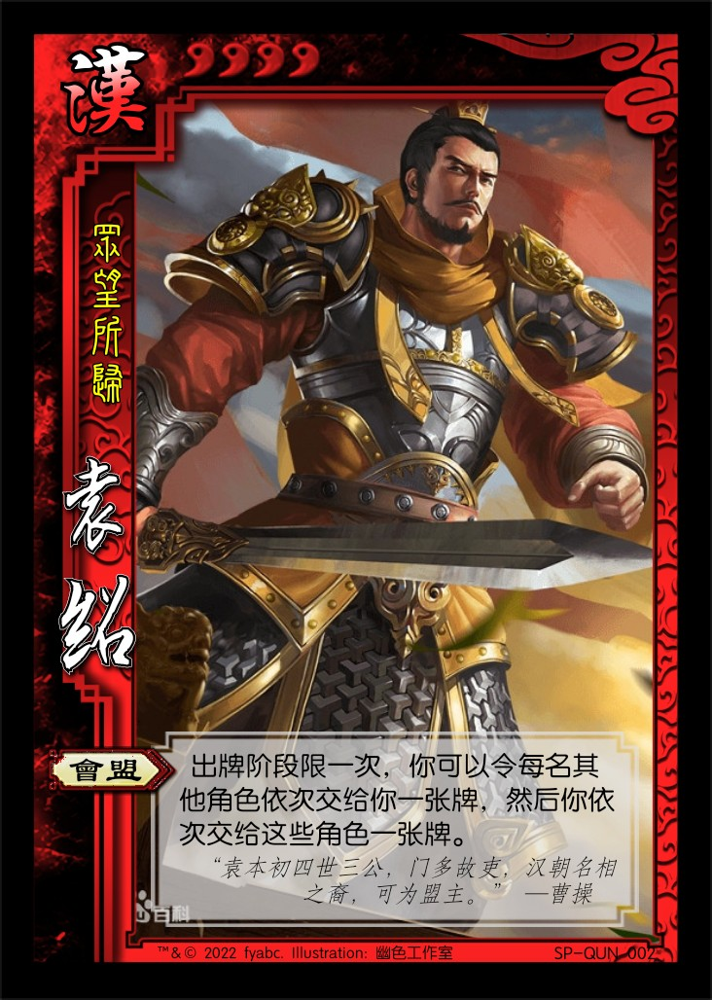 SP-QUN002 SP袁绍 男 汉 4体力 称号：众望所归
   1. 【会盟】：出牌阶段限一次，你可以令每名其他角色依次交给你一张牌，然后你依次交给这些角色一张牌。

2. 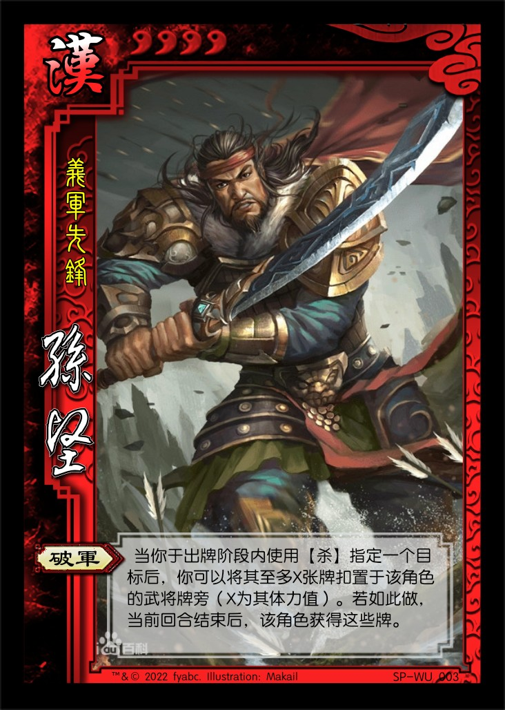 SP-WU003 SP孙坚 男 汉 4体力 称号：义军先锋
   1. 【破军】：当你于出牌阶段内使用【杀】指定一个目标后，你可以将其至多X张牌扣置于该角色的武将牌旁（X为其体力值）。若如此做，当前回合结束后，该角色获得这些牌。

3. 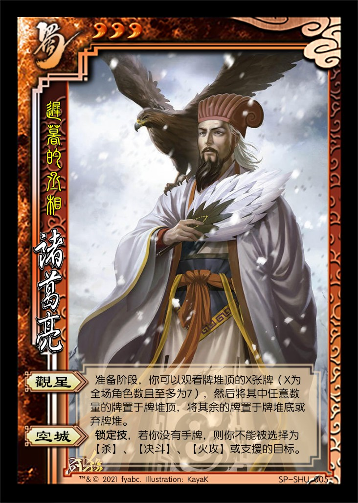 SP-SHU005 诸葛亮 男 蜀 3体力 称号：迟暮的丞相
   1. 【观星】：准备阶段，你可以观看牌堆顶的X张牌（X为全场角色数且至多为7），然后将其中任意数量的牌置于牌堆顶，将其余的牌置于牌堆底或弃牌堆。
   2. 【空城】：**锁定技**，若你没有手牌，则你不能被选择为【杀】、【决斗】、【火攻】或支援的目标。

   > 针对支援机制的微调版本，防止支援破空城。

----

1.  LE003 吕布 男 神 6体力 称号：最强神话  
   1. 【无前】：出牌阶段，你可以将两张相同花色的牌当【决斗】、【冲阵】或【摧锋夺锐】使用。
   2. 【神愤】：锁定技，当你使用一张除【决斗】、【冲阵】和【摧锋夺锐】以外的锦囊牌时，你失去1点体力或减1点体力上限。
