# 三国杀重置计划 扩展包3：诸侯讨董（190 - 191）

## 新概念

1. 援军牌：类似官方扩展中的“赠予”机制，可以在自己的回合将此牌（正面朝上）交给一名其他角色（此动作本身称为支援）若援军牌为装备牌，则可以改为直接置入目标角色的装备区。

   > 援军牌的右上角有“援”标记。  
   > 与官方扩展中的“赠予”机制唯一的区别是支援装备时多了一个置入手牌的选项。

## 特殊玩法说明

## 杂注

1. 董卓军的势力特色：高体力上限（不一定高体力值），可能有负面效果；对体力上限做文章
2. 诸侯联军的势力特色：进行手牌传递（包括支援）；本扩展中四个非SP的诸侯联军武将分别包含四种花色之一，以获得某种对称性，类似于原创之魂2017中的设计思路。

## 游戏牌

### 全牌表

“\*”表示援军牌

| 花色\点数  |    A    |     2    |     3    |    4    |    5    |   6   |     7    |     8    |  9  |  10   |    J    |    Q     |    K    |
| :-------: | :------: | :-----: | :------: | :-----: | :------: | :---: | :------: | :-----: | :--: | :---: | :----: | :------: | :------: |
|     ♠     | *古锭\** |    杀    | **巧取** | **巧取**|   雷杀   | 雷杀\* |**摧锋** |**冲阵\***| 酒\* | **兵** |   杀   | **无懈** | **勠力** |
|     ♥     | **联军** | *赤帻\** |   酒\*   |   桃    |    桃    |  桃   |    桃    |**冲阵\***|  闪  |   闪  |   杀   |   火杀   |  火杀\*  |
|     ♣     |  *烂银*  |    杀    | **联军** | **兵**  | *鹊画\** |  杀   |**摧锋\***|**冲阵\***| 雷杀 | 雷杀\* |**无懈**| **勠力** | **勠力** |
|     ♦     | **决斗** |   桃\*   | **联军** |  闪     |  *+1\**  |  闪   |    闪    |    闪    |  闪  |  闪\* |  闪\*  |  *铁脊*  | **摧锋** |

统计： 总 164，标+EX 112，扩展3 52  
注：括号内为扩展3牌数量

1. 基本牌 80 (27) 48.780%
   1. 杀 39 (11) 23.780%
      1. 黑色 26 (8) 15.854%
      2. 红色 13 (3) 7.927%
      3. 普通杀 25 (5) 15.244%
      4. 属性杀 14 (6) 8.537%
         1. 雷杀 9 (4) 5.488%
         2. 火杀 5 (2) 3.049%
   2. 闪 23 (9) 14.024%
      1. ♥ 6 (2) 3.659%
      2. ♦ 17 (7) 10.366%
   3. 桃 13 (5) 7.927%
      1. ♥ 10 (4) 6.098%
      2. ♦ 3 (1) 1.829%
   4. 酒 5 (2) 3.049%
2. **锦囊牌** 56 (19) 34.146%
   1. 普通 49 (17) 29.878%
      - 决斗 3 (1) 顺 4 拆 5
      - 借刀 2 无中 4 无懈 5 (2)
      - 南蛮 3 万箭 1 桃园 1
      - 五谷 2 火攻 2 铁索 3
      - 巧取 2 (2) 摧锋 3 (3) 冲阵 3 (3) 勠力 3 (3) 联军 3 (3)
   2. 延时 7 (2) 4.2688%
      - 闪电 1 乐 2 兵 4 (2)
3. *装备牌* 28 (6) 17.073%
   1. 武器 14 (3) 8.537%
   2. 防具 6 (2) 3.659%
   3. 坐骑 7 (1) 4.268%
      1. +1马 4 (1) 2.439%
      2. -1马 3 1.829%
   4. 宝物 1 0.610%

> 说明：  
> 1.增加了锦囊牌比例  
> 2.增加的两张【兵粮寸断】反映袁术给孙坚断粮的典故；增加的【决斗】反映扩展主题。  
> 3.总计16张援军牌，每个花色4张：♠A【古锭刀】、♠6雷【杀】、♠8【冲阵】、♠9【酒】；♥2【赤帻】、♥3【酒】、♥8【冲阵】、♥K火【杀】；♣5【鹊画弓】、♣7【摧锋夺锐】、♣8【冲阵】、♣10雷【杀】；♦2【桃】、♦5【白鹤】、♦10【闪】、♦J【闪】。  

### 游戏牌说明

1.  【联军盛宴】：锦囊，普通  
   出牌阶段，对至多三名角色使用。每名目标角色依次摸一张牌并将一张牌置于牌堆顶，最后你摸一张牌。
2.  【勠力同心】：锦囊，普通  
   出牌阶段，对一名角色使用。切换该角色及所有与其相邻的角色的横置状态。  
   重铸：出牌阶段，你可以移去此牌，然后摸一张牌。

   > “切换横置状态”指将武将牌从横置（连环状态）变为竖置（非连环状态），竖置变为横置。
   > 当总角色数不大于3时，相当于切换所有角色的横置状态。  
   > 作为【铁索连环】的替代品。  
3. 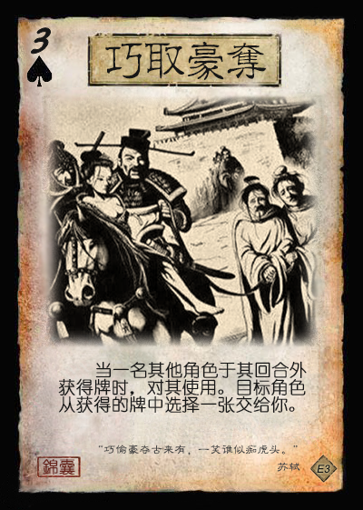 【巧取豪夺】：锦囊，普通  
   当一名其他角色于其回合外获得牌时，对其使用。目标角色从获得的牌中选择一张交给你。
4.  【摧锋夺锐】：锦囊，普通  
   出牌阶段，对一名装备区中牌数比你多的角色使用。将其装备区中的一张牌移动到你的装备区（替换原装备）。

   > 补充标准包中减少的拆装备手段。
5.  【冲阵】：锦囊，普通  
   出牌阶段，对你的下家使用。其选择一项：受到你造成的1点伤害，且若其下家不为你，则你可令其下家再次进行此选择；或打出一张【闪】。

   > 说明：当有角色选择打出【闪】后，此结算终止，否则按照座位顺序不断向下传递直到转回自己或使用者选择停止结算为止。  
   > 【冲阵】的结算可能影响多名角色，但目标角色只有下家一人。  
   > 所有【冲阵】均为援军牌，与位置相关的效果相配合，类似官方国战中的【火烧连营】。  
6. 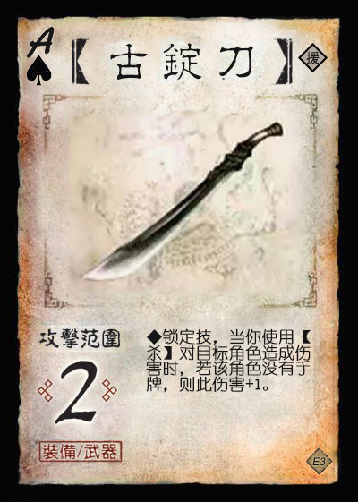 【古锭刀】：装备，武器 攻击范围：2  
   **锁定技**，当你使用【杀】对目标角色造成伤害时，若该角色没有手牌，则此伤害+1。

   > 此【古锭刀】为援军牌。
7.  【铁脊蛇矛】：装备，武器 攻击范围：3  
   出牌阶段限一次，当你发动一次支援后，你可以视为使用一张火属性的【杀】。

   > 此法使用的火【杀】的使用时机不是出牌阶段内的空闲时间点，因此不计入使用次数限制。
8.  【鹊画弓】：装备，武器 攻击范围：5  
   你可以将一张手牌当【杀】使用。若如此做，此【杀】结算完成后，你进行判定，若结果为♠，你移去此【鹊画弓】。

   > 引文：“坚取箭，连放两箭，皆被华雄躲过。再放第三箭时，因用力太猛，拽折了鹊画弓，只得弃弓纵马而奔。”  ——《三国演义》
9. 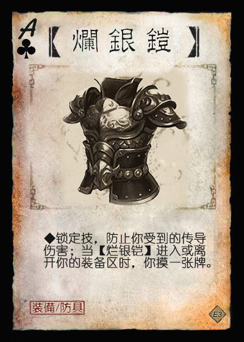 【烂银铠】：装备，防具  
   **锁定技**，防止你受到的传导伤害；当【烂银铠】进入或离开你的装备区时，你摸一张牌。

   > 是否会导致刷牌？  
10. 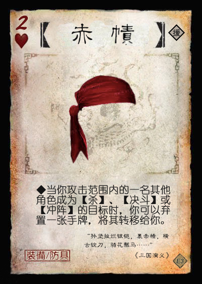 【赤帻】：装备，防具  
   当你攻击范围内的一名其他角色成为【杀】、【决斗】或【冲阵】的目标时，你可以弃置一张手牌，将其转移给你。
11. 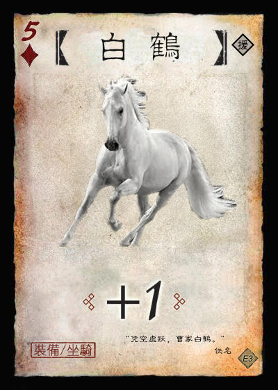 【白鹤】：装备，+1马

   > 引文：“凭空虚跃，曹家白鹤。” ——佚名  
   > 传说中曹洪的坐骑。为援军牌，符合“曹洪赠马”的典故。

## 场景牌

## 武将

1. 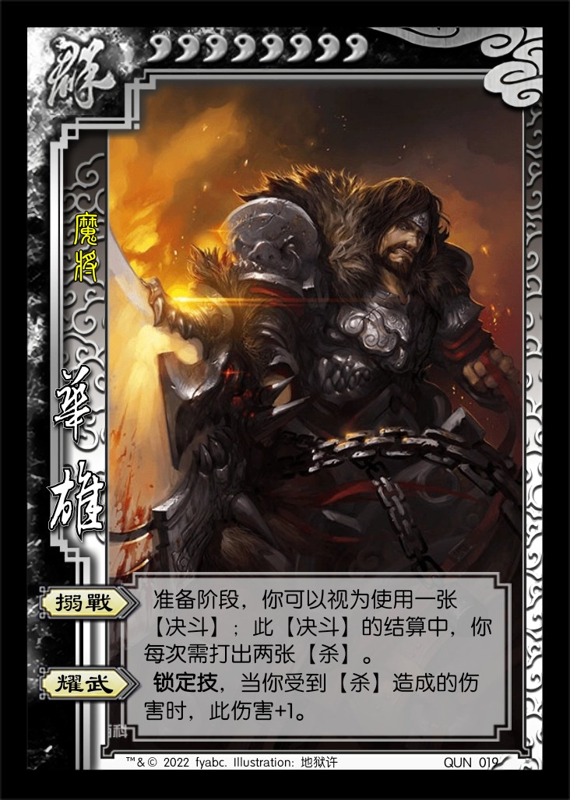 QUN019 华雄 男 群 8体力/8上限 称号：魔将
   1. 【搦战】：准备阶段，你可以视为使用一张【决斗】；此【决斗】的结算中，你每次需打出两张【杀】。
   2. 【耀武】：**锁定技**，当你受到【杀】造成的伤害时，此伤害+1。
2. 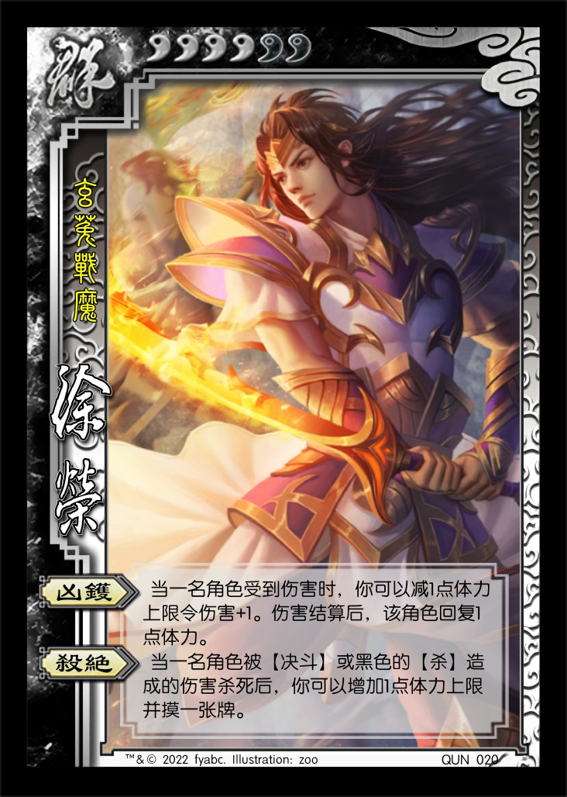 QUN020 徐荣 男 群 4体力/6上限 称号：玄菟战魔
   1. 【凶镬】：当一名角色受到伤害时，你可以减1点体力上限令伤害+1。伤害结算后，该角色回复1点体力。
   2. 【杀绝】：当一名角色被【决斗】或黑色的【杀】造成的伤害杀死后，你可以增加1点体力上限并摸一张牌。
3. 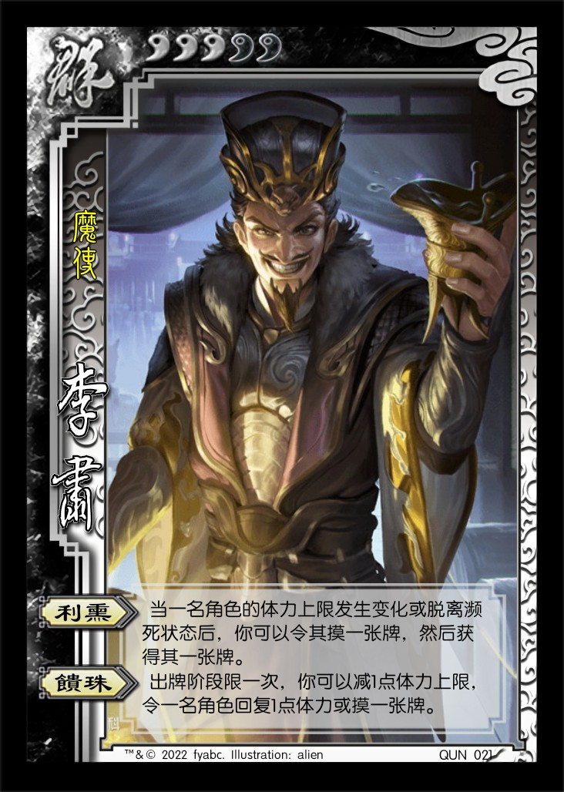 QUN021 李肃 男 群 3体力/5上限 称号：魔使
   1. 【利熏】：当一名角色体力上限发生变化或脱离濒死状态后，你可以令其摸一张牌，然后你获得其一张牌。
   2. 【馈珠】：出牌阶段限一次，你可以减1点体力上限，令一名角色回复1点体力或摸一张牌。
4.  QUN022 牛辅 男 群 4体力/6上限 称号：魔王骖驾
   1. 【掠命】：你可以将一张基本牌或1点体力上限当【巧取豪夺】使用。

   > “将1点体力上限当XX使用”等价于“减1点体力上限，然后视为使用一张XX”，是后者的简化描述。  
   > 类似地，“将1点体力值当XX使用”等价于“失去1点体力，然后视为使用一张XX”。  
5. 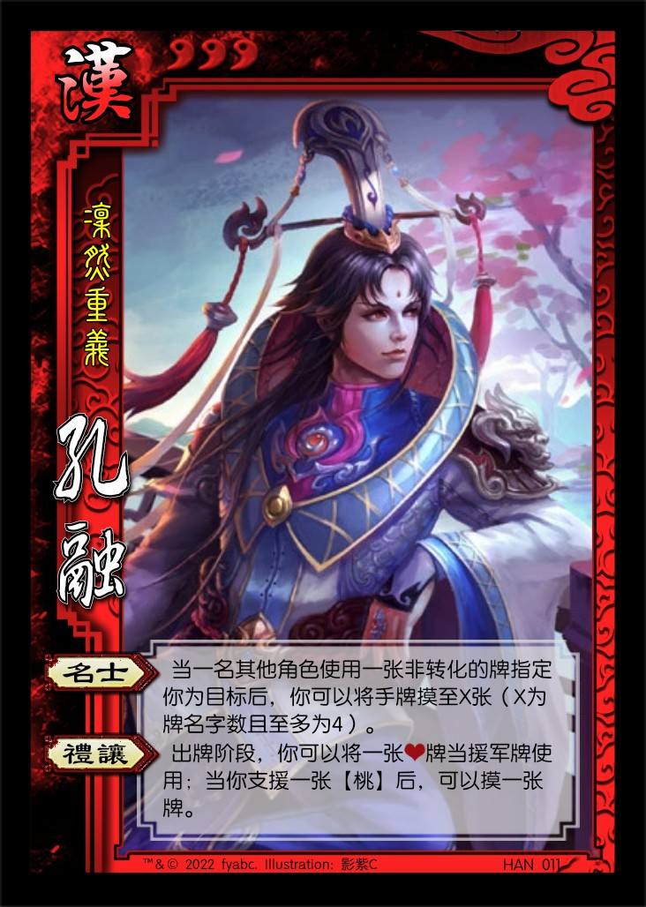 HAN011 孔融 男 汉 3体力 称号：凛然重义
   1. 【名士】：当一名其他角色使用一张非转化的牌指定你为目标后，你可以将手牌摸至X张（X为牌名字数且至多为4）。
   2. 【礼让】：出牌阶段，你可以将一张♥牌当援军牌使用；当你支援一张【桃】后，可以摸一张牌。

   > 【礼让】体现孔融让梨（桃）的典故。  
   > TODO：【名士】需要测试技能强度。  
   > 本扩展四个汉势力角色的技能包含四种花色中的各一个（孔融为♥）。  
6. 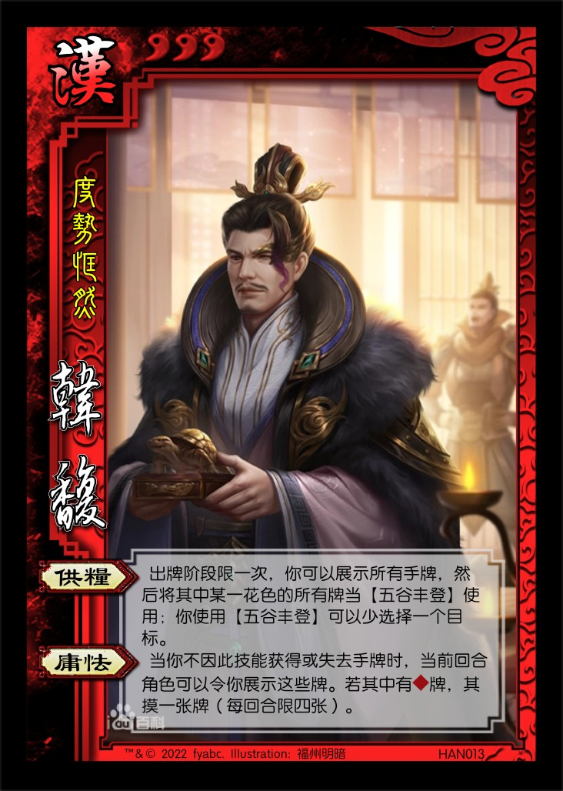 HAN012 韩馥 男 汉 3体力 称号：度势恇然
   1. 【供粮】：出牌阶段限一次，你可以展示所有手牌，然后将其中某一花色的所有牌当【五谷丰登】使用；你使用【五谷丰登】可以少选择一个目标。
   2. 【庸怯】：当你不因此技能获得或失去手牌时，当前回合角色可以令你展示这些牌。若其中有♦牌，其摸一张牌（每回合限四张）。

   > 【庸怯】说明：1) 若一次性获得或失去了多张手牌（例如摸牌阶段和弃牌阶段），则这些牌至少有一张♦花色即可触发摸牌；2) 韩馥因【庸怯】获得的牌无法触发【庸怯】。  
   > 【庸怯】与讨董联盟时期的袁绍可以相互配合（但受益者为袁绍）；被主版本袁绍克制（响应【万箭齐发】的【闪】多为♦花色），契合人物关系。  
   > 【供粮】反映了诸侯讨董过程中，韩馥留守邺城供给军粮的事迹，也与【庸怯】配合，消耗多余♦牌，并且获得想要的牌。  
   > 本扩展四个汉势力角色的技能包含四种花色中的各一个（韩馥为♦）。  
   > TODO：测试武将强度。
7. 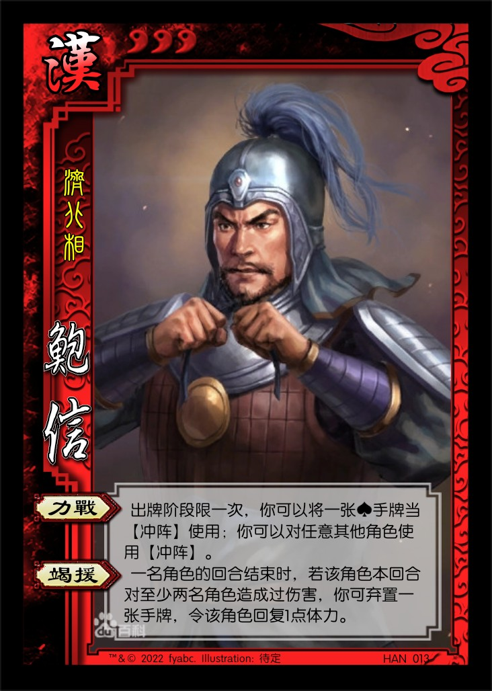 HAN013 鲍信 男 汉 3体力 称号：济北相
   1. 【力战】：出牌阶段限一次，你可以将一张♠手牌当【冲阵】使用；你可以对任意其他角色使用【冲阵】。
   2. 【竭援】：一名角色的回合结束时，若该角色本回合至少对两名角色造成过伤害，你可弃置一张手牌，令该角色回复1点体力。

   > 【竭援】可以联动曹操使用AOE和鲍信自身的【力战】技能，契合历史。  
   > 本扩展四个汉势力角色的技能包含四种花色中的各一个（鲍信为♠）。  
   > 感谢 @陸伯言 提供的设计思路：<https://zhuanlan.zhihu.com/p/492512001>  
8. 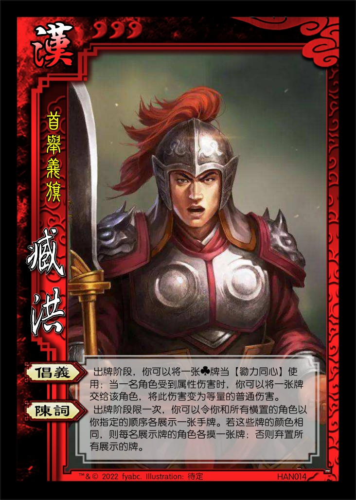 HAN014 臧洪 男 汉 3体力 称号：首举义旗
   1. 【倡义】：出牌阶段，你可以将一张♣牌当【勠力同心】使用；当一名角色受到属性伤害时，你可以将一张牌交给该角色，将此伤害变为等量的普通伤害。
   2. 【陈词】：出牌阶段限一次，你可以令你和所有横置的其他角色以你指定的顺序各展示一张手牌。若这些牌的颜色相同，则每名展示牌的角色各摸一张牌；否则弃置所有展示的牌。

   > 表现臧洪首倡讨董联军时期的事迹，【陈词】对应臧洪发表盟誓演讲的历史事件（《三国志》和《后汉书》均全文收录了演讲词）。  
   > 在【陈词】展示手牌的过程中，符合条件但没有手牌的角色被跳过，不参与展示牌和后续结算（若臧洪本人没有手牌，也会被跳过）。  
   > 【陈词】可以令友方角色摸牌，也可以令敌方角色弃牌，并且可以通过控制展示牌的顺序灵活使用。  
   > 本扩展四个汉势力角色的技能包含四种花色中的各一个（臧洪为♣）。  

----

1. 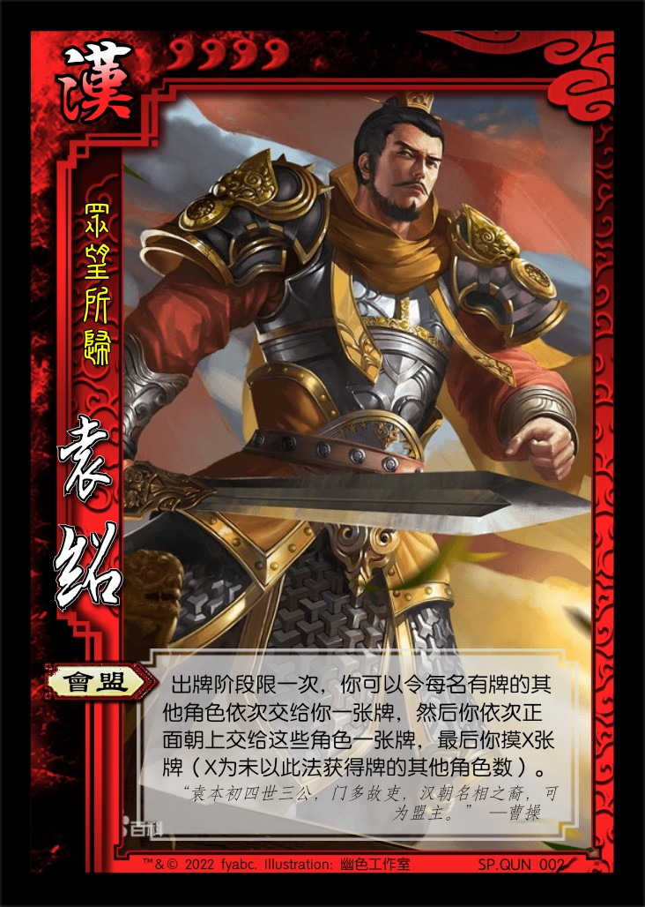 SP.QUN002 SP袁绍 男 汉 4体力 称号：众望所归
   1. 【会盟】：出牌阶段限一次，你可以令每名有手牌的其他角色依次交给你一张牌，然后你依次正面朝上交给这些角色一张牌，最后你摸X张牌（X为未以此法获得牌的其他角色数）。

2. 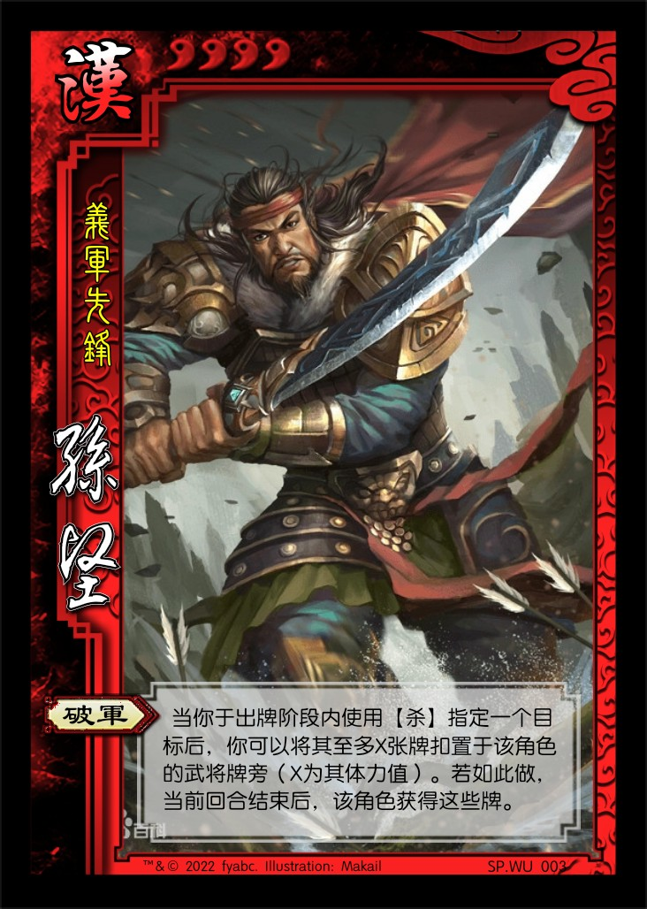 SP.WU003 SP孙坚 男 汉 4体力 称号：义军先锋
   1. 【破军】：当你于出牌阶段内使用【杀】指定一个目标后，你可以将其至多X张牌扣置于该角色的武将牌旁（X为其体力值）。若如此做，当前回合结束后，该角色获得这些牌。

   > 将官方徐盛的技能给了SP孙坚，与【古锭刀】契合。  
   > 孙坚的特性（菜刀）与联军的其他武将（传递手牌）格格不入，体现出与其他诸侯逡巡不进的状态相比，孙坚独自积极讨伐董卓的事迹。  
3. 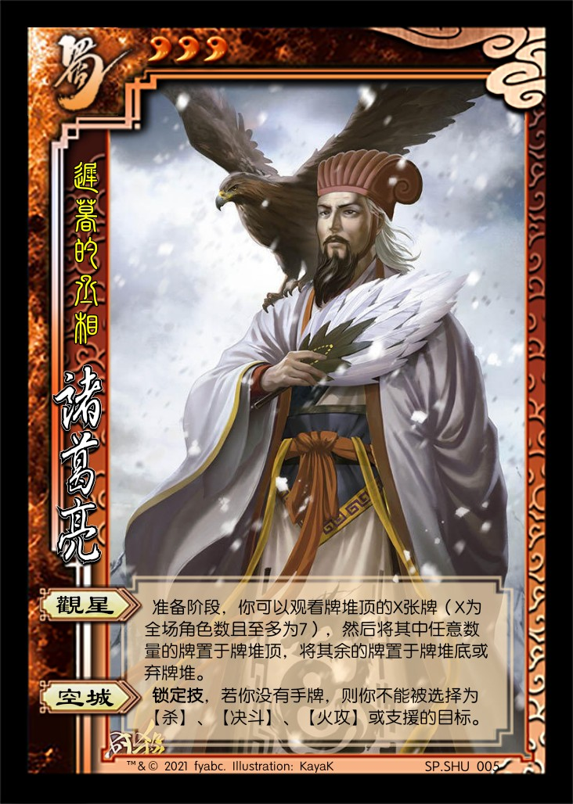 SP.SHU005 诸葛亮 男 蜀 3体力 称号：迟暮的丞相
   1. 【观星】：准备阶段，你可以观看牌堆顶的X张牌（X为全场角色数且至多为7），然后将其中任意数量的牌置于牌堆顶，将其余的牌置于牌堆底或弃牌堆。
   2. 【空城】：**锁定技**，若你没有手牌，则你不能被选择为【杀】、【决斗】、【火攻】或支援的目标。

   > 针对支援机制的微调版本，防止支援破空城。（不属于本扩展）

----

1. 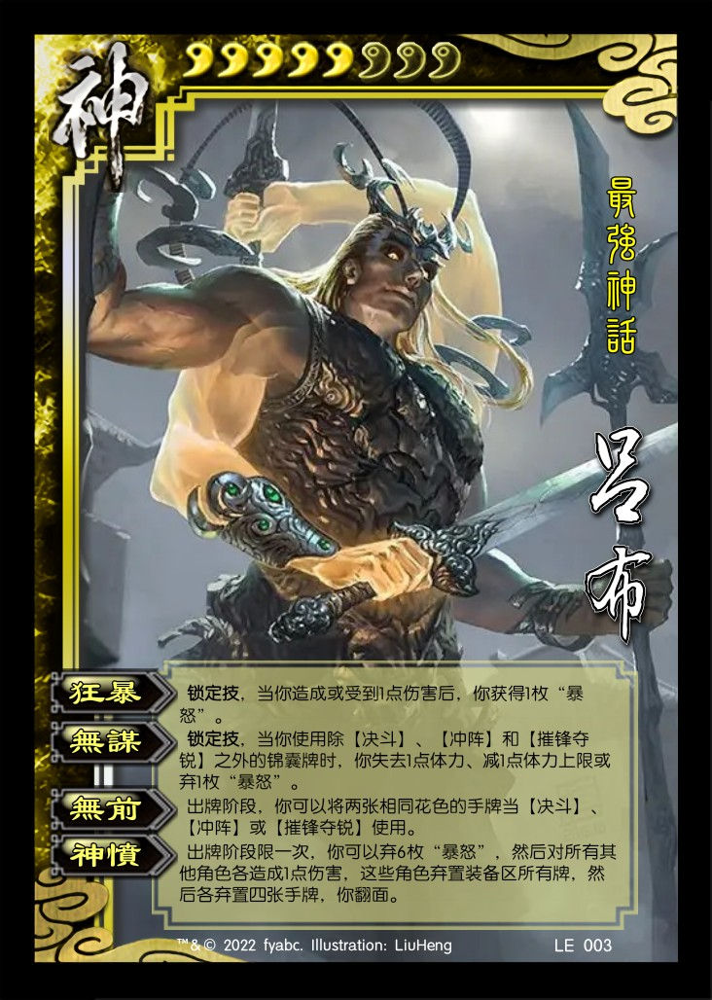 LE003 吕布 男 神 5体力/8上限 称号：最强神话  
   1. 【狂暴】：**锁定技**，当你造成或受到1点伤害后，你获得1枚“暴怒”。
   2. 【无谋】：**锁定技**，当你使用一张除【决斗】、【冲阵】和【摧锋夺锐】以外的锦囊牌时，你失去1点体力、减1点体力上限或弃1枚“暴怒”。
   3. 【无前】：出牌阶段，你可以将两张相同花色的手牌当【决斗】、【冲阵】或【摧锋夺锐】使用。
   4. 【神愤】：出牌阶段限一次，你可以弃6枚“暴怒”，然后对所有其他角色各造成1点伤害，这些角色弃置装备区所有牌，然后各弃置四张手牌，你翻面。

   > 基于官方林包神吕布的模板设计的技能，并针对该扩展特色进行了调整。  
   > 由于新【无前】造伤害能力增强，新【无谋】负面效果削弱，因此取消了开局的2枚“暴怒”。  
