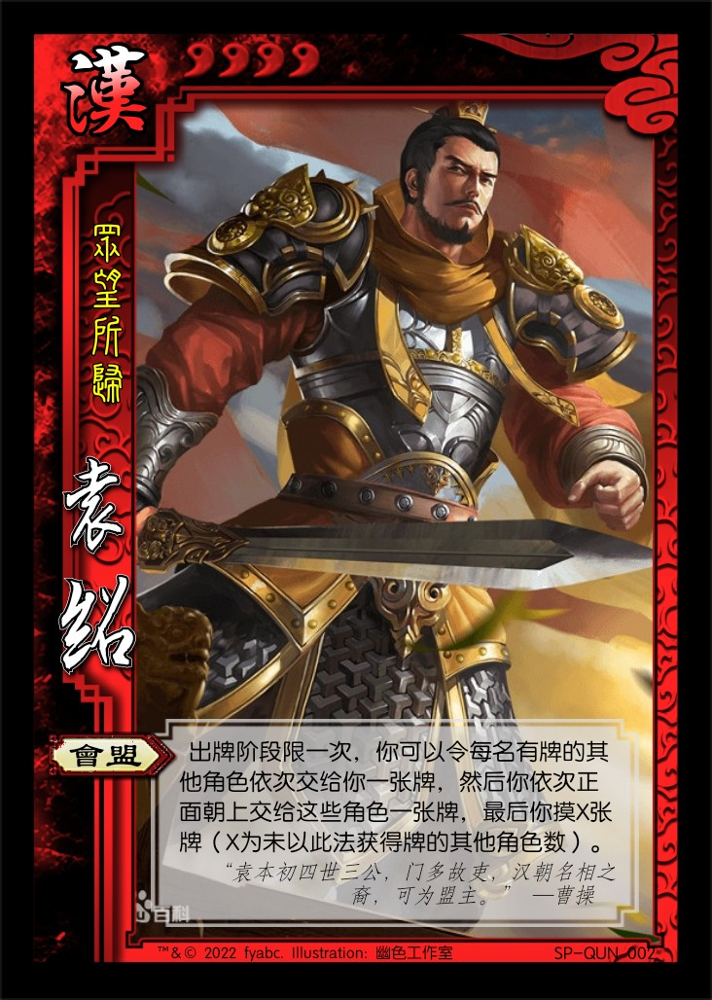

# 三国杀重生计划 扩展包3：诸侯讨董（190 - 191）

## 新概念

1. 援军牌：类似国战势备篇连横牌，可以在自己的回合将此牌（正面朝上）交给一名其他角色（此动作本身称为支援）。

## 特殊玩法说明

## 资料

1. 十八路诸侯（演义）
   1. 标准版已出现：曹操、袁术、公孙瓒、孙坚、袁绍
   2. 标准版未出现：韩馥、孔伷、刘岱、王匡、张邈、桥瑁、袁遗、鲍信、孔融、张超、陶谦、马腾、张杨
2. 虎牢关之战，装备信息：
   1. 第五回：“见吕布出阵：头戴三叉束发紫金冠，体挂西川红锦百花袍，身披兽面吞头连环铠，腰系勒甲玲珑狮蛮带”
   2. 第五回：“北海太守孔融部将武安国，使铁锤飞马而出”
   3. 第五回：“刘玄德掣双股剑，骤黄鬃马，刺斜里也来助战”
   4. 第五回：“次日筑台三层，遍列五方旗帜，上建白旄黄钺，兵符将印，请绍登坛。”
   5. 第五回：“第一个，右北平土垠人，姓程，名普，字德谋，使一条铁脊蛇矛；第二个，姓黄，名盖，字公覆，零陵人也，使铁鞭；第三个，姓韩，名当，字义公，辽西令支人也，使一口大刀；第四个，姓祖，名茂，字大荣，吴郡富春人也，使双刀。”
   6. 第五回：“孙坚披烂银铠，裹赤帻，横古锭刀，骑花鬃马”

## 游戏牌

### 全牌表

“'”表示援军牌

| 花色\点数  |    A     |   2    |    3    |    4    |    5    |   6   |    7    |     8     |   9   |  10   |    J    |    Q     |    K     |
| :-------: | :------: | :----: | :-----: | :-----: | :-----: | :---: | :------: | :-------: | :---: | :---: | :-----: | :------: | :------: |
|     ♠     |  *古锭'*  |   杀   | **偷梁** | **偷梁**|  雷杀  | 雷杀'  | **摧锋** | **破竹'** |  酒' | **兵** |   杀    | **无懈** | **勠力** |
|     ♥     | **联军** | *赤帻'* |   酒'   |   桃    |   桃    |  桃   |    桃    | **破竹'** |  闪  |   闪   |    杀    |   火杀   |  火杀'   |
|     ♣     |  *烂银*  |   杀   | **联军** | **兵**  | *鹊画'* |  杀   | **摧锋'** | **破竹'** | 雷杀 | 雷杀'  | **无懈** | **勠力** | **勠力** |
|     ♦     | **万箭** |   桃'   | **联军** |  闪     |  *+1'*  |  闪   |    闪    |    闪     |  闪  |  闪'   |   闪'   |  *铁脊*  | **摧锋** |

> 说明：  
> 1.增加了锦囊牌比例  
> 2.增加了两张【兵粮寸断】，反映袁术给孙坚断粮的典故。  
> 3.总计16张援军牌，每个花色4张。  

### 游戏牌说明

1. 【联军盛宴】：锦囊，普通  
   出牌阶段，对至多三名角色使用。每名目标角色依次摸一张牌并将一张牌置于牌堆顶。
2. 【勠力同心】：锦囊，普通  
   出牌阶段，对一名角色使用。切换该角色及所有与其相邻的角色的横置状态。  
   重铸：出牌阶段，你可以移去此牌，然后摸一张牌。

   > “切换横置状态”指将武将牌从横置（连环状态）变为竖置（非连环状态），竖置变为横置。
   > 当总角色数不大于3时，相当于切换所有角色的横置状态。  
   > 作为【铁索连环】的替代品。  
3. 【偷梁换柱】：锦囊，普通  
   当一名其他角色于其回合外获得牌时，对其使用。目标角色从获得的牌中选择一张交给你。
4. 【摧锋夺锐】：锦囊，普通  
   出牌阶段，对一名装备区中牌数比你多的角色使用。将其装备区中的一张牌移动到你的装备区（替换原装备）。

   > 当你的装备区中对应位置有牌时，【摧锋夺锐】直接替换原装备。  
   > 补充标准包中减少的拆装备手段。
5. 【势如破竹】：锦囊，普通  
   出牌阶段，对你的下家使用。其选择一项：受到你造成的1点伤害；或打出一张【闪】，并令其下家再次进行此选择。

   > 说明：当有角色选择受到伤害后，此结算终止，否则按照座位顺序不断向下传递。  
   > 【势如破竹】的结算可能影响多名角色，但目标角色只有下家一人。  
   > 【势如破竹】的结算可能转回自己。特殊情况：单挑情况下，【势如破竹】类似于双方打出【闪】版本的【决斗】。  
   > 所有【势如破竹】均为援军牌，与位置相关的效果相配合，类似官方国战中的【火烧连营】。  
6. 【古锭刀】：装备，武器 攻击范围：2  
   **锁定技**，当你使用【杀】对目标角色造成伤害时，若其没有手牌，此伤害+1。

   > TODO：是否需要修改效果？
7. 【铁脊蛇矛】：装备，武器 攻击范围：3
8. 【鹊画弓】：装备，武器 攻击范围：5  
   你可以将一张手牌当【杀】使用。若如此做，此【杀】结算完成后，你进行判定，若结果为♠，你移去此【鹊画弓】。

   > 引文：“坚取箭，连放两箭，皆被华雄躲过。再放第三箭时，因用力太猛，拽折了鹊画弓，只得弃弓纵马而奔。”  ——《三国演义》
9. 【烂银铠】：装备，防具
10. 【赤帻】：装备，防具
11. 【白鹤】：装备，+1马

   > 引文：“凭空虚跃，曹家白鹤。” ——佚名  
   > 传说中曹洪的坐骑。为援军牌，符合“曹洪赠马”的典故。

## 场景牌

## 武将

1.  华雄 男 群 4体力
   1. 【搦战】：准备阶段，你可以视为使用一张【决斗】。该【决斗】的结算中，你每次需打出两张【杀】。
   2. 【耀武】：当你杀死一名角色后，你可以回复1点体力或摸一张牌。

2.  韩馥 男 群 3体力
3.  孔融 男 群 3体力
   1. 【礼让】：出牌阶段，你可以将一张红桃手牌当援军牌使用；当你于出牌阶段发动第一次支援后，可以摸一张牌。
   2. 【名士】：TODO

----

1.  SP袁绍 男 群 4体力 称号：众望所归
   1. 【会盟】：出牌阶段限一次，你可以令每名其他角色依次交给你一张牌，然后你依次交给这些角色一张牌。

2.  SP孙坚 男 群 4体力 称号：江东的猛虎
   1. 【某某】：出牌阶段限一次，你可以将一张黑色手牌当【摧锋夺锐】使用。若你以此法获得了宝物牌，你回复1点体力。

----

1.  吕布 男 神 5体力 称号：最强神话  
   1. 【无前】：出牌阶段，你可以将两张相同花色的手牌当【势如破竹】使用。
