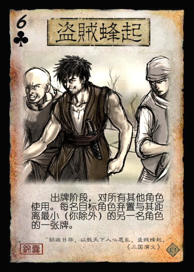

# 三国杀重生计划 扩展包4：文和乱武（192 - 195）

## 新概念

## 特殊玩法说明

## 临时资料

1. 飞熊军：董卓骑兵精锐
2. 豹掠军、虎贲军、凤瑶军、龙骧军：均来自官方诸侯伐董模式
   1. 飞熊狼牙棒、豹掠弯刀、虎贲巨锤、龙骧长枪、凤瑶轻剑

## 游戏牌

### 全牌表

| 花色\点数 |   A   |   2   |   3   |   4   |   5   |   6   |   7   |   8   |   9   |  10   |   J   |   Q   |   K   |
| :-------: | :---: | :---: | :---: | :---: | :---: | :---: | :---: | :---: | :---: | :---: | :---: | :---: | :---: |
|     ♠     |**乱武**| *鱼鳞* |   酒   |**析骸**| *大驾* |   杀   |**绝处**|  血杀  |  血杀  |**盗贼**|  雷杀  |  雷杀  | *狼牙* |
|     ♥     |**绝处**|   桃   |   桃   |**析骸**| **顺** | *巨锤* |   闪   |   闪   |   闪   |**盗贼**|  血杀  |  血杀  |   桃   |
|     ♣     |**饥荒**| *鱼鳞* | **拆** |  血杀  |   杀   |   杀   |   杀   |   杀   |   酒   |  血杀  |  血杀  |**绝处**| *弯刀* |
|     ♦     | *拂尘* |   闪   |   闪   |   闪   |   桃   |  火杀  |  血杀  |  血杀  |   闪   |   闪   |   闪   | *长枪* |**乱武**|

统计： 总 164，标+EX 112，扩展4 52  
注：括号内为扩展4牌数量

1. 基本牌 85 (32) 51.829%
   1. 杀 45 (17) 27.439%
      1. 黑色 30 (12) 18.293%
      2. 红色 15 (5) 9.146%
      3. 普通杀 34 (14) 20.732%
         1. 血杀 9 (9) 5.488%
      4. 属性杀 11 (3) 6.707%
         1. 雷杀 7 (2) 4.268%
         2. 火杀 4 (1) 2.439%
   2. 闪 23 (9) 14.024%
      1. ♥ 7 (3) 4.268%
      2. ♦ 16 (6) 9.756%
   3. 桃 12 (4) 7.317%
      1. ♥ 9 (3) 5.488%
      2. ♦ 3 (1) 1.829%
   4. 酒 5 (2) 3.049%
2. **锦囊牌** 49 (12) 29.878%
   1. 普通 43 (11) 26.220%
      - 决斗 2 顺 5 (1) 拆 6 (1)
      - 借刀 2 无中 4 无懈 3
      - 南蛮 3 万箭 1 桃园 1
      - 五谷 2 火攻 2 铁索 3
      - 乱武 2 (2) 析骸 2 (2) 绝处 3 (3) 盗贼 2 (2)
   2. 延时 6 (1) 3.659%
      - 闪电 1 乐 2 兵 2 饥荒 1 (1)
3. *装备牌* 30 (8) 18.293%
   1. 武器 15 (4) 9.146%
   2. 防具 6 (2) 3.659%
   3. 坐骑 7 (1) 4.268%
      1. +1马 3 1.829%
      2. -1马 4 (1) 2.439%
   4. 宝物 2 (1) 1.220%

> 说明：  
> 1.该扩展伤害类AOE和弃牌效果较多，可能类似于官方“文和乱武”模式的环境。  
> 2.该扩展引入血【杀】和【绝处逢生】对大量伤害进行一定的平衡。  
> 3.董卓四将的四把武器分别分布于四种花色，且和各自拥有者配合较好。

### 游戏牌说明

1.  血【杀】：基本  
   属于【杀】的一种。当你使用血【杀】造成伤害时，你可以进行判定，若结果不小于4X（X为你的体力值），你回复1点体力。

   > 血【杀】造成的伤害为普通伤害。
   > 考虑到该扩展的大量AOE，增加血【杀】，为低血量角色提供一个额外的回复机会。
2.  【文和乱武】：锦囊，普通  
   出牌阶段，对所有其他角色使用。目标角色依次选择一项：1.对其最近的另一名角色使用一张【杀】；2.失去1点体力。

   > 引文：“我自冷眼看世界，不闻天下是与非。”  
   > ♠A和♦K，一头一尾各一张【文和乱武】，显示扩展主题。  
3.  【析骸而爨】：锦囊，普通  
   当一名角色脱离濒死状态后，对你或该角色使用。目标角色摸三张牌。  
   当一名角色死亡后，对至多三名角色使用。目标角色回复1点体力。  

   > 引文：“华元曰：‘敝邑易子而食，析骸以爨。’” ——《左传·宣公十五年》  
   > 以“分食尸体”的效果契合锦囊的名称。  
   > 为提高该锦囊的使用频率，设定了两个使用时机。  
4.  【绝处逢生】：锦囊，普通  
   当你成为其他角色使用基本牌或锦囊牌的目标后，对该牌使用。此牌对你无效，然后若你的体力值为最小，你回复1点体力；若你的手牌数为最少，你摸一张牌。

   > 参考了官方“忠胆英杰”模式中的【金蝉脱壳】的设计，增加额外的回复功能，作为【无懈可击】的替代品。  
5.  【饥荒】：锦囊，延时  
   出牌阶段，对你使用。将【饥荒】放置于你的判定区里。若判定结果为♣2~9，则目标角色弃置四张牌且跳过本回合的摸牌阶段。若判定不为此结果，将之移动到下家的判定区里。

   > 模仿【闪电】的效果。  
6.  【飞熊狼牙棒】：装备，武器 攻击范围：3  

   > 生造的李傕/飞熊军的武器，来源于官方“诸侯伐董”模式。  
7.  【豹掠弯刀】：装备，武器 攻击范围：2  

   > 生造的郭汜/豹掠军的武器，来源于官方“诸侯伐董”模式。  
8.  【虎贲巨锤】：装备，武器 攻击范围：3  

   > 生造的樊稠/虎贲军的武器，来源于官方“诸侯伐董”模式。  
9.  【龙骧长枪】：装备，武器 攻击范围：4  

   > 生造的张济/龙骧军的武器，来源于官方“诸侯伐董”模式。  
10.  【鱼鳞甲】：装备，防具  
11.  【乘舆大驾】：装备，-1马  

   > 引文：“乘舆大驾，公卿奉引，大仆卿，大将军参乘。属车八十一乘，备千乘万骑。西都行祠天郊，甘泉备之。” ——《后汉书.舆服志》  
12.  【拂尘】：装备，宝物  

----

来自其他扩展的游戏牌：

1. 

## 武将

1.  李傕 男 群 4体力 QUN023
2.  郭汜 男 群 4体力 QUN024
3.  樊稠 男 群 4体力 QUN025
4.  张济 男 群 4体力 QUN026
5.  杨奉&韩暹 男 汉 4体力 HAN015
   1. 【护归】：
6.  董承 男 汉 4体力 HAN016
7.  杨彪 男 汉 3体力 HAN017
8.  张杨 男 汉 4体力 HAN018

----

1.  刘协 男 汉 3体力 SP-HAN001
   1. 【危境】：TODO（一名其他角色的回合结束时，若你在本回合受到过伤害，该角色可以令你交给其一张手牌。）
   2. 【劝和】：TODO（当你失去牌时，……）
2.  徐晃 男 汉 4体力 SP-WEI-TODO

----

1.  贾诩 男 神 3体力 LE004
