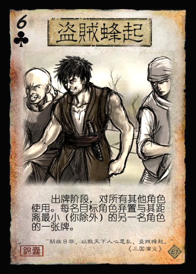
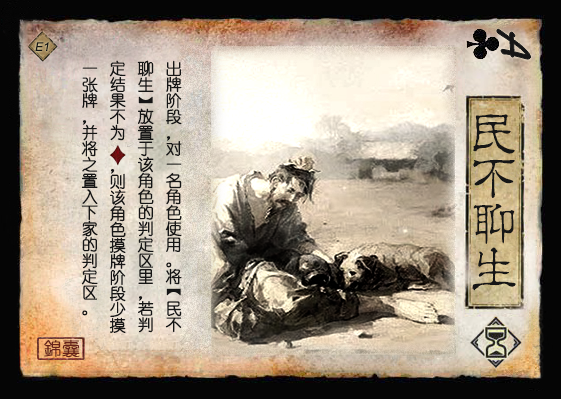
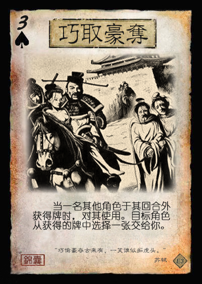

# 三国杀重生计划 扩展包4：文和乱武（192 - 195）

## 新概念

## 特殊玩法说明

## 游戏牌

### 全牌表

| 花色\点数 |   A   |   2   |   3   |   4   |   5   |   6   |   7   |   8   |   9   |  10   |   J   |   Q   |   K   |
| :-------: | :---: | :---: | :---: | :---: | :---: | :---: | :---: | :---: | :---: | :---: | :---: | :---: | :---: |
|     ♠     |**乱武**|       |       |       |       |       |       |       |       |       |       |       |       |
|     ♥     |       |       |       |       |       |       |       |       |       |       |       |       |       |
|     ♣     |       |       |       |       |       |       |       |       |       |       |       |       |       |
|     ♦     |       |       |       |       |       |       |       |       |       |       |       |       |**乱武**|

统计： 总 164，标+EX 112，扩展4 52  
注：括号内为扩展4牌数量

1. 基本牌 53 (XX) 48.780%
   1. 杀 28 (XX) 23.780%
      1. 黑色 18 (XX) 15.854%
      2. 红色 10 (XX) 7.927%
      3. 普通杀 20 (XX) 15.244%
      4. 属性杀 8 (XX) 8.537%
         1. 雷杀 5 (XX) 5.488%
         2. 火杀 3 (XX) 3.049%
   2. 闪 14 (XX) 14.024%
      1. ♥ 4 (XX) 3.659%
      2. ♦ 10 (XX) 10.366%
   3. 桃 8 (XX) 7.927%
      1. ♥ 6 (XX) 6.098%
      2. ♦ 2 (XX) 1.829%
   4. 酒 3 (XX) 3.049%
2. **锦囊牌** 37 (XX) 34.146%
   1. 普通 34 (XX) 29.878%
      - 决斗 2 顺 4 拆 5
      - 借刀 2 无中 4 无懈 3
      - 南蛮 3 万箭 1 桃园 1
      - 五谷 2 火攻 2 铁索 3
      - 乱武 2 (2)
   2. 延时 5 (XX) 4.2688%
      - 闪电 1 乐 2 兵 2
3. *装备牌* 22 (XX) 17.073%
   1. 武器 11 (XX) 8.537%
   2. 防具 4 (XX) 3.659%
   3. 坐骑 6 (XX) 4.268%
      1. +1马 3 2.439%
      2. -1马 3 1.829%
   4. 宝物 2 (1) 1.220%

> 说明：  

### 游戏牌说明

1.  血【杀】：基本  
   属于【杀】的一种。当你使用血【杀】造成伤害时，你可以进行判定，若结果不小于4X（X为你的体力值），你回复1点体力。

   > 血【杀】造成的伤害为普通伤害。
   > 考虑到该扩展的大量AOE，增加血【杀】，为低血量角色提供一个额外的回复机会。
2.  【文和乱武】：锦囊，普通  
   出牌阶段，对所有其他角色使用。目标角色依次选择一项：1.对其最近的另一名角色使用一张【杀】；2.失去1点体力。

   > 引文：“我自冷眼看世界，不闻天下是与非。”  
   > ♠A和♦K，一头一尾各一张【文和乱武】，显示扩展主题。  
3.  【析骸而爨】：锦囊，普通  
   当一名角色脱离濒死状态后，对你或该角色使用。目标角色摸三张牌。  
   当一名角色死亡后，对至多三名角色使用。目标角色回复1点体力。  

   > 引文：“华元曰：‘敝邑易子而食，析骸以爨。’” ——《左传·宣公十五年》
   > 以“分食尸体”的效果契合锦囊的名称。  
   > 为提高该锦囊的使用频率，设定了两个使用时机。  
4.  【拂尘】：装备，宝物

----

来自其他扩展的游戏牌：

1. 
2. 
3. 

## 场景牌

## 武将

1.  李傕 男 群 4体力 QUN023
2.  郭汜 男 群 4体力 QUN024
3.  樊稠 男 群 4体力 QUN025
4.  张济 男 群 4体力 QUN026
5.  杨奉&韩暹 男 汉 4体力 HAN015
   1. 【护归】：
6.  董承 男 汉 4体力 HAN016
7.  杨彪 男 汉 3体力 HAN017
8.  张杨 男 汉 4体力 HAN018

----

1.  刘协 男 汉 3体力 SP-HAN001
   1. 【危境】：TODO（一名其他角色的回合结束时，若你在本回合受到过伤害，该角色可以令你交给其一张手牌。）
   2. 【劝和】：TODO（当你失去牌时，……）
2.  徐晃 男 汉 4体力 SP-WEI-TODO

----

1.  贾诩 男 神 3体力 LE004
