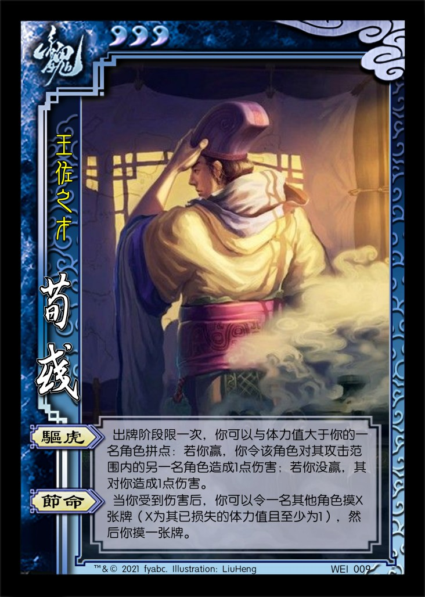

# 废弃的旧版设计

1.  刘宏 男 汉 5体力 称号：汉灵帝
   1. 【鬻爵】：其他角色的出牌阶段限一次，该角色可以展示并交给你一张牌。若此牌为：黑色，其弃置场上的一张牌；红色，其摸一张牌。
   2. 【党锢】：**锁定技**，摸牌阶段，你改为令所有手牌数大于你的其他角色依次选择一项：交给你一张牌，或本回合所有非锁定技失效。
   3. 【裸游】：**锁定技**，结束阶段，你展示所有手牌，然后你观看一名女性角色的所有手牌。
   4. 【天威】：**主公技**，准备阶段，你可以弃置一张牌，移去一名角色判定区内的一张牌。

   > 【裸游】出处：“帝盛夏避暑于裸游馆，长夜饮宴。  ——《拾遗记》”
   > 目标是设计为高体力带有负面技能的武将，符合三国杀对昏君/暴君的设计惯例（董卓、孙晧）

2.  荀彧 男 魏 3体力 称号：王佐之才
   1. 【驱虎】：出牌阶段限一次，你可以与体力值大于你的一名角色拼点：若你赢，你令该角色对其攻击范围内的另一名角色造成1点伤害；若你没赢，其对你造成1点伤害。
   2. 【节命】：当你受到伤害后，你可以令一名角色将手牌摸至三张。
3.  荀彧 男 魏 3体力 称号：王佐之才
   1. 【驱虎】：出牌阶段限一次，你可以与体力值大于你的一名角色拼点：若你赢，你令该角色对其攻击范围内的另一名角色造成1点伤害；若你没赢，其对你造成1点伤害。
   2. 【节命】：当你受到伤害后，你可以令一名其他角色摸X张牌（X为其已损失的体力值且至少为1，至多为4），然后你摸一张牌。
4.  WEI009 荀彧 男 魏 3体力 称号：王佐之才
   1. 【驱虎】：出牌阶段限一次，你可以与体力值大于你的一名角色拼点：若你赢，你令该角色对其攻击范围内的另一名角色造成1点伤害；若你没赢，其对你造成1点伤害。
   2. 【节命】：当你受到伤害后，你可以令一名角色将手牌摸至四张。
5.  许褚 男 魏 4体力 称号：虎痴
   1. 【裸衣】：出牌阶段限一次，你可以弃置一张牌，然后本回合你使用【杀】或【决斗】造成伤害时，此伤害+1。
6.  SHU003 关羽 男 蜀 4体力 称号：美髯公
   1. 【武圣】：若你的体力值大于0，你可以将一张红色牌当【酒】或【杀】使用或打出。
7.  赵云 男 蜀 4体力 称号：少年将军
   1. 【龙胆】：你可以将一张【杀】/【闪】当【闪】/【杀】使用或打出。
   2. 【救主】：当一名其他角色需要使用或打出一张【杀】/【闪】时，其可以令你选择是否打出一张【杀】/【闪】。若你选择是，视为该角色使用或打出了一张【杀】/【闪】。
8.  QUN007 华佗 男 群 3体力 称号：神医
   1. 【急救】：你的回合外，你可以将一张红色牌当【桃】使用。
   2. 【除疠】：出牌阶段限一次，你可以观看一名角色的所有手牌，然后你可以弃置其中的一张♠牌。若如此做，该角色回复1点体力。

----

1.  【冲阵】：锦囊，普通  
   出牌阶段，对你的下家使用。其选择一项：受到你造成的1点伤害；或打出一张【闪】，并令其下家再次进行此选择。

   > 说明：当有角色选择受到伤害后，此结算终止，否则按照座位顺序不断向下传递。  
   > 【冲阵】的结算可能影响多名角色，但目标角色只有下家一人。  
   > 【冲阵】的结算可能转回自己。特殊情况：单挑情况下，【冲阵】类似于双方打出【闪】版本的【决斗】。  
   > 所有【冲阵】均为援军牌，与位置相关的效果相配合，类似官方国战中的【火烧连营】。  
