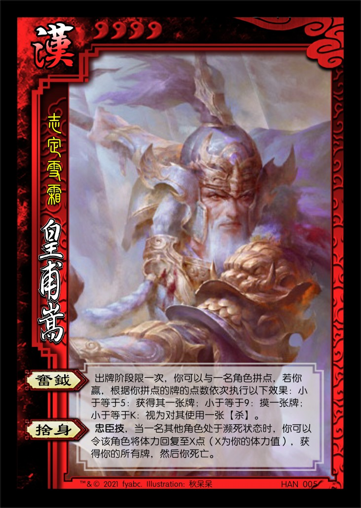
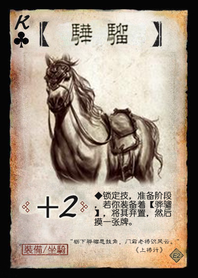

# 废弃的旧版设计

1.  刘宏 男 汉 5体力 称号：汉灵帝
   1. 【鬻爵】：其他角色的出牌阶段限一次，该角色可以展示并交给你一张牌。若此牌为：黑色，其弃置场上的一张牌；红色，其摸一张牌。
   2. 【党锢】：**锁定技**，摸牌阶段，你改为令所有手牌数大于你的其他角色依次选择一项：交给你一张牌，或本回合所有非锁定技失效。
   3. 【裸游】：**锁定技**，结束阶段，你展示所有手牌，然后你观看一名女性角色的所有手牌。
   4. 【天威】：**主公技**，准备阶段，你可以弃置一张牌，移去一名角色判定区内的一张牌。

   > 【裸游】出处：“帝盛夏避暑于裸游馆，长夜饮宴。  ——《拾遗记》”
   > 目标是设计为高体力带有负面技能的武将，符合三国杀对昏君/暴君的设计惯例（董卓、孙晧）

2.  荀彧 男 魏 3体力 称号：王佐之才
   1. 【驱虎】：出牌阶段限一次，你可以与体力值大于你的一名角色拼点：若你赢，你令该角色对其攻击范围内的另一名角色造成1点伤害；若你没赢，其对你造成1点伤害。
   2. 【节命】：当你受到伤害后，你可以令一名角色将手牌摸至三张。
3.  荀彧 男 魏 3体力 称号：王佐之才
   1. 【驱虎】：出牌阶段限一次，你可以与体力值大于你的一名角色拼点：若你赢，你令该角色对其攻击范围内的另一名角色造成1点伤害；若你没赢，其对你造成1点伤害。
   2. 【节命】：当你受到伤害后，你可以令一名其他角色摸X张牌（X为其已损失的体力值且至少为1，至多为4），然后你摸一张牌。
4.  WEI009 荀彧 男 魏 3体力 称号：王佐之才
   1. 【驱虎】：出牌阶段限一次，你可以与体力值大于你的一名角色拼点：若你赢，你令该角色对其攻击范围内的另一名角色造成1点伤害；若你没赢，其对你造成1点伤害。
   2. 【节命】：当你受到伤害后，你可以令一名角色将手牌摸至四张。
5.  许褚 男 魏 4体力 称号：虎痴
   1. 【裸衣】：出牌阶段限一次，你可以弃置一张牌，然后本回合你使用【杀】或【决斗】造成伤害时，此伤害+1。
6.  许褚 男 魏 4体力 称号：虎痴
   1. 【裸衣】：摸牌阶段，你可以少摸一张牌，然后视为使用一张【杀】或【决斗】。
7.  SHU003 关羽 男 蜀 4体力 称号：美髯公
   1. 【武圣】：若你的体力值大于0，你可以将一张红色牌当【酒】或【杀】使用或打出。
8.  赵云 男 蜀 4体力 称号：少年将军
   1. 【龙胆】：你可以将一张【杀】/【闪】当【闪】/【杀】使用或打出。
   2. 【救主】：当一名其他角色需要使用或打出一张【杀】/【闪】时，其可以令你选择是否打出一张【杀】/【闪】。若你选择是，视为该角色使用或打出了一张【杀】/【闪】。
9.  SHU007 马超 男 蜀 4体力 称号：一骑当千
   1. 【马术】：**锁定技**，你计算与其他角色的距离-1。
   2. 【铁骑】：当你使用【杀】指定一个目标后，你可以进行判定，若结果为：红色，该角色不能使用【闪】响应此【杀】；黑色，本回合该角色所有非锁定技失效。
10.  QUN007 华佗 男 群 3体力 称号：神医
   1. 【急救】：你的回合外，你可以将一张红色牌当【桃】使用。
   2. 【除疠】：出牌阶段限一次，你可以观看一名角色的所有手牌，然后你可以弃置其中的一张♠牌。若如此做，该角色回复1点体力。
11.  HAN005 皇甫嵩 男 汉 4体力 称号：志定雪霜
   1. 【奋钺】：出牌阶段限一次，你可以与一名角色拼点，若你赢，根据你拼点的牌的点数依次执行以下效果：小于等于5：获得其一张牌；小于等于9：摸一张牌；小于等于K：视为对其使用一张【杀】。
   2. 【舍身】：**忠臣技**，当一名其他角色处于濒死状态时，你可以令该角色将体力回复至X点（X为你的体力值），获得你的所有牌，然后你死亡。

   > 根据官方设计略微修改。
12.  SP-SHU001 SP刘备 男 汉 4体力 称号：汉嗣仁裔
    1. 【聚义】：**限定技**，结束阶段，你可以选择包含你的二至三名角色，这些角色各回复1点体力并获得技能“同心”。
    2. 【宗室】：**锁定技**，你的手牌上限+X（X为全场势力数）。

    > 【同心】：摸牌阶段，你可以改为令一名拥有技能“同心”的其他角色摸等量的牌。
13.  WEI006 张辽 男 魏 4体力 称号：前将军
    1. 【突袭】：摸牌阶段，你可以改为获得至多两名角色的各一张手牌。

    > 强度有点高，但描述简洁，而且也有攻击力不足的弱点，所以保持原样。
14.  WU006 甘宁 男 吴 4体力 称号：锦帆游侠
    1. 【奇袭】：你可以将一张黑色牌当【过河拆桥】使用。

----

1.  【黄钺】：装备，武器 攻击范围：3  
   你拼点的牌亮出后/你的判定牌生效前，你可以令其点数-2、+2或变为2（点数最小为A，最大为K）。

   > 点数为♠Q，使用时替换♠Q【飞石】。  
   > 与皇甫嵩【奋钺】契合。  
   > 引文：“阚泽曰：‘古之命将，必筑坛会众，赐白旄黄钺、印绶兵符，然后威行令肃…’  ——《三国演义》”
2.  【骅骝】：装备，+2马  
   **锁定技**，准备阶段，若你装备着【骅骝】，将其弃置，然后摸一张牌。

   > 引文：“枥下骅骝思鼓角，门前老将识风云。” ——《上将行》  
   > 一个持续一回合的加强版+1马。  
