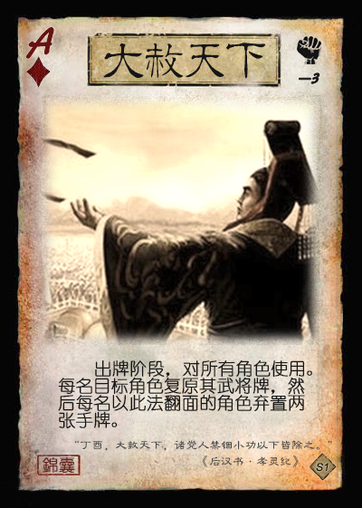
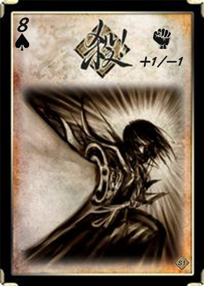

# 三国杀重置计划 新场景1：黄巾起义

## 背景

东汉末年，民不聊生，人心思变，一位名叫张角的道士借传教之机，暗中勾连各方势力，欲行大事……

## 游戏规则

1. 人数：6人
   1. **TODO**：设计支持其他人数的更多模式
2. 阵营划分
   1. 黄巾与汉廷两大势力对抗
3. 游戏流程
   1. 确定民愤
      1. 将民愤值指示物放在民愤记录条上0的位置。并令最大民愤值X=20、主帅死亡民愤值Y1=8、大将死亡民愤值Y2=5、重整回合数N=4。
   2. 确定阵营
      1. 将6张身份牌（1黄巾主帅、2黄巾大将、1汉廷主帅、2汉廷大将）随机分发给所有玩家，然后亮出身份。
      2. 若出现同一阵营的三个身份座位相连的情况，则将黄巾阵营中位于中间的身份和汉廷阵营中位于中间的身份交换。
         1. 防止同一阵营三连动。
   3. 选择武将
      1. 黄巾和汉廷分别拥有一个专属武将池，此外双方还有一个公共武将池，列举如下（带“+”号表示拥有主公技，*斜体*表示本模式专属武将）。
         1. 黄巾专属武将池：张角+、张宝+、张梁+、张燕、黄巾雷使、*张曼成*、*马元义*、*波才*、*程远志*、*严政*
         2. 汉廷专属武将池：刘宏+、皇甫嵩+、朱儁+、卢植、张让、董卓、曹操、刘备、刘焉、*封谞*
         3. 公共武将池：**TODO：20个**
         4. *说明*：公共武将池中包含后来参与讨伐黄巾的武将，这里可视为IF世界线：这些人才对汉室失望，被黄巾招募。
      2. 选择武将流程
         1. 双方分别从各自的专属武将池中随机选出6个武将，从其中选择3个武将，扣置在己方备战区中。
         2. 从公共武将池中随机选出6个武将，向双方展示。
         3. 从汉廷势力开始，双方主帅按照 1-2-2-1 的顺序依次从上述展示的公共武将中选择武将加入自己的备战区。
            1. 最终双方备战区各自拥有3+3=6名武将。
         4. 双方主帅和大将依次从本方的备战区中选择一名武将作为自己的出战武将。
            1. **可选规则**：本方所有出战武将均由主帅指定。
      3. 双方主帅的初始体力值和体力上限+1，且若拥有主帅技则主帅技生效。
   4. 分发起始手牌
      1. 每人分发四张起始手牌。
   5. 进行游戏
      1. 从*黄巾主帅*开始，按逆时针方向依次进行回合。黄巾主帅视为1号位玩家，1号位玩家的回合开始时视为新一轮的开始。
      2. 每轮开始时，*1号位角色*进行**民愤判定**，根据结果增减民愤：♠=+2，♣=+1，♦=0，♥=-1。
   6. 卡牌与技能的特殊规则
      1. **主帅技**：作为主帅时生效的技能，类似于身份模式的主公技。
      2. **重整技**：当一名角色处于重整状态时生效的技能。
      3. 部分游戏牌右上角有民愤增减的标记，使用此牌时*可以*执行该民愤增减效果。
         1. **可选规则**：使用此牌时*必须*执行该民愤增减效果，但带有民愤增减的牌可以被重铸。
      4. 目标数大于一个的锦囊牌结算时，由锦囊的使用者决定按照顺时针或者逆时针依次结算。
      5. 民愤利用机制
         1. 所有角色获得特殊技能【民心向背】：每轮每阵营各限一次，当一名黄巾/汉廷势力角色需要使用或打出一张【杀】或【闪】时，其可以令民愤-2/+2，视为使用或打出了一张【杀】或【闪】。
            1. *注意*：每个阵营角色使用该技能后，民愤向相反方向变化2。
            2. 实际使用中，两阵营分别拥有一个【民心向背】技能标记牌，每轮开始时翻至正面朝上，使用后翻至背面朝上。
   7. 角色死亡与重整
      1. 当一名黄巾/汉廷阵营的角色死亡时，杀死该角色的角色摸两张牌，并按照击杀奖励增减相应的民愤值Y1/Y2。
         1. **可选规则**：仅当一名角色被对面阵营的角色杀死时才能执行增减民愤值，被友方角色杀死或因无来源伤害死亡不能增减民愤值。
      2. 当一名角色死亡时，其进入N回合的重整状态。重整规则具体如下（参考了虎牢关模式的重整规则，并设计了几种变体）：
         1. 每次当轮到该重整角色时，其获得1个“重整”标记。（若有角色在自己的回合死亡，死亡的当回合不能获得重整标记）
         2. **复活变体规则1**：当重整标记数达到N时，该角色以满体力状态复活，并且摸三张牌（但本回合仍不能行动，需等到下一轮才可以开始行动）。
            1. 武将选择的**可选规则**：当一名角色复活时，该角色可以选择用己方备战区中的一名武将替换当前武将，原武将进入备战区。
         3. **复活变体规则2**：与变体规则1类似，但当重整标记数达到N时，复活改为非锁定（可以选择看局势在合适时机复活）。
            1. 武将选择的**可选规则**：当一名角色复活时，该角色可以选择用己方备战区中的一名武将替换当前武将，原武将进入备战区。
         4. **复活变体规则3**：当一名角色死亡时，若备战区中没有牌，则该角色*无法复活*；若备战区仍有武将，则按照变体规则1或2进行正常重整流程。
            1. 武将选择：当一名角色复活时，从备战区选出一张武将牌替换当前武将，原武将移出游戏。
         5. 重整规则的设计是为了增加身份等其他模式下先死亡角色的游戏参与度。
      3. 说明
         1. 重整角色视为已死亡，不计入座次计算，不能成为卡牌和技能的目标，也不能使用**重整技**之外的任何卡牌和技能。
   8. 胜利条件
      1. **军事胜利**：当一个*回合*结束时，若一个阵营的所有角色均处于重整状态，则另一阵营胜利。
      2. **民愤胜利**：当一*轮*结束时，若民愤不小于X，则黄巾胜利；若民愤不大于-X，则汉廷胜利。

## 游戏牌

### 全牌表

该模式牌堆基于标准版+扩展1的牌堆，并进行微调。

| 花色\点数 |   A    |   2    |   3    |   4   |   5    |   6    |   7    |   8    |   9    |   10   |   J    |   Q   |   K    |
| :-------: | :----: | :---: | :----: | :----: | :----: | :----: | :----: | :---: | :----: | :----: | :----: | :----: | :----: |
|     ♠     |**黄天 +2**| *八卦* | **拆** | **拆** | *青龙* | **乐** |**南蛮**| 杀 +1/-1 |   杀   | **兵** |**无懈**| *丈八* | *-1马* |
|     ♠     | *玉玺* | *雌雄* | **顺** | **顺** | *+1马* | *青釭* |  雷杀  |  雷杀  |   杀   |**铁索**| **顺** | **拆** |**南蛮**|
|     ♠     | *太平* | *黄巾* |**雷符**|**雷符**| *黄巾* |**盗贼**|  雷杀  |  雷杀  |   酒   |   杀   |   杀   | *飞石*  |**无懈**|
|    ♠EX    |        | *寒冰* |       |        |        |        |        |        |   酒   |       |        |        |        |
|     ♥     |**桃园**| 闪 2→0 |**火攻**|   桃   | *麒麟* |   桃   |   桃   |   桃   |   桃   |   杀   |   杀   |   桃   | *+1马* |
|     ♥     |**万箭**|   闪   |**五谷 -1**|**五谷 -1**| *-1马* | **乐** |**无中**|**无中**|**无中**|   杀   |**无中**| **拆** |   闪   |
|     ♥     |**汉道 -2**|   杀   |   桃   |   桃   |   桃   |   桃   |  火杀  |  闪   |   闪   |**雷符** |   闪   |**闪电**|**无懈**|
|    ♥EX    |        |       |        |        |  火杀  |        |        |        |       |         |        |   闪   |       |
|     ♣     | *连弩* | *藤甲* | **拆** |   杀   | *+1马* | *白银* |**南蛮**|   杀   |   杀   |   杀   |   杀   |**借刀**|**借刀**|
|     ♣     |**决斗**|   杀   |   杀   |   杀   |   杀   |  雷杀  |  雷杀  |  雷杀  |   杀   | **兵** |**铁索**|**铁索**|**无懈**|
|     ♣     |**民不 +2**| *黄巾* |  雷杀  |  雷杀  | *-1马* |**盗贼**|   杀   |   杀   |   杀   |   杀   |   杀   |**铁索**|**铁索**|
|    ♣EX    |        | *仁王* |       |        |        |        |        |        | 酒 2→0 |        |        |       |        |
|     ♦     | *连弩* |   闪   |   闪   |  火杀  |  火杀  |   闪   |   闪   |   闪   |   酒   |   闪   |   闪   |   桃   |   杀   |
|     ♦     |**决斗**|**火攻**|   桃   | **顺** | *贯石* |   闪   |   闪   |   杀   |   杀   |   杀   |   闪   | *方天* | *-1马* |
|     ♦     |**大赦 -3**| *法剑* |   桃   |  火杀  |   闪   |   闪   |   闪   |   闪   |   杀   |   闪   |   闪   |   杀   |**无懈**|
|    ♦EX    |        |       |        |        | *朱雀* |        |        |        |        |        |        |**无懈**|       |

TODO：继续微调牌堆，增加使用时修改民愤的卡牌。
TODO：将方差过大且对黄巾势力有优势的【闪电】修改为其他卡牌。
TODO：替换掉过多的【铁索连环】。

### 牌表调整一览

1. 卡牌替换
   1. ♠：♠A【闪电】替换为【黄天当立】、♠2【雌雄双股剑】效果修改、
   2. ♥：♥A【桃园结义】替换为【汉道永昌】、♥A【闪电】替换为【TODO】、
   3. ♣：
   4. ♦：
2. 民愤调整
   1. ♠：♠A【黄天当立】+2民愤、♠8【杀】+1/-1民愤、
   2. ♥：♥A【汉道永昌】-2民愤、♥2【闪】2→0民愤、♥3【五谷丰登】-1民愤、♥4【五谷丰登】-1民愤、
   3. ♣：♣A【民不聊生】+2民愤、♣9【酒】2→0民愤、
   4. ♦：♦A【大赦天下】-3民愤、

### 游戏牌说明

1. 民愤调整类别a：直接增加或减少  
   该类卡牌在右上角以+X和-X表示。当一名角色使用此牌时，其*可以*按照牌面的效果调整民愤。也有卡牌同时拥有+X和-X的两种效果，使用者可以选择其中的一种执行。在牌表中，这类牌分别记作+X、-X或+X/-X。

   1. 例1：
   2. 例2：

   > 注意：调整民愤的效果不是锁定的，特别是当民愤调整方向对己方不利时。

2. 民愤调整类别b：向0调整  
   该类卡牌在右上角以 X → 0 表示。当一名角色使用此牌时，其*可以*按照牌面显示的值X将民愤向0调整（至多调整至0，不能使民愤值变号）。在牌表中，这类牌记作bX。

   1. 例1：TODO

3. 【黄天当立】：锦囊
4. 【汉道永昌】：锦囊
5. 【雌雄双股剑】：装备，武器 攻击范围：2  
   当你使用♣【杀】指定一名角色为目标后，你可以令其选择一项：弃置一张手牌，或令民愤向对你有利的方向移动1点。

   > 修改了【雌雄双股剑】，设计了与新机制相关的新效果。
6. 【玉玺】：装备，宝物  
   黄巾势力不能使用此牌。  
   **锁定技**，你的手牌上限+2；TODO

   > 黄巾势力角色可以重铸此牌。
7. 【太平要术】：装备，宝物  
   汉廷势力不能使用此牌。  
   出牌阶段结束时，你可以将任意张手牌置于该牌上，称为“符”（“符”的数量至多为4）。  
   当一名角色的判定牌生效前，你可以打出一张“符”代替之。  
   你可以将两张“符”当一张【闪】使用或打出。

   > 汉廷势力角色可以重铸此牌。  
   > 与原版效果相同。  
8. TODO：其他新牌介绍

## 武将

### 黄巾专属武将

1.  S1.HNG001 张角 男 群 3体力 称号：天公将军
   1. 【雷击】：每当你使用或打出【闪】时，你可以令一名其他角色进行判定，若结果为♠，你对该角色造成1点雷电伤害，然后你令一名角色回复1点体力。
   2. 【鬼道】：当一名角色的判定牌生效前，你可以打出一张黑色牌替换之。
   3. 【黄天】：**主帅技**，其他友方角色的出牌阶段限一次，该角色可以将一张【闪】交给你。

   > 基于身份张角稍作调整，降低了【雷击】的输出，改为回复能力，主公技也做了相应修改。  

2.  S1.HNG002 张宝 男 群 3体力 称号：地公将军
   1. 【咒缚】：出牌阶段限一次，你可以将一张手牌置于一名没有“咒”的其他角色武将牌旁，称为“咒”，然后横置该角色。当有“咒”的角色判定时，将“咒”作为判定牌；其回合结束时，你获得其武将牌旁的“咒”。
   2. 【影兵】：当一张“咒”成为判定牌后，你可以摸两张牌。
   3. 【某某】：**主帅技**，TODO

   > TODO：偏弱且难以配合友方角色，需进行修改或重做（直接和民愤联动）
3.  S1.HNG003 张梁 男 群 4体力 称号：人公将军
   1. 【方统】：一名角色的判定牌生效后，你可以弃置一张手牌，然后根据此牌的颜色执行如下效果：黑色，该角色失去1点体力；红色，该角色回复1点体力。
   2. 【某某】：**主帅技**，TODO

4.  S1.HNG004 张燕 男 群 4体力 称号：黑山的飞燕
5.  S1.HNG005 黄巾雷使 女 群 3体力 称号：雷祭之姝
6.  S1.HNG006 张曼成 男 群 4体力 称号：南阳渠帅
7.  S1.HNG007 马元义 男 群 4体力 称号：血动黄帆
8.  S1.HNG008 波才 男 群 4体力 称号：黄巾先锋
9.  S1.HNG009 程远志 男 群 4体力 称号：TODO
10.  S1.HNG010 严政 男 群 4体力 称号：TODO
    1. TODO：黄巾阵营中，给严政设计劣势下通敌属性

### 汉廷专属武将

1.  S1.HAN001 刘宏 男 汉 5体力 称号：汉灵帝
2.  S1.HAN002 皇甫嵩 男 汉 4体力 称号：志定雪霜
3.  S1.HAN003 朱儁 男 汉 4体力 称号：征无遗虑
4.  S1.HAN004 卢植 男 汉 3体力 称号：国之桢干
5.  S1.HAN005 张让 男 汉 3体力 称号：窃幸绝禋
6.  S1.HAN006 董卓 男 汉 4体力 称号：西凉鬼豪
7.  S1.HAN007 曹操 男 汉 4体力 称号：崭露头角
8.  S1.HAN008 刘焉 男 汉 3体力 称号：裂土之宗
9.  S1.HAN009 刘备 男 汉 4体力 称号：汉嗣仁裔
10.  S1.HAN010 封谞 男 汉 3体力 称号：TODO
    1. TODO：汉廷阵营中，给封谞设计优势下通敌属性

### 公共武将
  
1.  S1.QUN001 某某 男 群 4体力 称号：某某
2. TODO：选择这一时期的人物。
