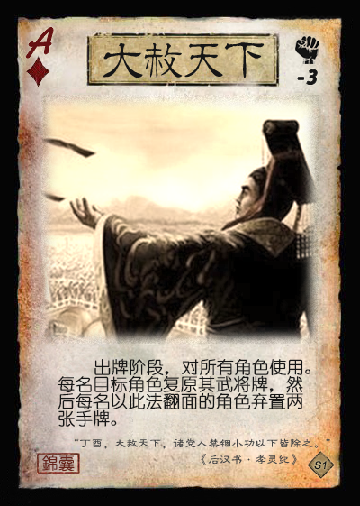

# 三国杀重置计划 新场景1：黄巾起义

## 背景

东汉末年，民不聊生，人心思变，一位名叫张角的道士借传教之机，暗中勾连各方势力，欲行大事……

## 游戏规则

1. 人数：6人
    1. **TODO**：设计支持其他人数的更多模式
2. 阵营划分
    1. **黄巾**与**汉廷**两大阵营对抗
3. 游戏流程
    1. 确定民愤
        1. 将民愤值指示物放在民愤记录条上0的位置。并令最大民愤值X=20、主帅死亡民愤值Y1=8、大将死亡民愤值Y2=5、重整回合数N=4。
        2. 
    2. 确定阵营
        1. 将6张身份牌（1黄巾主帅、2黄巾大将、1汉廷主帅、2汉廷大将）随机分发给所有玩家，然后亮出身份。
        2. 若出现同一阵营的三个身份座位相连的情况，则将黄巾阵营中位于中间的身份和汉廷阵营中位于中间的身份交换。
            1. 防止同一阵营三连动。
    3. 选择武将
        1. 黄巾和汉廷分别拥有一个专属武将池，此外双方还有一个公共武将池，列举如下（带“+”号表示拥有主公技，*斜体*表示本模式专属武将）。
            1. 黄巾专属武将池：张角+、张宝+、张梁+、张燕、黄巾雷使、*张曼成*、*马元义*、*波才*、*程远志*、*严政*
            2. 汉廷专属武将池：刘宏+、皇甫嵩+、朱儁+、卢植、张让、董卓、曹操、刘备、刘焉、*封谞*
            3. 公共武将池：共20个（廖化、公孙瓒、马腾、韩遂、关羽、张飞、赵云、曹仁、曹洪、孙坚、程普、袁绍、袁术、何进、何太后、吕布、貂蝉、孔融、糜竺、诸葛瑾）。
            4. *说明*：公共武将池中包含后来参与讨伐黄巾的武将，这里可视为IF世界线：这些人才对汉室失望，被黄巾招募。
        2. 选择武将流程
            1. 双方分别从各自的专属武将池中随机选出6个武将，从其中选择3个武将，扣置在己方备战区中。
            2. 从公共武将池中随机选出6个武将，向双方展示。
            3. 从汉廷势力开始，双方主帅按照 1-2-2-1 的顺序依次从上述展示的公共武将中选择武将加入自己的备战区。
                1. 最终双方备战区各自拥有3+3=6名武将。
            4. 双方主帅和大将依次从本方的备战区中选择一名武将作为自己的出战武将。
                1. **可选规则**：本方所有出战武将均由主帅指定。
        3. 双方主帅的初始体力值和体力上限+1，且若拥有主帅技则主帅技生效。
    4. 分发起始手牌
        1. 每人分发四张起始手牌。
    5. 进行游戏
        1. 从*黄巾主帅*开始，按逆时针方向依次进行回合。黄巾主帅视为1号位玩家，1号位玩家的回合开始时视为新一轮的开始。
        2. 每轮开始时，*1号位角色*进行**民愤判定**，根据结果增减民愤：♠=+2，♣=+1，♦=0，♥=-1。
    6. 卡牌与技能的特殊规则
        1. **主帅技**：作为主帅时生效的技能，类似于身份模式的主公技。
        2. **重整技**：当一名角色处于重整状态时生效的技能。
        3.  部分游戏牌右上角有民愤增减的标记，使用此牌时*可以*执行该民愤增减效果。
            1. **可选规则**：使用此牌时*必须*执行该民愤增减效果，但带有民愤增减的牌可以被重铸。
        4.  目标数大于一个的锦囊牌结算时，由锦囊的使用者决定按照顺时针或者逆时针依次结算。
        5.  民愤利用机制
            1. 所有角色获得特殊技能【民心向背】：每轮每阵营限一次，当一名黄巾/汉廷阵营角色需要使用或打出一张【杀】/【闪】时，其可以令民愤-2/+2，视为使用或打出了一张【杀】/【闪】。
                1. *注意*：每个阵营角色使用该技能后，民愤向相反方向变化2。
                2. 实际使用中，两阵营分别拥有一个【民心向背】技能标记牌，每轮开始时翻至正面朝上，使用后翻至背面朝上，如下图所示。
                3. 
                4. 
        6.  **围攻**与**队列**
            1. 引用自官方国战的概念，仅当*存活角色不少于4*时生效。
            2. 当一名角色A与两名不同阵营的角色X和Y相邻时（不计入重整角色），称X和Y围攻A，A被X和Y围攻。
            3. 当**至少两名**相同阵营的角色位于连续座次（不计入重整角色）时，称这些角色位于同一队列中。
            4. 备注1：一名角色可能同时既围攻其他角色又被其他角色围攻。
            5. 备注2：当有角色重整时，围攻和队列关系可能发生改变。【调虎离山】等卡牌和技能也可暂时影响围攻与队列关系。
        7.  **变更武将**
            1. 与国战概念类似，使用本方备战区的一张武将牌替换当前的武将牌，当前的武将牌**移出游戏**。
    7. 角色被击退与重整
        1. 本模式下角色“被击退”相当于正常模式下的“死亡”。
        2. 当一名黄巾/汉廷阵营的角色被击退时，若：
            1. 伤害来源为敌方角色，该角色摸两张牌，并按照击杀奖励增减相应的民愤值Y1/Y2；
            2. 伤害来源为友方角色，该角色摸两张牌，并按照击杀奖励的一半（向上取整）增减相应的民愤值；
            3. 无伤害来源，不执行任何奖惩。
        3. 当一名角色被击退时，其进入N回合的重整状态。重整规则具体如下（参考了虎牢关模式的重整规则，并设计了几种变体）：
            1. 每次当轮到该重整角色时，其获得1个“重整”标记。（若有角色在自己的回合被击退，被击退的当回合不能获得重整标记）
            2. **复活变体规则1**：当重整标记数达到N时，该角色以满体力状态复活，并且摸三张牌（但**本回合仍不能行动**，需等到下一轮才可以开始行动）。
                1. 武将选择的**可选规则**：当一名角色复活时，该角色可以选择用己方备战区中的一名武将替换当前武将，原武将进入备战区。
            3. **复活变体规则2**：与变体规则1类似，但当重整标记数达到N时，复活改为非锁定（可以选择看局势在合适时机复活）。
                1. 武将选择的**可选规则**：当一名角色复活时，该角色可以选择用己方备战区中的一名武将替换当前武将，原武将进入备战区。
            4. **复活变体规则3**：当一名角色被击退时，若备战区中没有牌，则该角色*无法复活*；若备战区仍有武将，则按照变体规则1或2进行正常重整流程。
                1. 武将选择：当一名角色复活时，从备战区选出一张武将牌替换当前武将，原武将移出游戏。
            5. 重整规则的设计是为了增加身份等其他模式下先死亡角色的游戏参与度。
        4. 说明
            1. 重整角色视为已被击退，不计入角色数、距离和座次的计算，不能成为卡牌和技能的目标，也不能使用**重整技**之外的任何卡牌和技能。
        5. 
    8. 胜利条件
        1. **军事胜利**：当一个*回合*结束时，若一个阵营的所有角色均被击退，则另一阵营胜利。
        2. **民愤胜利**：当一*轮*结束时，若民愤不小于X，则黄巾胜利；若民愤不大于-X，则汉廷胜利。

## 设计思路

1. 暂定民愤价值：+1/-1民愤约等于1价值（一张随机牌，0.5体力值）
2. 控制直接增减民愤的牌与民愤向0变化的牌的总量和比例。前者过多则游戏随机性过大；后者过多则游戏进程过长。
3. 民愤变化量大的主动牌可以在手中囤积作为一波终结手段。
4. 阵营风格：
   1. 黄巾：判定、雷电伤害、【闪】相关技能等。
   2. 汉廷：拼点、火焰伤害、强制命中等。

## 游戏牌

### 全牌表

该模式牌堆基于标准版+扩展1的牌堆，并进行微调。

| 花色\点数 |     A     |   2    |     3     |   4   |   5    |   6    |   7    |   8    |   9    |   10   |   J    |   Q   |   K    |
| :-------: | :-------: | :---: | :-------: | :----: | :----: | :----: | :----: | :---: | :----: | :----: | :----: | :----: | :----: |
|     ♠     |**黄天 +X**| *八卦* |   **拆**  | **拆** | *青龙* |**乐**|**南蛮 +1**|杀 +1/-1|   杀   |**兵 +1**|**无懈**| *丈八* | *攻马* |
|     ♠     |   *玉玺*  | *雌雄* |   **顺**  | **顺** | *防马* | *青釭* |  雷杀  |  雷杀  |   杀   |**一鼓**| **顺** | **拆** | **南蛮** |
|     ♠     |   *太平*  | *黄巾* |  **雷符** |**雷符**|**调虎**|**盗贼**|  雷杀  |  雷杀  |   酒   |   杀   |   杀   | *飞石*  | **无懈** |
|    ♠EX    |           | *寒冰* |          |        |        |        |        |        |   酒   |       |        |        |          |
|     ♥     |  **桃园** | 闪 2→0 |  **火攻** |   桃   | *麒麟* |   桃   |   桃   |   桃   |   桃   |   杀   |   杀   |   桃   |  *防马*  |
|     ♥     |  **万箭** |   闪   |**五谷 -1**|**五谷 -1**|*攻马*| **乐** |**无中**|**无中**|**无中**|   杀   |**无中**| **拆** |    闪   |
|     ♥     |**汉道 -X**|   杀   |     桃    |   桃   |   桃   |   桃   |  火杀  |  闪   |   闪   |**雷符** |   闪   |**鸣金**| **调虎** |
|    ♥EX    |           |       |           |        |  火杀  |        |        |        |       |         |        |   闪   |         |
|     ♣     |   *连弩*  | *藤甲* |   **拆**  |   杀   | *防马* | *白银* |**南蛮**|   杀   |   杀   |   杀   |   杀   |**借刀**| **借刀** |
|     ♣     |  **决斗** |   杀   |     杀    |   杀   | 杀 +1 |  雷杀  |  雷杀  |  雷杀  |   杀   | **兵** |**一鼓**|**鸣金**| **无懈** |
|     ♣     |**民不 +2**| *黄巾* |    雷杀   |  雷杀  | *攻马* |**盗贼 +1**|  杀  |   杀   |   杀   |   杀   |   杀   |**铁索**| **铁索**|
|    ♣EX    |           | *仁王* |          |        |        |        |        |        | 酒 1→0 |        |        |       |          |
|     ♦     |   *连弩*  |   闪   |     闪    |  火杀  |  火杀  |   闪   |   闪   |   闪   |   酒   |   闪   |   闪   |桃 +1/-1|    杀    |
|     ♦     |  **决斗** |**火攻**|     桃    | **顺** | *贯石* |   闪   |   闪   |   杀   |   杀   |   杀   |   闪   | *方天* |  *攻马*  |
|     ♦     |**大赦 -3**| *法剑* |     桃    |  火杀  |   闪   |   闪   |   闪   |   闪   |   杀   |   闪   | 闪 -1 |   杀   |**无懈 -1**|
|    ♦EX    |           |       |           |        | *朱雀* |        |        |        |        |        |        |**无懈**|         |

### 牌表调整一览

1. 卡牌替换
    1. ♠：♠A【闪电】替换为【黄天当立】、♠2【雌雄双股剑】效果修改、♠5【黄头巾】替换为【调虎离山】、♠10【铁索连环】替换为【一鼓作气】。
    2. ♥：♥A【桃园结义】替换为【汉道永昌】、♥Q【闪电】替换为【鸣金收兵】、♥K【无懈可击】替换为【调虎离山】。
    3. ♣：♣J【铁索连环】替换为【一鼓作气】、♣Q【铁索连环】替换为【鸣金收兵】。
    4. ♦：无。
2. 民愤调整
    1. ♠：♠A【黄天当立】+X民愤、♠7【南蛮入侵】+1民愤、♠8【杀】+1/-1民愤、♠10【兵粮寸断】+1民愤。
    2. ♥：♥A【汉道永昌】-X民愤、♥2【闪】2→0民愤、♥3【五谷丰登】-1民愤、♥4【五谷丰登】-1民愤。
    3. ♣：♣A【民不聊生】+2民愤、♣5【杀】+1民愤、♣6【盗贼蜂起】+1民愤、♣9【酒】1→0民愤。
    4. ♦：♦A【大赦天下】-3民愤、♦J【闪】-1民愤、♦Q【桃】+1/-1民愤、♦K【无懈可击】-1民愤。
    5. 总计16张，每个花色四张；除了A点有四张外，每个点数一张；黑色牌增加民愤，红色牌减少民愤。

### 游戏牌说明

1. 民愤调整类别a：直接增加或减少  
    该类卡牌在右上角以+X和-X表示。当一名角色使用此牌时，其*可以*按照牌面的效果调整民愤。也有卡牌同时拥有+X和-X的两种效果，使用者可以选择其中的一种执行。在牌表中，这类牌分别记作+X、-X或+X/-X。

    1. 例1：
    2. 例2：

    > 注意：调整民愤的效果不是锁定的，特别是当民愤调整方向对己方不利时。

2. 民愤调整类别b：向0调整  
    该类卡牌在右上角以 X → 0 表示。当一名角色使用此牌时，其*可以*按照牌面显示的值X将民愤向0调整（至多调整至0，不能使民愤值变号）。在牌表中，这类牌也记作X → 0。

    1. 例1：

3. 某阵营禁用卡牌  
    该类卡牌在右上角有相应的禁用标记，对应阵营的角色不能使用此牌（若此牌位于装备区，也不能将其移动到禁用阵营角色的装备区），但禁用阵营的角色可以打出、弃置或重铸此牌。

    1. 例1：
    2. 例2：
4.  【汉道永昌】：锦囊，普通  
    黄巾阵营禁用。  
    出牌阶段，对所有有手牌的敌方角色使用。你用一张手牌与这些角色同时拼点，你每赢一次，民愤-1。
5.  【黄天当立】：锦囊，普通  
    汉廷阵营禁用。  
6.  【盗贼蜂起】：锦囊，普通  
    出牌阶段，对所有其他角色使用。每名目标角色弃置与其距离最小（你除外）的另一名角色区域内的一张牌。

    > 微调：增加了弃置判定区牌的选项。
7.  【调虎离山】：锦囊，普通  
    出牌阶段，对一至两名其他角色使用。目标角色不计入距离和座次的计算，不能使用牌且不能成为牌的目标直到回合结束。你摸一张牌。

    > 引文：“待天以困之，用人以诱之，往蹇来返。” ——《三十六计》  
    > 沿用国战版【调虎离山】效果，较为适用于明确划分阵营的对抗和阵法效果。
8.  【一鼓作气】：锦囊，延时  
    出牌阶段，对你使用。将【一鼓作气】置于你的判定区，若判定结果为♣2~9，则保留此牌；若你的判定区内有【一鼓作气】，一名友方角色使用【杀】指定目标后，可令目标选择一项：弃置一张手牌，或令你摸一张牌。

    > 引文：“一鼓作气，再而衰，三而竭。” ——《左传·庄公十年》  
    > 一个团队进攻buff。若判定结果为♣2~9，即可一直拥有该buff。  
9.  【鸣金收兵】：锦囊，延时  
    出牌阶段，对你使用。将【鸣金收兵】置于你的判定区，若判定结果为♥2~9，则保留此牌；若你的判定区内有【鸣金收兵】，一名友方角色受到♠牌的伤害时，可防止此伤害。

    > 引文：“闻鼓声而进，闻金声而退。” ——《荀子·议兵》  
    > 一个团队防御buff。若判定结果为♥2~9，即可一直拥有该buff。  
10.  【雌雄双股剑】：装备，武器 攻击范围：2  
    当你使用♣【杀】指定一名角色为目标后，你可以令其选择一项：弃置一张手牌，或令民愤向对你有利的方向移动1点。

    > 修改了【雌雄双股剑】，设计了与新机制相关的新效果。
11.  【黄头巾】：装备，防具  
    当你受到雷电伤害时，你可以防止此伤害。  
    当你受到伤害后，你可以令民愤+1。  
    当你被击退时，可获得一个重整标记。

    > 重做【黄头巾】效果，适应新机制。
12.  【玉玺】：装备，宝物  
    黄巾阵营禁用。  
    **锁定技**，你的手牌上限+2；你视为拥有本方主帅的主帅技；结束阶段，你令民愤-1。  

13.  【太平要术】：装备，宝物  
    汉廷阵营禁用。  
    出牌阶段结束时，你可以将任意张手牌置于该牌上，称为“符”（“符”的数量至多为4）。  
    当一名角色的判定牌生效前，你可以打出一张“符”代替之。  
    你可以将两张“符”当一张【闪】使用或打出。

## 武将

### 黄巾专属武将

1.  S1.HJ001 张角 男 群 3体力 称号：天公将军
    1. 【雷击】：每当你使用或打出【闪】时，你可以令一名其他角色进行判定，若结果为♠，你对该角色造成1点雷电伤害，然后你可以令一名角色回复1点体力。
    2. 【鬼道】：当一名角色的判定牌生效前，你可以打出一张黑色牌替换之。
    3. 【黄天】：**主帅技**，其他友方角色的出牌阶段限一次，该角色可以将一张【闪】交给你。

    > 基于身份张角稍作调整，降低了【雷击】的输出，改为回复能力，主公技也做了相应修改。  
2.  S1.HJ002 张宝 男 群 3体力 称号：地公将军
    1. 【咒缚】：出牌阶段限一次，你可以将一张手牌置于一名没有“咒”的角色旁，称为“咒”。有“咒”的角色使用与“咒”花色或牌名相同的牌时，+1民愤。
    2. 【影兵】：**锁定技**，一名角色使用牌指定有“咒”的角色为目标结算后，移去该“咒”，然后若其为：友方角色，其摸两张牌；敌方角色，其弃置一张牌。
    3. 【蚁附】：**主帅技**，其他友方角色的出牌阶段限一次，该角色可以用一张黑色手牌替换一张“咒”。

    > 【影兵】中的“其”指使用牌的角色。  
    > 修改“咒”的效果，加入新的民愤机制。
3.  S1.HJ003 张梁 男 群 4体力 称号：人公将军
    1. 【方统】：一名角色的判定牌生效后，你可以弃置一张手牌，然后根据此牌的颜色执行如下效果：黑色，该角色失去1点体力；红色，该角色回复1点体力。
    2. 【集军】：**主帅技**，**重整技**，其他友方角色的出牌阶段限一次，该角色可以失去1点体力，令你获得一个重整标记。

4.  S1.HJ004 张燕 男 群 4体力 称号：黑山的飞燕
    1. 【捷速】：准备阶段/结束阶段，若你的手牌数小于手牌上限，你可以进行判定，若结果为黑色，你视为对一名其他角色使用一张无距离限制的雷【杀】。
5.  S1.HJ005 黄巾雷使 女 群 3体力 称号：雷祭之姝
    1. 【黄巾】：**锁定技**，若你的装备区里没有防具牌，你视为装备着【黄头巾】。
    2. 【符篆】：出牌阶段限一次，你可以将一张黑色普通锦囊牌当【黄巾雷符】使用，然后摸一张牌。
    3. 【助祭】：当一名角色造成雷电伤害时，你可以令其进行判定，若结果为：黑色，该角色获得此牌；红色，你获得此牌。
6.  S1.HJ006 张曼成 男 群 4体力 称号：南阳渠帅
7.  S1.HJ007 马元义 男 群 4体力 称号：血动黄帆
8.  S1.HJ008 波才 男 群 4体力 称号：黄巾先锋
9.  S1.HJ009 程远志 男 群 4体力 称号：TODO
10.  S1.HJ010 严政 男 群 4体力 称号：TODO
    1. TODO：黄巾阵营中，给严政设计劣势下通敌属性

### 汉廷专属武将

1.  S1.HAN001 刘宏 男 汉 5体力 称号：汉灵帝
   1. 【鬻爵】：TODO
   2. 【党锢】：**限定技**，出牌阶段，你可以选择一名处于重整状态的角色，移除其至多两个重整标记。
   3. 【天威】：**主帅技**，准备阶段，你可以弃置一张牌，移去一名友方角色判定区内的一张牌。
2.  S1.HAN002 皇甫嵩 男 汉 4体力 称号：志定雪霜
    1. 【奋钺】：出牌阶段限一次，你可以与一名角色拼点，若你赢，根据你拼点的牌的点数依次执行以下效果：小于等于5：获得其一张牌；小于等于9：摸一张牌；小于等于K：视为对其使用一张【杀】。若你没赢，你摸一张牌并结束出牌阶段。
    2. 【舍身】：**主帅技**，你被击退时，可令一名友方角色回复1点体力并摸三张牌。
3.  S1.HAN003 朱儁 男 汉 4体力 称号：征无遗虑
    1. 【某某】：出牌阶段限一次，你可以选择一项：将一张黑色基本牌当【一鼓作气】使用；或将一张红色基本牌当【鸣金收兵】使用。
    2. 【某某】：**主帅技**，TODO
4.  S1.HAN004 卢植 男 汉 3体力 称号：国之桢干
5.  S1.HAN005 张让 男 汉 3体力 称号：窃幸绝禋
6.  S1.HAN006 董卓 男 汉 4体力 称号：西凉鬼豪
7.  S1.HAN007 曹操 男 汉 4体力 称号：崭露头角
    1. 【令法】：**锁定技**，游戏开始时，你将一张牌置于你的武将牌上，称为“令”；准备阶段，你可以用一张牌替换一张“令”；一名角色使用与【令】同名的牌时，需弃置一张基本牌，否则此牌无效。

    > **TODO**：进一步设计法则系技能
8.  S1.HAN008 刘焉 男 汉 3体力 称号：裂土之宗
9.   S1.HAN009 刘备 男 汉 4体力 称号：汉嗣仁裔
    1. 【仁德】：出牌阶段，你可以将任意张手牌交给其他角色，然后若你于此阶段内给出第二张“仁德”牌时，你回复1点体力。本阶段结束时，民愤-X（X为本阶段以此法获得牌的敌方角色数）。
10.  S1.HAN010 封谞 男 汉 3体力 称号：TODO
    1. TODO：汉廷阵营中，给封谞设计优势下通敌属性

### 公共武将
  
1.  S1.QUN001 廖化 男 群 4体力 称号：啸聚山林
    1. 【当先】：**锁定技**，你登场后，执行一个额外的回合；你重整时，每轮额外获得一个重整标记。
    2. 【寇抄】：结束阶段，你可以获得至多两名其他角色区域内的各一张牌，然后失去等量的体力。

    > 【当先】执行额外回合的时机包括游戏开始时和重整完成后，即廖化在游戏开始时执行一个额外的回合，且重整完成后立即执行其回合。  
    > 该技能组是对重整机制的一个设计尝试。
2.  S1.QUN002 公孙瓒 男 群 4体力 称号：威震塞外
    1. 【疏犷】：你使用【杀】指定一名敌方角色为唯一目标后，可指定任意名与该角色同一队列的其他角色为额外目标。
    2. 【义从】：**锁定技**，若你是围攻角色，你计算与其他角色的距离-1；若你是被围攻角色，其他角色计算与你的距离+1。

    > 该技能组是对阵法效果的一个设计尝试。
3.  S1.QUN003 马腾 男 群 4体力 称号：驰骋西陲
    1. 【马术】：**锁定技**，你计算与其他角色的距离-1。
    2. 【雄异】：**限定技**，出牌阶段，你可以令所有友方角色各摸两张牌，所有被击退的友方角色获得一个重整标记，然后你可以变更此武将。

    > 该技能组是对变更武将效果的一个设计尝试。
4.  S1.QUN004 韩遂 男 群 4体力 称号：驰骋西陲
    1. 【马术】：**锁定技**，你计算与其他角色的距离-1。
    2. 【逆乱】：一名其他角色的结束阶段，若本回合民愤发生过变化，或其于本回合内对你使用过【杀】，你可以将一张黑色牌当【杀】对其使用。
5.  S1.QUN005 关羽 男 群 4体力 称号：美髯公
    1. 【武圣】：若你的体力值大于0，你可以将一张红色牌当【酒】或无距离限制且无视防具的【杀】使用或打出。
6.  S1.QUN006 张飞 男 群 4体力 称号：万夫不当
    1. 【咆哮】：**锁定技**，你使用【杀】无次数限制；当你于出牌阶段使用的第二张【杀】结算完成后，你摸一张牌。
7.  S1.QUN007 赵云 男 群 4体力 称号：少年将军
    1. 【龙胆】：你可以将一张【杀】/【闪】当【闪】/【杀】使用或打出。
    2. 【救主】：当一名其他友方角色于其回合外需要使用或打出一张【杀】/【闪】时，你可以打出一张【杀】/【闪】，然后视为该角色使用或打出了一张【杀】/【闪】。
8.  S1.QUN008 曹仁 男 群 4体力 称号：驰骋西陲
9.  S1.QUN009 曹洪 男 群 4体力 称号：福将
    1. 【援护】：
10.  S1.QUN010 孙坚 男 群 4体力 称号：武烈帝
    1. 【破军】：当你于出牌阶段内使用【杀】指定一个目标后，你可以将其至多X张牌扣置于该角色的武将牌旁（X为其体力值）。若如此做，当前回合结束后，该角色获得这些牌。
11.  S1.QUN011 程普 男 群 4体力 称号：三朝虎臣
12.  S1.QUN012 袁绍 男 群 4体力 称号：高贵的名门
13.  S1.QUN013 袁术 男 群 4体力 称号：仲家帝
14.  S1.QUN014 何进 男 群 4体力 称号：色厉内荏
15.  S1.QUN015 何太后 女 群 3体力 称号：弄权之蛇蝎
16.  S1.QUN016 吕布 男 群 4体力 称号：武的化身
17.  S1.QUN017 貂蝉 女 群 3体力 称号：绝世的舞姬
    1. 【离间】：出牌阶段限一次，你可以弃置一张牌并选择两名男性角色，然后令其中一名角色视为对另一名角色使用一张【决斗】。
    2. 【闭月】：结束阶段，你可以摸一张牌。
18.  S1.QUN018 孔融 男 群 3体力 称号：凛然重义
19.  S1.QUN019 糜竺 男 群 3体力 称号：挥金追义
20.  S1.QUN020 诸葛瑾 男 群 3体力 称号：敦仁弘雅
    1. 【缓释】：友方角色的判定牌亮出前，你可以观看牌堆顶的三张牌，然后以任意顺序置于牌堆顶。
    2. 【弘援】：摸牌阶段，你可以少摸一张牌，然后令其他友方角色各摸一张牌。
    3. 【明哲】：你的回合外，当你使用或打出一张红色牌时，或因弃置而失去一张红色牌后，你可以摸一张牌。

    > 沿用经典3V3模式中的诸葛瑾，仅对【缓释】稍作修改，符合诸葛氏控制牌堆顶的风格。  
    > 称号来源：分别截取自《三国志》中虞翻的评价“诸葛敦仁，则天活物，比蒙清论，有以保分。”和陈寿的评价“瑾为人有容貌思度，于时服其弘雅。”
