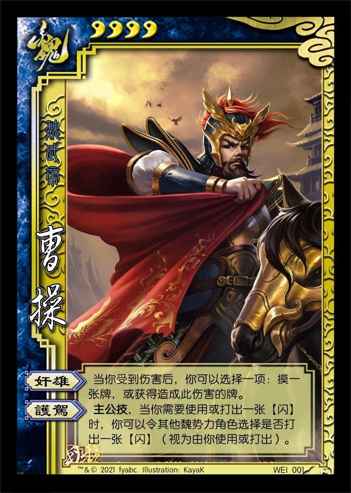
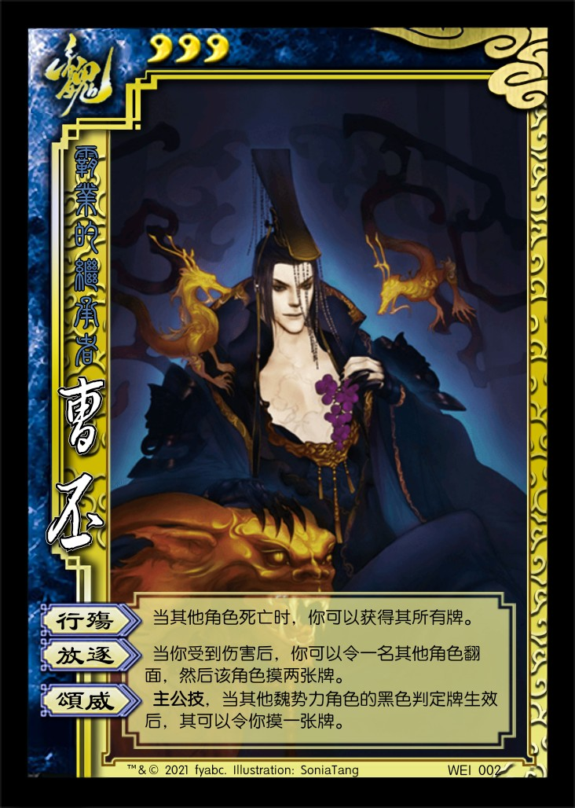
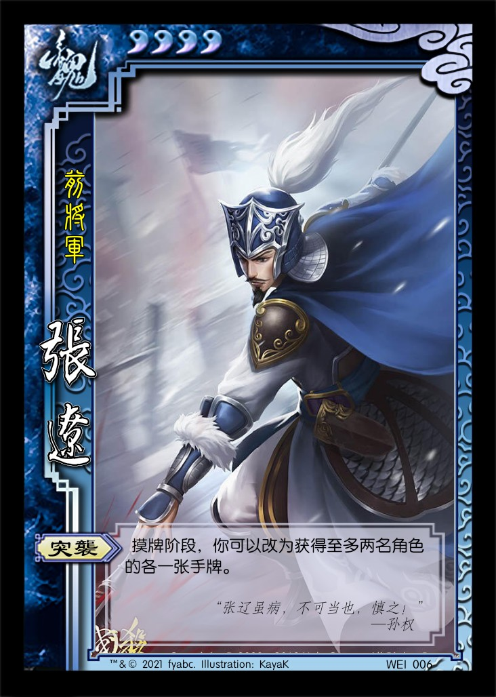
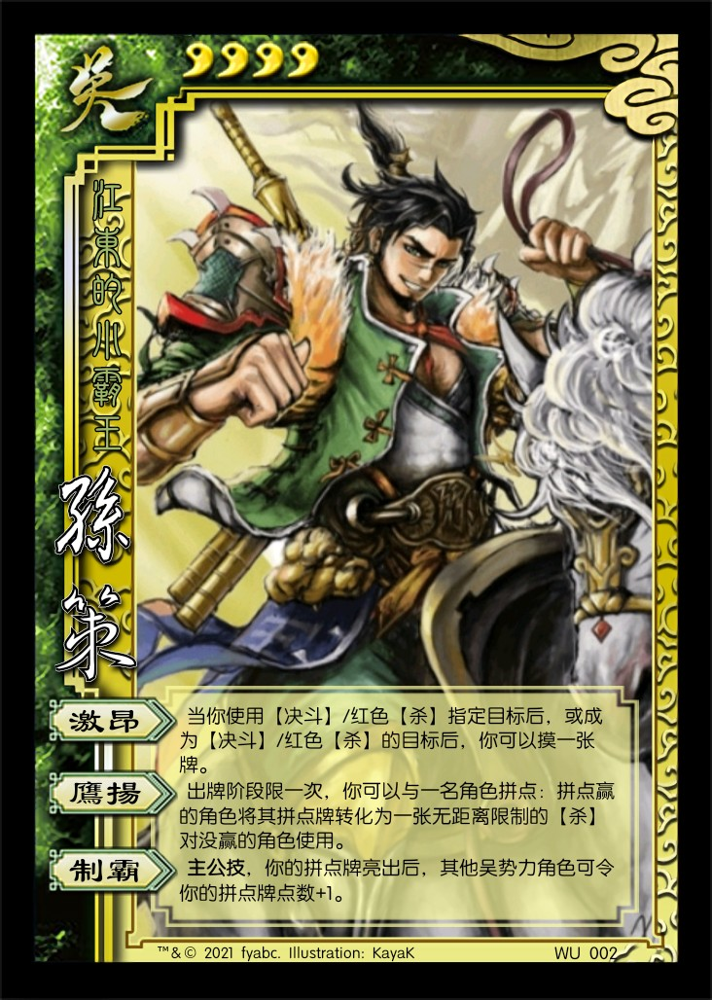
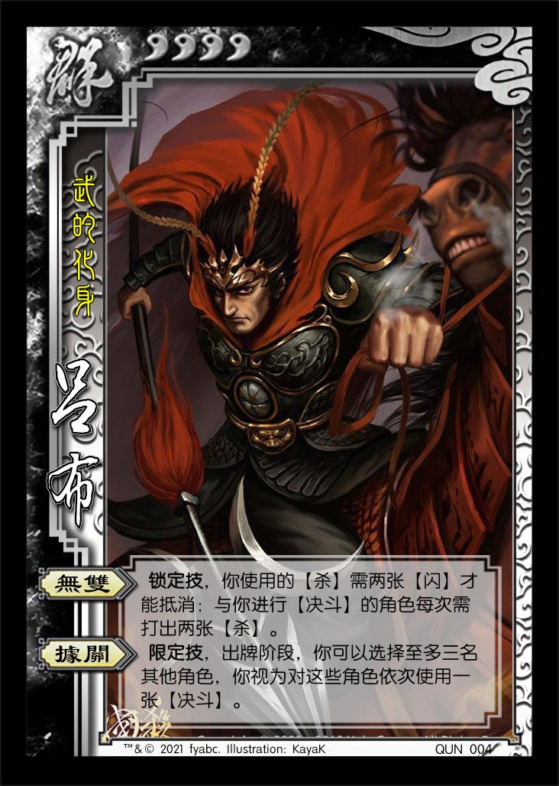

# 三国杀重置计划 标准版

## 新概念

1. 封锁：指不能使用或打出某一类别的牌。  
   > 例：本回合中，封锁一名角色的♦手牌，即本回合中，该角色不能使用或打出♦手牌，但可以弃置♦手牌，也可以使用【急袭】等技能使用♦的【田】。
   > 例：本回合中，封锁一名角色的♦牌，即本回合中，该角色不能使用或打出♦牌，也不能使用【急袭】等技能使用♦的【田】，但可以弃置♦牌。
2. 结算完成后：指前一张牌或技能的结算完成后，所有角色都处于等待的状态。
   1. 设计目的：将嵌套结算变为顺序结算
   2. 例：当一名角色受到伤害，结算完成后，你可以弃置其一张牌。
   3. 若“结算完成后”所响应的事件（在上例中即为“当一名角色受到伤害”这一事件）处于另一嵌套结算中，则需要等待其外层结算完成后才可发动此效果。
   4. 若一个结算中嵌套了多于一个所响应的事件，则此效果可以对每个事件依次顺序发动。
   5. 若此效果触发的结算中嵌套了一个新的所响应的事件，则可于此效果结算完成后，在满足条件的情况下再次发动此效果。

## 游戏牌

### 全牌表

| 花色\点数 |    A     |    2     |    3     |    4     |   5    |   6    |    7     |    8     |    9     |    10    |    J     |    Q     |    K     |
| :-------: | :------: | :------: | :------: | :------: | :----: | :----: | :------: | :------: | :------: | :------: | :------: | :------: | :------: |
|     ♠     | **闪电** |  *八卦*  |  **拆**  |  **拆**  | *青龙* | **乐** | **南蛮** |    杀    |    杀    |  **兵**  | **无懈** |  *丈八*  |   *-1*   |
|     ♠     |  *玉玺*  |  *雌雄*  |  **顺**  |  **顺**  |  *+1*  | *青釭* |   雷杀   |   雷杀   |    杀    | **铁索** |  **顺**  |  **拆**  | **南蛮** |
|    ♠EX    |          |  *寒冰*  |          |          |        |        |          |          |    酒    |          |          |          |          |
|     ♥     | **桃园** |    闪    | **火攻** |    桃    | *麒麟* |   桃   |    桃    |    桃    |    桃    |    杀    |    杀    |    桃    |   *+1*   |
|     ♥     | **万箭** |    闪    | **五谷** | **五谷** |  *-1*  | **乐** | **无中** | **无中** | **无中** |    杀    | **无中** |  **拆**  |    闪    |
|    ♥EX    |          |          |          |          |  火杀  |        |          |          |          |          |          |    闪    |          |
|     ♣     |  *连弩*  |  *藤甲*  |  **拆**  |    杀    |  *+1*  | *白银* | **南蛮** |    杀    |    杀    |    杀    |    杀    | **借刀** | **借刀** |
|     ♣     | **决斗** |    杀    |    杀    |    杀    |   杀   |  雷杀  |   雷杀   |   雷杀   |    杀    |  **兵**  | **铁索** | **铁索** | **无懈** |
|    ♣EX    |          |  *仁王*  |          |          |        |        |          |          |    酒    |          |          |          |          |
|     ♦     |  *连弩*  |    闪    |    闪    |   火杀   |  火杀  |   闪   |    闪    |    闪    |    酒    |    闪    |    闪    |    桃    |    杀    |
|     ♦     | **决斗** | **火攻** |    桃    |  **顺**  | *贯石* |   闪   |    闪    |    杀    |    杀    |    杀    |    闪    |  *方天*  |   *-1*   |
|    ♦EX    |          |          |          |          | *朱雀* |        |          |          |          |          |          | **无懈** |          |

统计： 总 112

1. 基本牌 53 47.321%
   1. 杀 28 25.000%
      1. 黑色 19 16.964%
      2. 红色 9 8.036%
      3. 普通杀 20 17.857%
      4. 属性杀 8 7.143%
         1. 雷杀 5 4.464%
         2. 火杀 3 2.679%
   2. 闪 14 12.500%
      1. ♥ 4 3.571%
      2. ♦ 10 8.929%
   3. 桃 8 7.143%
      1. ♥ 6 5.357%
      2. ♦ 2 1.786%
   4. 酒 3 2.679%
2. **锦囊牌** 37 33.035%
   1. 普通 32 28.571%
      - 决斗 2 顺 4 拆 5
      - 借刀 2 无中 4 无懈 3
      - 南蛮 3 万箭 1 桃园 1
      - 五谷 2 火攻 2 铁索 3
   2. 延时 5 4.464%
      - 闪电 1 乐 2 兵 2
3. *装备牌* 22 19.643%
   1. 武器 11 9.821%
   2. 防具 4 3.571%
   3. 坐骑 6 5.357%
      1. +1马 3 2.679% （♠5绝影、♥K爪黄飞电、♣5的卢）
      2. -1马 3 2.679% （♥5赤兔、♦K紫骍、♠K大宛）
   4. 宝物 1 0.893%

> 说明：将官方的标准版+军争篇压缩了一下，形成新的标准版牌堆。各类卡牌比例与官方版差距不大，主要较大的变动是减少了两张【酒】和三张【铁索连环】，并且将唯一的宝物由【木牛流马】改为【玉玺】。

### 游戏牌说明

1. 【火攻】：锦囊，普通  
    出牌阶段，对一名角色使用。该角色可以展示一张手牌，然后你可以弃置一张与之花色相同的手牌。若其未如此做，或若你如此做，你对其造成1点火属性伤害。  
    > 让【火攻】可以对没有手牌的角色使用，提高这张牌的效率，也更合逻辑一些。
2. 【玉玺】：装备，宝物

    **锁定技**，你的手牌上限+2；你视为拥有当前主公的主公技。

## 场景牌

1. 【群雄逐鹿】
   1. TODO：和【玉玺】相关；改变【玉玺】的效果，所有角色争夺【玉玺】。
2. 【某某】
   1. TODO：有若干张相关的特殊游戏牌（“神器组件”）。游戏开始时，主公获得其中一个组件；杀死一名角色后，获得其拥有的所有组件；集齐所有组件即可获得游戏胜利。

## 可选规则

1. 尊奉天子：如果场上仍有东汉皇帝（刘宏、刘辩、刘协等）存活，场上所有蜀势力角色视为汉势力角色。
   1. TODO：需要进一步设计以解决与刘协主公技的冲突问题。
2. （聚会欢乐向）避讳：本局游戏中，每当有玩家说了读音为hóng、biàn或xié的字并被其他玩家发现，该玩家需弃置一张牌或失去1点体力。

## 杂注

1. 汉势力的颜色设计为比蜀势力更深的红色，体现汉之“火德”，以及东汉与蜀汉的一脉相承的关系。
2. 汉势力的势力特色：待设计（TODO）
   1. 可选项1：给其他人增加buff或debuff（暗寓汉室至高无上的权力，能轻易使人飞黄腾达或万劫不复）。

## 武将牌

1.  曹操 男 魏 4体力 称号：魏武帝
   1. 【奸雄】：当你受到伤害后，你可以获得造成此伤害的牌。
   2. 【护驾】：**主公技**，当你需要使用或打出一张【闪】时，你可以令其他魏势力角色选择是否打出一张【闪】（视为由你使用或打出）。

   > 未作改动。
   > 一个备选的增强方案：【奸雄】：当你受到伤害后，你可以将造成此伤害的牌置于你的武将牌上（至多四张）；你可将这些牌如手牌般使用或打出，且不受次数限制。
2.  曹丕 男 魏 3体力 称号：霸业的继承者
   1. 【行殇】：当其他角色死亡时，你可以获得其所有牌。
   2. 【放逐】：当你受到伤害后，你可以令一名其他角色翻面，然后该角色摸两张牌。
   3. 【颂威】：**主公技**，当其他魏势力角色的黑色判定牌生效后，其可以令你摸一张牌。

   > 参考了[西方妖怪：国战推重计划——【曹魏】](https://zhuanlan.zhihu.com/p/58921610)，将摸牌数直接改为2以简化描述。

3.  司马懿 男 魏 3体力 称号：狼顾之鬼
   1. 【反馈】：当你受到伤害后，你可以获得伤害来源的一张牌。
   2. 【鬼才】：当一名角色的判定牌生效前，你可以打出一张牌代替之。

   > 未作改动。
4.  曹仁 男 魏 4体力 称号：大将军
   1. 【据守】：结束阶段，你可以摸三张牌并翻面，然后你可以使用一张装备牌。
   2. 【解围】：你可以将装备区的牌当【无懈可击】使用。
5.  夏侯惇 男 魏 4体力 称号：独眼的罗刹
   1. 【刚烈】：当你受到伤害后，你可以进行判定，若结果不为♥，伤害来源选择一项：1.弃置两张手牌；2.受到你造成的1点伤害。若结果为♥，你获得此判定牌。

   > 略微加强了一些稳定性。（需要增加技能以改变纯防御的特性吗？）
6.  张辽 男 魏 4体力 称号：前将军
   1. 【突袭】：摸牌阶段，你可以改为获得至多两名角色的各一张手牌。

   > 强度有点高，但描述简洁，而且也有攻击力不足的弱点，所以保持原样。
7.  许褚 男 魏 4体力 称号：虎痴
   1. 【裸衣】：出牌阶段限一次，你可以弃置一张牌，然后本回合你使用【杀】或【决斗】造成伤害时，此伤害+1。

   > 效果与【酒】和关羽同质化，如何改进？
8.  郭嘉 男 魏 3体力 称号：早终的先知
   1. 【天妒】：当你的判定牌生效后，你可以获得此牌。
   2. 【遗计】：当你受到1点伤害后，你可以观看牌堆顶的两张牌，然后将这些牌交给任意角色。

   > 未作改动。
9.  荀彧 男 魏 3体力 称号：王佐之才
   1. 【驱虎】：出牌阶段限一次，你可以与体力值大于你的一名角色拼点：若你赢，你令该角色对其攻击范围内的另一名角色造成1点伤害；若你没赢，其对你造成1点伤害。
   2. 【节命】：当你受到伤害后，你可以令一名角色将手牌摸至三张。

   > 标准包中拼点系统的代表武将  
   > 需要测试强度，【节命】是否过弱？
10.  甄姬 女 魏 3体力 称号：薄幸的美人
    1. 【倾国】：你可以将一张黑色手牌当【闪】使用或打出。
    2. 【洛神】：准备阶段，你可以进行判定。当黑色判定牌生效后，你获得之。若结果为黑色，你可以重复此流程。

   > 未作改动。

----

1.  刘备 男 蜀 4体力 称号：乱世的枭雄
   1. 【仁德】：出牌阶段，你可以将任意张手牌交给其他角色，然后若你于此阶段内给出第二张“仁德”牌时，你回复1点体力。
   2. 【激将】：**主公技**，当你需要使用或打出【杀】时，你可以令其他蜀势力角色选择是否打出一张【杀】（视为由你使用或打出）。

   > 未作改动。
2.  刘禅 男 蜀 3体力 称号：无为的真命主
   1. 【享乐】：**锁定技**，当你成为一名角色使用【杀】的目标后，除非该角色弃置一张基本牌，否则此【杀】对你无效。
   2. 【放权】：你可以跳过出牌阶段，然后此回合结束时，你可以弃置一张手牌并令一名其他角色获得一个额外的回合。
   3. 【若愚】：**主公技**，**觉醒技**，准备阶段，若你是体力值最小的角色，你加1点体力上限，回复1点体力，然后获得“激将”。

   > 未作改动。
3.  关羽 男 蜀 4体力 称号：美髯公
   1. 【武圣】：你可以将一张红色牌当【酒】（仅限效果一）或【杀】使用或打出。

   > 需要测试强度。
4.  张飞 男 蜀 4体力 称号：万夫不当
   1. 【咆哮】：**锁定技**，你使用【杀】无次数限制；当你于出牌阶段使用的第二张【杀】结算完成后，你摸一张牌。

   > 根据国战的张飞做了一些加强。“结算完成后”是目前还在构想中的一个概念，目的是把嵌套结算转化为线性结算，减少复杂度和可能的bug。
5.  诸葛亮 男 蜀 3体力 称号：迟暮的丞相
   1. 【观星】：准备阶段，你可以观看牌堆顶的X张牌（X为全场角色数且至多为5），然后将其中任意数量的牌置于牌堆顶，将其余的牌置于牌堆底或弃牌堆。
   2. 【空城】：**锁定技**，若你没有手牌，则你不能被选择为【杀】、【决斗】或【火攻】的目标。

   > 【观星】其余的牌中，几张置于牌堆底，几张置于弃牌堆是自己任选的，且置于弃牌堆的牌不被视为弃置。  
   > 与【火攻】的修改对应，这里增加了对【火攻】的防御。
6.  赵云 男 蜀 4体力 称号：少年将军
   1. 【龙胆】：你可以将一张【杀】/【闪】当【闪】/【杀】使用或打出。
   2. 【救主】：当一名其他角色需要使用或打出一张【杀】/【闪】时，其可以令你选择是否打出一张【杀】/【闪】。若你选择是，视为该角色使用或打出了一张【杀】/【闪】。
7.  马超 男 蜀 4体力 称号：一骑当千
   1. 【马术】：**锁定技**，你计算与其他角色的距离-1。
   2. 【铁骑】：当你使用【杀】指定一个目标后，你可以进行判定，若结果为：红色，该角色不能使用【闪】响应此【杀】；黑色，本回合该角色所有非锁定技失效。

   > 略微增加了一些稳定性。
8.  黄忠 男 蜀 4体力 称号：老当益壮
   1. 【烈弓】：当你使用【杀】指定一个目标后，若该角色的手牌数不小于你的体力值或不大于你的攻击范围，则你可以令其不能使用【闪】响应此【杀】。

   > 去掉了有点莫名其妙的“于出牌阶段内”限制条件。
9.  姜维 男 蜀 4体力 称号：龙的衣钵
   1. 【挑衅】：出牌阶段限一次，你可以选择一名攻击范围内含有你的角色，然后除非该角色对你使用一张【杀】，否则你弃置其一张牌。
   2. 【志继】：**觉醒技**，准备阶段，若你没有手牌，你需回复1点体力或摸两张牌，然后减1点体力上限，获得“观星”。

   > 未作改动。
10.  黄月英 女 蜀 3体力 称号：归隐的杰女
    1. 【集智】：当你使用锦囊牌时，你可以摸一张牌。
    2. 【奇才】：**锁定技**，你使用锦囊牌无距离限制；其他角色不能弃置你装备区中除坐骑牌以外的牌。

   > 略微增加了【集智】的强度，略微加强了一些防御能力。

----

1.  孙权 男 吴 4体力 称号：年轻的贤君
   1. 【制衡】：出牌阶段限一次，你可以弃置至多X张牌（X为场上角色数），然后摸等量的牌。
   2. 【救援】：**主公技**，**锁定技**，其他吴势力角色对你使用的【桃】回复的体力+1。

   > 削弱了一下单挑强度。
2.  孙策 男 吴 4体力 称号：江东的小霸王
   1. 【激昂】：当你使用【决斗】或红色【杀】指定目标后，或成为【决斗】或红色【杀】的目标后，你可以摸一张牌。
   2. 【魂姿】：TODO
   3. 【制霸】：**主公技**，

   > 主公身份下如何削弱？
3.  孙坚 男 吴 4体力 称号：武烈帝
   1. 【英魂】：准备阶段，你可以选择一项：令一名其他角色摸X张牌，然后弃一张牌；或令一名其他角色摸一张牌，然后弃X张牌（X为你已损失的体力值）。
   2. 【破虏】：**主公技**，
4.  周瑜 男 吴 3体力 称号：大都督
   1. 【英姿】：**锁定技**，每当你一次摸两张或更多的牌时，你多摸一张牌；你的手牌上限至少为3。
   2. 【反间】：出牌阶段限一次，你可以展示一张手牌并交给一名其他角色，其选择一项：1.展示所有手牌，弃置与此牌相同花色的牌；2.失去1点体力。

   > 【英姿】仅限于从牌堆摸牌时触发，这样写只是为了和黄盖配合。
5.  鲁肃 男 吴 3体力 称号：独断的外交家
   1. 【好施】：摸牌阶段，你可以多摸两张牌，然后若你的手牌数大于5，则你将一半的手牌（向下取整）交给手牌最少的一名其他角色。
   2. 【缔盟】：出牌阶段限一次，你可以将一至三张手牌交给一名其他角色，然后该角色交给你等量的手牌。

   > 以更为柔和的方式体现“缔盟”，变为纯辅助技能，取代原来的破坏手牌管理的方式。
6.  甘宁 男 吴 4体力 称号：锦帆游侠
   1. 【奇袭】：你可以将一张黑色牌当【过河拆桥】使用。
7.  吕蒙 男 吴 4体力 称号：白衣渡江
   1. 【克己】：若你未于出牌阶段内使用或打出过【杀】，则你可以跳过弃牌阶段。
   2. 【谋断】：若你于出牌阶段使用了四张至少三种不同花色的牌，你可以于此回合结束后，获得一个额外的回合。

   > TODO：测试【谋断】的强度。
8.  黄盖 男 吴 4体力 称号：轻身为国
   1. 【苦肉】：出牌阶段限一次，你可以令一名角色对你造成1点伤害，然后该角色摸两张牌。
   2. 【诈降】：**锁定技**，在你的回合内，你每受到1点伤害，本回合内你使用【杀】的次数上限+1。
9.  陆逊 男 吴 3体力 称号：儒生雄才
   1. 【谦逊】：**锁定技**，你不能被选择为【顺手牵羊】和【乐不思蜀】的目标。
   2. 【度势】：出牌阶段限一次，你可以令至多三名角色摸两张牌然后弃置两张牌。若你选择了三名角色，你需先弃置一张红色手牌。

   > 基于国战陆逊的技能做的设计。
10.  孙尚香 女 吴 3体力 称号：弓腰姬
    1. 【结姻】：出牌阶段限一次，你可以弃置两张手牌并选择一名男性角色，然后你与其各回复1点体力。
    2. 【枭姬】：当你失去装备区里的牌后，你可以摸两张牌。

----

1.  张角 男 群 3体力 称号：天公将军
   1. 【雷击】：每当你使用或打出【闪】时，你可以令一名其他角色进行判定，若结果为♠，你对该角色造成2点雷电伤害。
   2. 【鬼道】：当一名角色的判定牌生效前，你可以打出一张黑色牌替换之。
   3. 【黄天】：**主公技**，其他群势力角色的出牌阶段限一次，该角色可以将一张【闪】或【闪电】交给你。

   > 未作改动。看似强大，但实际脆皮，这也符合历史上张角的表现。
2.  袁绍 男 群 4体力 称号：高贵的名门
   1. 【乱击】：
   2. 【血裔】：**主公技**，**锁定技**，
3.  袁术 男 群 4体力 称号：仲家帝
   1. 【妄尊】：出牌阶段限一次，若场上或弃牌堆中有【玉玺】，你可以弃置一张手牌，然后获得之。
   2. 【伪帝】：摸牌阶段，若你装备着【玉玺】，你可以多摸一张牌。

   > 测试强度。
4.  吕布 男 群 4体力 称号：武的化身
   1. 【无双】：**锁定技**，你使用的【杀】需两张【闪】才能抵消；与你进行【决斗】的角色每次需打出两张【杀】。
   2. 【战神】：**限定技**，出牌阶段，你可以选择至多三名其他角色，你视为对这些角色依次使用一张【决斗】。

   > 需要测试：增加的限定技是否过强？
5.  公孙瓒 男 群 4体力 称号：白马将军
   1. 【义从】：**锁定技**，若你的体力值大于2，你计算与其他角色的距离-1；若你的体力值不大于2，其他角色计算与你的距离+1。

   > 未作改动（可能需要增加技能以丰富游戏玩法）。
6.  刘表 男 群 3体力 称号：荆襄霸主
   1. 【自守】：摸牌阶段，你可以多摸X张牌（X为全场势力数）。若如此做，本回合你使用牌不能选择其他角色为目标。
   2. 【宗室】：**锁定技**，你的手牌上限+X（X为全场势力数）。

   > 未作改动。
7.  华佗 男 群 3体力 称号：神医
   1. 【急救】：你的回合外，你可以将一张红色牌当【桃】使用。
   2. 【除疠】：出牌阶段限一次，你可以观看一名角色的所有手牌，然后你可以弃置其中的一张♠牌。若如此做，该角色回复1点体力。

   > 把手牌中的♠牌看作“病根”，用【除疠】去掉它就可以回复体力。
8.  貂蝉 女 群 3体力 称号：绝世的舞姬
   1. 【离间】：出牌阶段限一次，你可以弃置一张牌并选择两名男性角色，然后令其中一名男性角色视为对另一名男性角色使用一张【决斗】。
   2. 【闭月】：结束阶段，你可以摸一张牌。

   > 未作改动。
9.  贾诩 男 群 3体力 称号：冷酷的毒士
   1. 【完杀】：**锁定技**，你的回合内，不处于濒死状态的其他角色不能使用【桃】。
   2. 【乱武】：**限定技**，出牌阶段，你可以令所有其他角色除非对各自距离最小的另一名角色使用一张【杀】，否则失去1点体力。
   3. 【帷幕】：**锁定技**，你不能被选择为黑色锦囊牌的目标。

   > 未作改动。
10.  蔡文姬 女 群 3体力 称号：异乡的孤女
    1. 【悲歌】：当一名角色受到【杀】造成的伤害后，你可以弃置一张牌，然后令其进行判定，若结果为：  
      ♥：其回复1点体力；♣：伤害来源弃置两张牌；♦：其摸两张牌；♠：伤害来源失去1点体力。
    2. 【断肠】：**锁定技**，当你死亡时，杀死你的角色失去所有武将技能。

   > 将【悲歌】的♠判定结果改为“失去1点体力”，减小方差。来源：[西方妖怪：国战推重计划——【群雄】](https://zhuanlan.zhihu.com/p/59344207)

----

1.  刘协 男 汉 3体力 称号：受困天子
   1. 【天命】：每当你成为【杀】的目标后，你可以先弃置两张牌再摸两张牌，然后若当前的体力值最大的角色仅有一名且不是你，其可以先弃置两张牌再摸两张牌。
   2. 【密诏】：出牌阶段限一次，你可以将所有手牌交给一名其他角色，令其与你选择的另一名有手牌的角色拼点，然后拼点赢的角色视为对拼点没赢的角色使用一张【杀】。
   3. 【皇统】：**主公技**，**限定技**，准备阶段，你可以将体力回复至X点（X为汉势力或拥有技能“宗室”的角色数）。

   > 所有汉室宗亲（包括前期扩展包中的SP刘备）都拥有【宗室】技能。  
   > TODO：技能描述稍长，如何简化？
2.  伏皇后 女 汉 3体力 称号：孤注一掷
   1. 【惴恐】：
   2. 【求援】：
