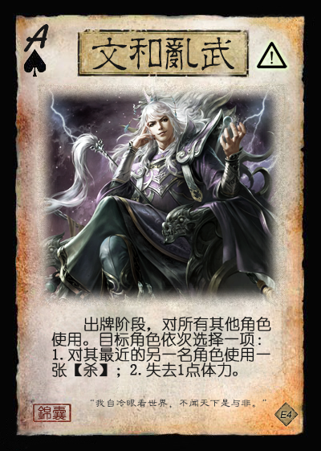

# 三国杀新机制DIY尝试

写作时间：2023.07.25

本文简单总结我在三国杀DIY的过程中对新机制的尝试，主要分为以下三类：

## 官方现有机制的提炼与推广

在三国杀发展过程中，本身出现过很多有潜力的新机制的尝试，但是许多这类尝试往往局限于少量的武将/卡牌/模式中，未能得到推广。该部分内容尝试从现有的内容中提炼出一些新机制，将其规范化并推广以提高其游戏性且更适合面杀。（该部分内容以总结为主）

### 关键词：搜索

本机制主要受到界徐庶技能【荐言】的启发，主要目标是实现一个具有泛用性、面杀友好且能较好地与其他游戏元素产生互动的**定向检索**功能。

（原图来源：[紫乔图鉴](https://www.bilibili.com/read/cv15377079)）

1. 机制描述
    1. 关键词格式：令一名角色**搜索X：N张C**
    2. 操作步骤：此次搜索的发起者指定一名角色为目标，该角色从牌堆顶依次亮出牌，直至亮出N张满足条件C的牌、或共计亮出X张牌、或牌堆耗尽为止。目标角色获得满足条件的牌，*将其余牌以原顺序放回牌堆*。
    3. 定义：**X**称为此次搜索的“**上限**”，**N**称为此次搜索的“**目标张数**”，**C**称为此次搜索的“**条件**”。
2. 注意点
    1. 与原版【荐言】相比，搜索中除了搜索目标外的牌会以原顺序放回牌堆而不是置入弃牌堆，因此减慢了牌堆的消耗速度，适宜面杀；同时使所有角色获得关于牌堆顶牌的额外信息，可以产生额外的打法和配合。
3. 例子
    1. 例1：搜索6：一张装备牌
    2. 例2：搜索4：两张基本牌
        1. 注：若亮牌过程结束时，仅亮出一张基本牌，则获得这一张基本牌。
    3. 例3：搜索13：一张点数等于当前亮出牌数的牌
        1. 动态变化的条件
    4. 例4：搜索∞：一张【桃】
        1. “搜索∞”表示不停止亮出牌的过程，直到满足要求或牌堆耗尽为止。
4. 相关卡牌与技能举例
    1. 例1：【某某】：当你发起或以你为目标的搜索结算后，你可以在牌堆顶的前四张牌中选择一张交给一名其他角色。
    2. 例2：【某某】：**锁定技**，你发起的或以你为目标的搜索亮出牌数的上限+4。
    3. 例3：【某某】：**限定技**，当一名角色发起一次搜索时，你可以令此次搜索的条件反转。

### 手牌区细化：设置明置手牌区

本机制的主要目的有二：

- 将线上常见的“**不计入手牌上限**”的概念进一步规范化，并使其面杀友好。
- 为游戏牌增加设计空间：将一些响应时机较少的游戏牌（特别是一些回合外响应牌）设置为可明置（可不计入手牌上限）可减少这些牌由于占用手牌空间而被弃掉的情况，提高这些牌的使用率。

1. 机制描述
    1. 将原版规则中的手牌区划分为明置和暗置两个子区
    2. **暗置手牌区**：等同于标准的手牌区，受手牌上限限制。
    3. **明置手牌区**：此区域中的牌始终明置，仍为手牌的一部分，上限固定为5。
    4. 一些新概念与原有概念调整：
        1. **手牌上限**：现在特指“暗置手牌上限”。
        2. **总手牌上限**：明置与暗置手牌之和的上限。
        3. **明置/暗置一张手牌**：将该手牌从暗置区/明置区移动到另一个区域。
            1. 如无特殊说明，手牌均属于暗置区，且不可被明置；明置的手牌不可被暗置。
        4. **可明置**：游戏牌的属性之一，通常属于某些回合外锦囊。出牌阶段，你可选择一张位于暗置手牌区的可明置牌，明置之。
    5. 其他说明
        1. 【过河拆桥】、【顺手牵羊】等可弃置或获得手牌的卡牌和技能在选择其目标区域时，额外增加一个“明置手牌区”的选项。
2. 例子
    1. 【瞒天过海】：锦囊，普通  
        一名其他角色的判定阶段开始前，对其使用。该角色跳过此阶段，然后视为使用一张基本牌。  
        可明置。
    2. 【急中生智】：锦囊，普通  
        出牌阶段，对你使用。本阶段你使用与此牌花色相同的牌时，摸一张牌（至多摸五张）。  
        一名其他角色的出牌阶段开始时，对其使用。目标角色本阶段不能使用与此牌花色相同的牌。  
        可明置。

### 触发式基本牌/普通锦囊牌

本机制主要受到国战势备篇锦囊牌【敕令】的启发，主要目标是实现某种强制性触发的事件，并对其进行拓展以提升其与其他机制的互动性。

（原图来源：[紫乔图鉴](https://www.bilibili.com/read/cv3001452)）

1. 机制描述
    1. 部分基本牌和普通锦囊牌可能带有触发效果（在卡牌右上方标记，见下方例子）。若一张带触发效果的牌未因使用而从一名角色的手牌进入弃牌堆，则于此回合结束时视为*当前回合角色*使用了此牌，*且此牌不可被抵消*（若此牌需指定目标，则由该角色指定目标；若此牌无合法目标，则取消此牌）。
2. 举例
    1. 
    2. 
3. 机制说明
    1. 为了增加灵活性，触发式锦囊牌在被触发时额外添加了“不可被抵消”的效果（即【杀】不可被【闪】抵消，锦囊牌不可被【无懈可击】抵消），可以利用这一机制完成强命与多刀操作。
4. 需要改进的地方
    1. 与势备篇【敕令】相比，目前设定的触发式卡牌在触发其效果后**不会移出游戏**。该设定与从弃牌堆回收卡牌的技能组合可能导致恶性的永动问题，需要进一步考虑解决方案。
    2. 这一机制能够在特殊的历史场景模式中用作固定触发的事件，其功能有待进一步开发。

## 与主流模式兼容的新机制

### 风向、季节与水属性伤害

本机制参考三国杀战棋的扩展[《帷幄千里·天》](https://www.bilibili.com/read/cv8787605)中的风向机制，试图将该机制应用于经典模式中。

1. 机制描述
    1. **风向**：每轮开始时判定，根据结果确定本轮风向（顺时针/逆时针），顺风/逆风有相应的加成/减成
        1. 当存活角色数不小于3时，顺风方向的攻击范围+1，逆风方向的攻击范围-1。
        2. 非传导的火属性伤害自动随风向传导至下一名角色。
    2. **季节**：每轮开始时改变季节（春→夏→秋→冬→春……），根据季节改变一些特点
        1. 春季：当一名角色受到伤害后，若该角色本回合受到的伤害值不小于2，其回复1点体力。
        2. 夏季：一名角色使用雷【杀】造成伤害后，其摸一张牌；受到水属性伤害的角色获得等量的瘟疫标记。
        3. 秋季：火【杀】造成的伤害+1；【兵粮寸断】判定结果反转。
        4. 冬季：水属性伤害变为冰属性伤害。
    3. **水属性伤害**：一种新的属性伤害
        1. 水属性伤害属于属性伤害，但无法传导，横置的角色受到水属性伤害也不会解除“连环状态”。
        2. 水属性伤害在夏季会造成瘟疫：受到伤害的角色获得等量的瘟疫标记，其每回合的准备阶段，弃置所有瘟疫标记，并选择一项：弃置等量的♥牌；或失去等量的体力。
        3. 水属性伤害在冬季变为冰属性伤害（可传导；参考官方应变篇，当一名角色造成冰属性伤害时，若此伤害不为传导伤害，其可以防止此伤害，依次弃置受伤角色的两张牌。
    4. 相关卡牌与技能举例
        1. 【呼风唤雨】：技能，普通  
            出牌阶段，对你使用。你选择一项：重新指定当前季节；或重新指定当前风向。  
            重铸：出牌阶段，你可以移去此牌，然后摸一张牌。

### 关键词：征伐

本机制是正在设计中的新场景模式“魏晋嬗代”的一部分，意图在于模拟司马家族取代魏国的过程中发生的战争事件（主动发动或被动迎战），以及这些事件对曹魏后期政局的影响。

详情参考下面的“魏晋嬗代”章节。

## 新游戏模式

### 新场景：黄巾起义

1. 详细内容请见专栏：

    <https://zhuanlan.zhihu.com/p/496132563>

2. 场景简介：
    1. 6名玩家分为黄巾和汉廷两个势力对抗
    2. 引入“民愤”机制，衡量黄巾和汉廷的势力消长情况，作为额外的胜利方式。
    3. 使用164张卡牌的专属牌堆（包括大量新锦囊和装备）和40个可选武将（10个黄巾势力武将、10个汉廷势力武将、20个中立武将，其中包括6个模式专属武将），与民愤机制紧密互动。
    4. 引入虎牢关模式的“重整”概念，使得武将死亡后一定时间复活，防止早出局的玩家体验过差。
    5. 引入国战的“队列”和“围攻”概念，配合“重整”概念导致的座次变动和相关卡牌/技能，为游戏增加新的战略要素。

### 新场景：魏晋嬗代（设计中）

1. 人数：6人
2. 魏晋两方对抗（3V3）
    1. 每方包含一个主公与若干臣子，主公的武将固定，臣子的武将从备选武将中选择
    2. 主公死亡时，按照固定的顺序替换为下一位主公；臣子死亡时，从备选武将中选择一个替换之，并进入5回合的重整状态（类似虎牢关模式）
    3. 行动顺序参考3V3模式
    4. 魏方主公：曹芳-曹髦-曹奂
        1. 魏方备选武将：曹爽、桓范、王凌、毌丘俭、文钦、文鸯、嵇康、何晏、李丰、夏侯玄等
    5. 晋方主公：司马懿-司马师-司马昭
        1. 晋方备选武将：贾充、成济、司马孚、羊祜、杜预、山涛、钟会、邓艾、卫瓘、石苞等
3. 胜利目标：敌方所有主公武将死亡
4. 部分特殊机制
    1. 辅政标记：象征着当前的辅政者，拥有此标记的角色（称为辅政者）获得若干技能。
        1. 辅政标记技能：
            1. 【秉权】：**锁定技**，摸牌阶段，你多摸一张牌；你死亡时，将此标记交给杀死你的角色。（若无此角色，则交给由你选择的一名友方其他角色）
        2. 游戏开始时，魏方主公决定由一名臣子获得辅政标记。
        3. （*待设计*）更多辅政标记的转移方式
        4. （*待设计*）辅政标记和征伐事件的联动
    2. **征伐**
        1. 一类事件，模拟魏国后期的对外战争，一般由相应的锦囊牌和武将技能触发。
        2. 基本格式：征伐（X）。成功：执行S；失败：执行F。
        3. 事件流程
            1. 一名角色发起征伐，该角色称为此次征伐的**主将**。
            2. 从该角色开始，所有角色依次选择是否弃置一张牌。若该角色以此法弃置了牌，则称该角色在此次征伐中**出兵**，否则称该角色在此次征伐中**未出兵**。该角色以此法弃置的牌称为“征伐牌”。
            3. 所有角色选择完毕后，计算所有“征伐牌”的点数之和，若不小于X，则此次征伐*成功*；否则此次征伐*失败*。
            4. 若征伐成功，则此次征伐中所有出兵的角色依次执行S（如无特殊说明，S为“摸一张牌”）。
            5. 若征伐失败，则需要选择一名角色执行F。
                1. 若此次征伐的主将未出兵，则主将执行F；
                2. 若此次征伐的主将已出兵，则主将选择一名未出兵的角色执行F。
        4. 其他说明
            1. 执行S和F造成的伤害来源为此次征伐的主将。
        5. 一些默认征伐目标（作为征伐的简写）
            1. **蜀**：征伐（25）。失败：受到1点火焰伤害。
            2. **吴**：征伐（25）。失败：受到1点雷电伤害。
            3. **燕**：征伐（20）。失败：受到1点伤害。
            4. **胡**：征伐（15）。失败：失去1点体力。
        6. 变体规则：
            1. 在征伐开始前（上述事件流程的步骤1之前），增加判定步骤，根据判定结果触发对应的效果（按从上到下的优先级触发，至多触发一个）：
                1. 若结果为【闪电】：跳过剩余流程，此次征伐视为强制失败且所有角色未出兵。
                2. 若结果为♠：主将选择一项：弃置一张【杀】、或弃置两张牌。
                3. 若结果为♥：此次征伐的目标点数+X（X为判定牌的点数的一半，向下取整）
                4. 若结果为♣：所有♣“征伐牌”的点数不计入总数。
                5. 若结果为♦：此次征伐结算后，所有未出兵角色选择一项：失去1点体力，或弃置一张装备牌。
            2. 若某次征伐失败，则下次征伐的目标点数+X（X为此次征伐的目标与所有“征伐牌”点数之和的差）；若某次征伐目标点数大于50，则游戏直接结束，所有角色均失败。
                1. 表示征伐失败导致国势衰弱，应对下次征伐更加困难。
        7. （*待设计*）继续改进征伐机制，使其更具有博弈性
5. 部分特殊卡牌
    1.  征伐锦囊
        1. 【伐蜀】：锦囊，普通，触发  
            出牌阶段，对所有角色使用。发起一次以“蜀”为目标的征伐。
        2. 【征吴】：锦囊，普通，触发  
            出牌阶段，对所有角色使用。发起一次以“吴”为目标的征伐。
        3. 【定燕】：锦囊，普通，触发  
            出牌阶段，对所有角色使用。发起一次以“燕”为目标的征伐。
        4. 【讨胡】：锦囊，普通，触发  
            出牌阶段，对所有角色使用。发起一次以“胡”为目标的征伐。
        5. 【平叛】：锦囊，普通，触发  
            出牌阶段，对所有角色使用。你进行判定，然后发起一次目标点数为2X的征伐（X为判定牌点数）。失败：弃置两张手牌。
        6. 该类锦囊均为触发式效果，在未因使用而进入弃牌堆的回合结束时自动触发（参见上述说明）（主动使用可以看作主动征讨，触发可以看作防御敌国进攻）。
        7. （*待设计*）牌堆中3x【伐蜀】、3x【征吴】、1x【定燕】、1x【讨胡】、2x【平叛】，共计10张；设计各种与征伐相关的卡牌和技能。

## 其他

关于我的更多DIY作品，可以浏览我的专栏：[我的三国杀DIY专栏](https://www.zhihu.com/column/c_1287813097709694976)
目前已完成了三个扩展和一个专属模式，更多DIY扩展和模式正在开发中，欢迎关注。
